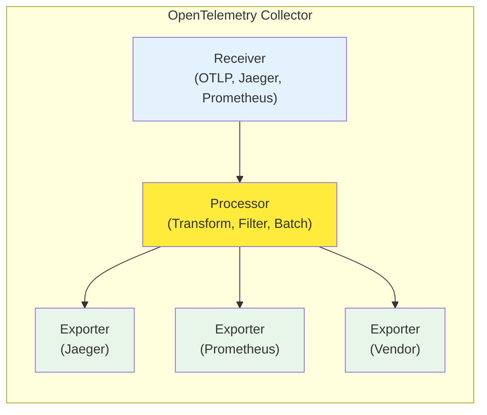

## 要約（Summary）

- OpenTelemetry Collector は、テレメトリデータの受信（receiver）→ 加工（processor）→ 送信（exporter）という3段階のパイプライン構造で動作する。
- このアーキテクチャはベンダー非依存で、traces/metrics/logs のすべてに対応する。
- パイプライン構造により、データ変換・フィルタリング・ルーティングを柔軟に実装できる。

## 本文（Body）

### 背景・問題意識

可観測性（observability）の実装において、テレメトリデータの収集・変換・配送は共通課題である。ベンダー固有の仕組みでは、バックエンドの変更時に大規模な作り直しが発生する。OpenTelemetry Collector は、この課題を解決するために設計された汎用的なテレメトリ中継・変換サービスである。

### アイデア・主張

OpenTelemetry Collector は、3つの主要コンポーネントからなるパイプライン構造を持つ：

1. **Receiver（受信）**: テレメトリデータを受け取る入口
   - OTLP、Jaeger、Prometheus、Zipkin など、複数プロトコルに対応
   - push型とpull型の両方をサポート

2. **Processor（加工）**: データの変換・フィルタリング・集約を行う中間層
   - 属性の追加・削除、サンプリング、バッチ処理などを実施
   - 複数のprocessorを連鎖させて複雑な変換を実現

3. **Exporter（送信）**: 加工したデータを送信先バックエンドへ配送
   - Jaeger、Prometheus、Grafana Cloud、各種ベンダーバックエンドに対応
   - 複数のexporterに同時送信可能（データの複製・分岐）

このパイプライン構造は、traces（分散トレース）、metrics（メトリクス）、logs（ログ）のすべての信号タイプに一貫して適用される。

### 内容を視覚化するMermaid図

### 具体例・ケース

**マルチバックエンド配送の例**:
- アプリケーションから OTLP 形式でデータを受信（Receiver）
- 属性を追加し、サンプリングレートを適用（Processor）
- 本番環境は Grafana Cloud へ、開発環境は Jaeger へ並行送信（Exporter）

**データ変換の例**:
- Prometheus形式でメトリクスを受信（Receiver）
- メトリクス名を正規化し、不要なラベルを削除（Processor）
- OTLP形式で Prometheus Remote Write へ送信（Exporter）

### 反論・限界・条件

- **パフォーマンスオーバーヘッド**: パイプライン処理により、わずかなレイテンシとCPU使用率の増加が発生する
- **設定の複雑性**: 複数のreceiver/processor/exporterを組み合わせると、設定ファイルが複雑化する
- **メモリ消費**: バッファリングやバッチ処理のため、メモリ使用量が増加する可能性がある
- **単一障害点リスク**: Collector自体が障害を起こすと、すべてのテレメトリデータが影響を受ける

## リンク（Links）

- [[20251129172153-opentelemetry-temporality-definition|OpenTelemetry Temporalityの基本概念]] - Temporality の概念はメトリクス処理の重要要素
- [[20251129172154-backend-temporality-choice|バックエンドによるTemporality選択基準]] - バックエンドの選択がパイプライン設計に影響
- [[20251129172155-temporality-conversion-challenges|Temporality変換の課題と方法]] - Processor での変換時の課題
- [[202511291430-delta-to-cumulative-processor|OpenTelemetry DeltaToCumulative Processorの概要]] - 具体的な Processor の実装例

## メタ（Meta）

- 関連する実務領域：可観測性、SRE、DevOps、プラットフォームエンジニアリング
- 次のアクション：実際の Collector 設定を書いて、パイプラインの挙動を確認する
