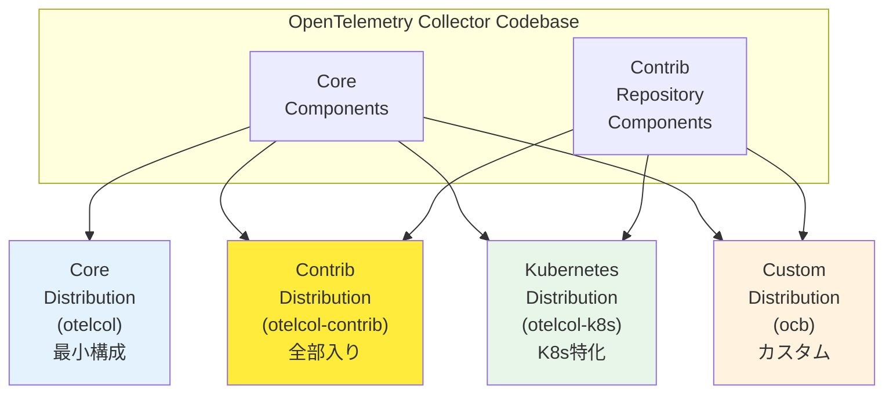

## 要約（Summary）

- OpenTelemetry Collector には、用途に応じた複数の公式ディストリビューション（配布形態）が存在する。
- Core、Contrib、Kubernetes、eBPF profiling など、含まれるコンポーネントと用途が異なる。
- ディストリビューション選択は、必要機能・攻撃面・メンテナンス性のトレードオフである。

## 本文（Body）

### 背景・問題意識

OpenTelemetry Collector は同一のアーキテクチャを持つが、どのコンポーネント（receiver/processor/exporter）を含めるかによって、バイナリサイズ、依存関係、セキュリティリスクが大きく変わる。OpenTelemetry プロジェクトは、この問題に対して「用途別のディストリビューション」という形で対応している。

### アイデア・主張

OpenTelemetry 公式は、複数のディストリビューション（distribution）をビルド済みバイナリ/コンテナイメージとして提供する：

**主要なディストリビューション**:

1. **Core（otelcol）**: 最小限の安定コンポーネントのみ
   - OTLP、Prometheus、Jaeger などの基本的なreceiver/exporter
   - プロダクション環境での安定性を最優先

2. **Contrib（otelcol-contrib）**: 多数のコンポーネントを同梱した「全部入り」
   - コミュニティ貢献のreceiver/exporter/processorを広範に含む
   - 検証・PoC・要件が流動的な環境に適する

3. **Kubernetes（otelcol-k8s）**: Kubernetes環境特化
   - k8s attributes processor、k8s objects receiverなどを含む

4. **その他**: eBPF profiling など、特定ユースケース向け

**ディストリビューションの本質**:
- 「別製品」ではなく、同一コードベースから異なるコンポーネントセットを選んでビルドしたもの
- どれを選んでも、パイプライン構造は同じ
- 必要に応じて、ocb（OpenTelemetry Collector Builder）でカスタムディストリビューションも作成可能

### 内容を視覚化するMermaid図

### 具体例・ケース

**Core を選ぶケース**:
- 本番環境で、必要なコンポーネントが明確に定まっている
- セキュリティ監査を通す必要があり、含まれるコードを最小化したい
- バイナリサイズとメモリフットプリントを小さく保ちたい

**Contrib を選ぶケース**:
- PoC段階で、どのバックエンドを使うか決まっていない
- 複数のプロトコル・バックエンドを試しながら評価したい
- AWS/GCP/Azureなど、クラウドベンダー固有のexporterが必要

**カスタムディストリビューションを作るケース**:
- Contribでは含まれないコンポーネントが必要
- 本番環境で、攻撃面を最小化しつつ必要機能だけ含めたい
- 社内標準のコンポーネントセットを定義して配布したい

### 反論・限界・条件

- **選択の複雑性**: 初心者には、どのディストリビューションを選ぶべきか分かりにくい
- **メンテナンスコスト**: カスタムディストリビューションは、自分でビルド・テスト・配布の責任を負う
- **アップグレードリスク**: Contribは多数のコンポーネントを含むため、アップグレード時の変更影響が大きい
- **ドキュメントの分散**: コンポーネントごとにドキュメントが分かれており、全体像の把握が困難

## リンク（Links）

- [[20251220123656-otel-collector-pipeline-architecture|OpenTelemetry Collector のパイプラインアーキテクチャ]] - Collector の基本アーキテクチャ
- [[202511291430-delta-to-cumulative-processor|OpenTelemetry DeltaToCumulative Processorの概要]] - Contrib に含まれる Processor の例
- [[202511291440-load-balancing-exporter|OpenTelemetry Collector Load Balancing Exporterの概要]] - Contrib に含まれる Exporter の例

## メタ（Meta）

- 関連する実務領域：プラットフォームエンジニアリング、セキュリティ、DevOps
- 次のアクション：自組織の要件を整理し、ディストリビューション選択基準を文書化する
