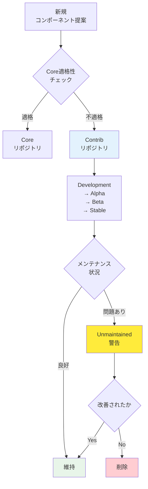

## 要約（Summary）

- opentelemetry-collector-contrib リポジトリは、Core に含めるには不適格なコンポーネントを集約する場である。
- 各コンポーネントは信号ごとに安定性レベルが定義され、コミュニティまたは特定ベンダーがメンテナンスする。
- 放置やリスクがあると判断されれば、unmaintained 扱いになり、最終的には削除される。

## 本文（Body）

### 背景・問題意識

オープンソースプロジェクトでは、コア機能の品質を保ちつつ、コミュニティからの貢献を受け入れる仕組みが必要である。OpenTelemetry Collector では、すべてのコンポーネントを Core リポジトリに入れると、品質・メンテナンス性が低下するリスクがある。Contrib リポジトリは、この課題に対する解決策として機能する。

### アイデア・主張

**Contrib リポジトリの位置付け**:

opentelemetry-collector-contrib は、以下の理由で Core に含めにくいコンポーネントを受け入れる：

1. **成熟度の問題**: まだ実験的で、APIが安定していない
2. **メンテナンス体制**: 特定企業が主導し、コミュニティ全体のサポートが薄い
3. **用途のニッチさ**: 特定のバックエンドやプロトコルに依存し、汎用性が低い
4. **外部依存**: 特定のSDKやライブラリに強く依存する

**ガバナンスの仕組み**:

- **信号別の安定性レベル**: 各コンポーネントは、traces/metrics/logs ごとに安定性が定義される
  - `stable`: 本番環境で使用可能
  - `beta`: 機能は安定しているが、破壊的変更の可能性あり
  - `alpha`: 実験的、APIが変わる可能性が高い
  - `development`: 開発中、本番利用不可
  
- **メンテナンス責任**: コンポーネントごとに code owner が定義され、特定の個人・企業が責任を持つ

- **unmaintained への降格**: 以下の場合、unmaintained ステータスに移行
  - code owner が応答しない
  - 重大なバグが長期間放置される
  - セキュリティリスクが指摘されたまま修正されない

- **最終的な削除**: unmaintained 状態が続けば、リポジトリから削除される

### 内容を視覚化するMermaid図

### 具体例・ケース

**成熟度による分類**:
- AWS CloudWatch Exporter → Contrib（AWS固有、特定ベンダーがメンテ）
- OTLP Receiver → Core（標準プロトコル、コミュニティ全体がサポート）
- Kafka Receiver → Contrib（特定ミドルウェア依存）

**unmaintained への降格例**（仮想）:
- あるレガシーシステム向けのexporterが、code ownerの退職により応答がなくなる
- 重大なメモリリークバグが報告されるが、3ヶ月間修正されない
- コミュニティが警告を発し、unmaintained ステータスに移行
- 6ヶ月後、改善の見込みがないため、次のメジャーバージョンで削除

### 反論・限界・条件

- **予測可能性の低下**: Contrib のコンポーネントは、将来削除される可能性があり、長期利用に不安が残る
- **品質のばらつき**: コンポーネントごとにメンテナンス品質が大きく異なる
- **依存リスク**: 特定ベンダーがメンテしているコンポーネントは、そのベンダーの戦略変更で放置される可能性
- **ドキュメントの質**: Core に比べて、Contrib のコンポーネントはドキュメントが不十分な場合がある

## リンク（Links）

- [[20251220123740-otel-collector-distribution-strategy|OpenTelemetry Collector のディストリビューション戦略]] - Contrib ディストリビューションとの関係
- [[20251220123656-otel-collector-pipeline-architecture|OpenTelemetry Collector のパイプラインアーキテクチャ]] - Collector の基本構造
- [[202511291430-delta-to-cumulative-processor|OpenTelemetry DeltaToCumulative Processorの概要]] - Contrib の具体的なコンポーネント例

## メタ（Meta）

- 関連する実務領域：OSSガバナンス、プラットフォームエンジニアリング、技術選定
- 次のアクション：使用している Contrib コンポーネントの安定性レベルとメンテナンス状況を確認する
