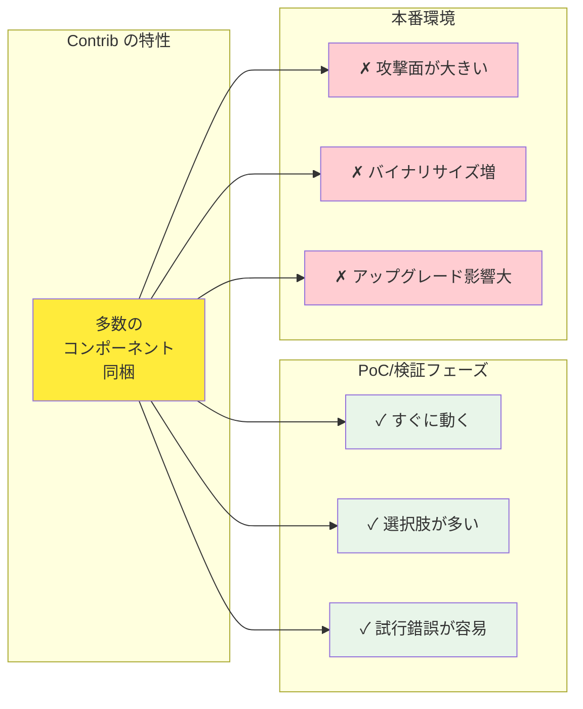

## 要約（Summary）

- Contrib ディストリビューション（otelcol-contrib）は、多数のコンポーネントを同梱した「全部入り」Collector である。
- 検証・PoC・要件が流動的な場面では強力だが、本番環境ではリスクとオーバーヘッドがある。
- 本番利用では、カスタムディストリビューションで必要コンポーネントだけ含める戦略が推奨される。

## 本文（Body）

### 背景・問題意識

テレメトリ基盤の構築では、初期段階では要件が不明確であることが多い。どのバックエンドを使うか、どのプロトコルで受け取るか、どんな変換が必要かが固まっていない段階で、最小構成の Collector を選ぶと、頻繁な入れ替えが発生する。一方、本番環境では、不要なコードを含むことはセキュリティリスクとなる。

### アイデア・主張

**Contrib ディストリビューション（otelcol-contrib）の特性**:

**強み**:
1. **選択肢の多さ**: 必要な receiver/exporter がすぐに見つかる
2. **試行錯誤の容易さ**: 設定変更だけで別のバックエンドに切り替えられる
3. **すぐに動く**: ダウンロードして設定すればすぐに動作確認できる
4. **ドキュメントの充実**: 人気があるため、コミュニティのサンプル設定が豊富

**弱み**:
1. **攻撃面の拡大**: 使わないコンポーネントの脆弱性もバイナリに含まれる
2. **バイナリサイズ**: Core の数倍のサイズになり、コンテナイメージも大きくなる
3. **依存関係の複雑さ**: 多数の外部ライブラリに依存し、ライセンス確認が困難
4. **アップグレード影響**: 使っていないコンポーネントの変更も含まれ、リリースノートが膨大

**適用場面の判断基準**:

| フェーズ | 推奨 | 理由 |
|---------|------|------|
| PoC・検証 | Contrib | 要件が流動的、試行錯誤が必要 |
| ステージング初期 | Contrib | 構成がまだ固まっていない |
| ステージング後期 | カスタム検討 | 構成が固まり、本番化が見えてきた |
| 本番環境 | カスタム推奨 | セキュリティ・安定性を優先 |

### 内容を視覚化するMermaid図

### 具体例・ケース

**Contrib が適している例**:
- 新規サービスで、Datadog と Grafana Cloud のどちらを使うか検証中
- マイクロサービスごとに異なるテレメトリプロトコルを使っており、統一前の過渡期
- 複数のクラウドベンダーのマネージドサービスへの同時配信を試している

**カスタムディストリビューションに移行すべき例**:
- 本番環境で使うコンポーネントが、OTLP receiver、batch processor、OTLP exporter の3つだけと確定した
- セキュリティ監査で「使わないコードを含めるな」と指摘された
- コンテナイメージサイズを減らして、起動時間を短縮したい

**実際の移行パス**:
1. PoC: Contrib で色々試す（1-2ヶ月）
2. ステージング: Contrib のまま、設定を固めていく（2-3ヶ月）
3. 本番化直前: ocb でカスタムディストリビューションを作成
4. 本番: カスタム版をデプロイ、CI/CDに組み込み

### 反論・限界・条件

- **メンテナンスコスト**: カスタムディストリビューションは、自分でビルド・テスト・配布する必要がある
- **学習コスト**: ocb の使い方を学ぶ時間が必要
- **緊急対応**: 新しいコンポーネントが急遽必要になった場合、Contrib ならすぐ使えるが、カスタムは再ビルドが必要
- **組織の成熟度**: 小規模チームでは、カスタムディストリビューションの運用負荷が高すぎる場合がある

実務的には、「Contrib で始めて、本番化時にカスタムに移行するか判断」という段階的アプローチが現実的である。

## リンク（Links）

- [[20251220123740-otel-collector-distribution-strategy|OpenTelemetry Collector のディストリビューション戦略]] - ディストリビューション戦略の全体像
- [[20251220123816-contrib-repository-governance|Contrib リポジトリのガバナンスモデル]] - Contrib のガバナンスとリスク
- [[20251220123656-otel-collector-pipeline-architecture|OpenTelemetry Collector のパイプラインアーキテクチャ]] - Collector の基本構造

## メタ（Meta）

- 関連する実務領域：プラットフォームエンジニアリング、セキュリティ、DevOps、意思決定
- 次のアクション：現在のフェーズと要件を整理し、Contrib継続 or カスタム移行の判断を行う
