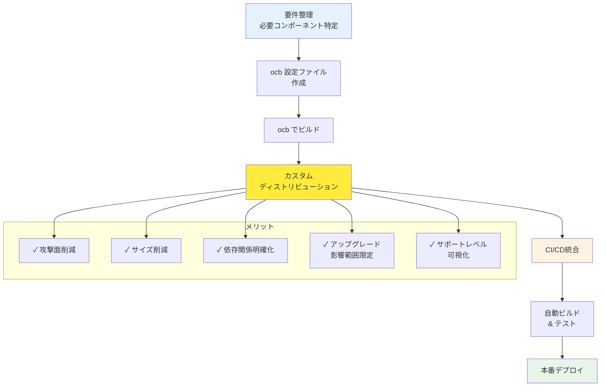

## 要約（Summary）

- カスタムディストリビューションは、必要なコンポーネントだけを含めた独自の Collector ビルドである。
- OpenTelemetry Collector Builder（ocb）を使って、設定ファイルベースで簡単に作成できる。
- 攻撃面・サイズ・依存・アップグレード戦略・サポートレベルの5つの観点で判断する。

## 本文（Body）

### 背景・問題意識

本番環境では、不要なコードを含むことはセキュリティリスクとなる。Contrib ディストリビューションは便利だが、100以上のコンポーネントのうち実際に使うのは数個だけ、という状況は珍しくない。OpenTelemetry は、この課題に対して「ocb（OpenTelemetry Collector Builder）」という公式ツールを提供し、カスタムディストリビューションの作成を推奨している。

### アイデア・主張

**カスタムディストリビューションの作成**:

OpenTelemetry Collector Builder（ocb）は、YAML設定ファイルで必要なコンポーネントを宣言すると、それらだけを含むバイナリ/コンテナイメージをビルドするツールである。

**ocb の基本的な使い方**:
```yaml
# builder-config.yaml
dist:
  name: my-otelcol
  description: My custom OpenTelemetry Collector
  output_path: ./dist

receivers:
  - gomod: go.opentelemetry.io/collector/receiver/otlpreceiver v0.91.0
processors:
  - gomod: go.opentelemetry.io/collector/processor/batchprocessor v0.91.0
exporters:
  - gomod: go.opentelemetry.io/collector/exporter/otlpexporter v0.91.0
```

コマンド実行:
```bash
ocb --config builder-config.yaml
```

**カスタム化の判断基準（5つの観点）**:

1. **攻撃面（Attack Surface）**
   - 含まれるコンポーネントが少ないほど、脆弱性のリスクが減る
   - セキュリティ監査の対象コードを絞れる

2. **サイズ（Size）**
   - バイナリサイズ、コンテナイメージサイズが削減される
   - 起動時間、メモリフットプリントが小さくなる

3. **依存（Dependencies）**
   - 外部ライブラリの数が減り、ライセンス確認が容易
   - トランジティブ依存の脆弱性リスクが減る

4. **アップグレード戦略（Upgrade Strategy）**
   - 使っているコンポーネントだけの変更を追えばよい
   - リリースノートの確認範囲が限定される

5. **サポートレベル（Support Level）**
   - 必要なコンポーネントの安定性・メンテナンス状況を事前に確認できる
   - unmaintained なコンポーネントを含めない選択ができる

### 内容を視覚化するMermaid図



### 具体例・ケース

**最小構成の例（OTLP → OTLP）**:
```yaml
receivers:
  - otlpreceiver
processors:
  - batchprocessor
exporters:
  - otlpexporter
```
→ OTLP でデータを受けて、バッチ処理して、OTLP で送信するだけ

**実務的な構成例**:
```yaml
receivers:
  - otlpreceiver         # アプリからの受信
  - prometheusreceiver   # Prometheus メトリクスのスクレイプ
processors:
  - batchprocessor       # バッチ処理
  - attributesprocessor  # 属性追加
  - filterprocessor      # フィルタリング
exporters:
  - otlpexporter         # Grafana Cloud へ送信
  - prometheusexporter   # Prometheus へ送信
```

**CI/CD統合の例**:
1. GitHub Actions で ocb を実行
2. カスタムディストリビューションのコンテナイメージをビルド
3. セキュリティスキャン（Trivy等）を実行
4. Artifact Registry / ECR にプッシュ
5. 本番環境にデプロイ

### 反論・限界・条件

- **初期コスト**: ocb の学習、CI/CD の構築に時間がかかる
- **メンテナンス負荷**: 定期的なアップグレード、脆弱性対応を自分で行う必要がある
- **柔軟性の低下**: 新しいコンポーネントが必要になったら、再ビルド・再デプロイが必要
- **テストの責任**: 公式ディストリビューションと異なり、自分でテストを実施する責任
- **組織の成熟度**: 小規模チームでは、カスタムディストリビューションの運用が重荷になる可能性

**現実的な判断**:
- スタートアップ・小規模チーム：Contrib で十分な場合が多い
- エンタープライズ・規制業界：カスタムディストリビューションが推奨される
- 中規模組織：段階的移行（Contrib → カスタム）が現実的

## リンク（Links）

- [[20251220123740-otel-collector-distribution-strategy|OpenTelemetry Collector のディストリビューション戦略]] - ディストリビューション全体の戦略
- [[20251220123852-contrib-distro-characteristics|Contrib ディストリビューションの特性と適用場面]] - Contrib との比較
- [[20251220123816-contrib-repository-governance|Contrib リポジトリのガバナンスモデル]] - Contrib のリスク理解
- [[20251220123656-otel-collector-pipeline-architecture|OpenTelemetry Collector のパイプラインアーキテクチャ]] - Collector の基本構造

## メタ（Meta）

- 関連する実務領域：プラットフォームエンジニアリング、DevOps、セキュリティ、CI/CD
- 次のアクション：ocb のサンプルを動かして、カスタムディストリビューション作成を体験する
