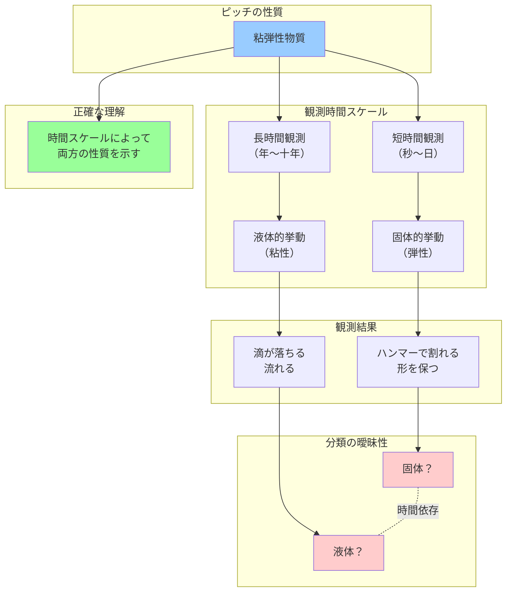

## 要約（Summary）

- 物質が「固体」か「液体」かの分類は、観測する時間スケールに依存して変わる
- ピッチ（タール状樹脂）は短時間では固体のように振る舞うが、年単位の長時間では液体として流れる
- 分類や定義は観測条件（時間スケール）に依存するため、「どちらか一方」という二値的判断は不正確である

## 本文（Body）

物質の状態（固体・液体・気体）は物理学の基本的な分類だが、この分類が観測時間スケールによって変わることがある。特に粘弾性物質では、短時間の観測では固体的（弾性的）挙動を示し、長時間の観測では液体的（粘性的）挙動を示す。

### 背景・問題意識

日常的な直感では、物質は「固体」か「液体」かのどちらかに明確に分類できると考えがちである。水は液体、石は固体というように。しかし、この分類は「どのくらいの時間スケールで観測するか」に依存する場合がある。

ピッチドロップ実験は、この直感に反する現象を示す古典的な実験である。ピッチ（タール状の樹脂）を漏斗に入れて放置すると、数年〜十年かけて滴が落ちる。この実験の目的は：
1. **粘度測定（レオロジー）**：滴が落ちるまでの時間から、極端に高い粘度を実測する
2. **教育デモ**：「固体っぽい液体」の存在を示し、見た目だけで判断できないことを体感させる
3. **時間スケールの重要性**：観測時間によって物性の見え方が変わることを示す

### アイデア・主張

**物質の固体・液体という分類は、観測する時間スケールに依存する。短時間観測では固体、長時間観測では液体という二面性を持つ物質（粘弾性物質）が存在し、この場合「どちらか」という二値的判断は不正確である。**

ピッチの例：
- **短時間（秒〜日）**：ハンマーで叩くと割れる → 固体的挙動
- **長時間（年〜十年）**：滴として落ちる → 液体的挙動

この二面性は、物質の本質的な性質（粘弾性）によるものであり、どちらも「正しい」観察結果である。

### 内容を視覚化するMermaid図

### 具体例・ケース

**ピッチドロップ実験**
- クイーンズランド大学（1927年開始）：約87年間で9滴が落下
- 実験結果：ピッチは水の約2000億倍の粘度を持つ
- 日常的には固体に見えるが、長期的には確実に流れている

**ガラス**
- 短時間：明らかな固体（割れる、形を保つ）
- 超長時間（数百年〜）：非常にゆっくり流れる可能性が議論されている（「中世の窓ガラスが下部で厚い」という俗説があるが、実際は製造工程の問題）

**マントル（地球内部）**
- 短時間（地震波の伝播）：固体として振る舞う
- 長時間（地質学的時間スケール）：対流を起こす流体として振る舞う

### 反論・限界・条件

**「最終的にどちらなのか」という問いへの答え**
- 科学的には：粘弾性物質として扱うのが正確
- 日常語としては：文脈に依存する
  - 長期現象を語るなら「超高粘度の液体」
  - 短期現象を語るなら「ガラス状の固体」

**分類基準の多様性**
物理学での「相（phase）」の定義は複数の基準が絡む：
- 分子配列・秩序の有無
- 融解の有無
- せん断応力（横方向の力）への長期的応答

ピッチは長期的にせん断応力で変形し続けるため液体的だが、短期ではガラス（非晶質固体）のように振る舞う。

**実用上の意味**
- 工学的設計：時間スケールを明示した上で材料特性を評価する必要がある
- 建材や構造物：クリープ（長期荷重による変形）を考慮しなければならない

**他の物質での類似現象**
- コーンスターチと水の混合物（ダイラタンシー）：ゆっくり触ると液体、素早く叩くと固体
- シリーパテ：ゆっくり引くと伸びる、素早く引くとちぎれる

## 関連ノート（Links）

- [[20251215010142-subjective-feeling-vs-statistics|実感と統計データの乖離]] 日常的直感と科学的測定の違い
- [[20251215010141-magazine-book-statistical-confusion|書籍と雑誌の統計的混同]] カテゴリー境界の曖昧性と分類の重要性
- [[20251129225832-coding-agent-estimation-disruption|コーディングエージェントが従来の見積もりを破壊する理由]] 文脈（タスクの性質）によって評価が変わる類似構造

## To-Do / 次に考えること

- [ ] レオロジー（流動学）の基礎概念について詳しく調べる
- [ ] ガラス転移温度と物質の状態変化について学ぶ
- [ ] 工学における材料のクリープ特性について調査する
- [ ] 観測時間スケール依存性が重要な他の現象を探す
