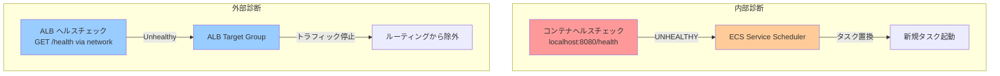

## 概要

ECS（Elastic Container Service）には「コンテナヘルスチェック」と「ALB ヘルスチェック」という**2つの独立したヘルス判定メカニズム**が存在する。それぞれが異なる観測点から健全性を判定し、失敗時には異なる主体が異なる対処を行う。

## 二重構造の本質

### 1. コンテナヘルスチェック（内部診断）

- **観測点**: コンテナ内部（localhost/127.0.0.1）
- **判定者**: ECS サービススケジューラ
- **失敗時の対処**: タスクを UNHEALTHY とマークし、Service 配下なら置き換え（replacement）を実行

### 2. ALB ヘルスチェック（外部診断）

- **観測点**: ネットワーク越し（ALB → ECS タスク）
- **判定者**: Application Load Balancer
- **失敗時の対処**: Unhealthy なターゲットへのトラフィック配信を停止

## なぜ二重構造が必要か

この設計により、以下の異なる関心事を分離できる：

- **内部ヘルス**: プロセス生存、依存サービスへの疎通、内部状態の整合性
- **外部ヘルス**: エンドユーザーから見た到達性、アプリケーション応答

コンテナ内部は健全でも ALB から到達できない場合、またはその逆のケースが存在しうる。両方を監視することで、より包括的な可用性管理が可能になる。

## Mermaid 図

## 関連ノート

- [[20251220130119-ecs-container-health-check-mechanism|ECS コンテナヘルスチェックの動作メカニズム]] - コンテナヘルスチェックの詳細動作
- [[20251220130149-ecs-essential-container-task-health|Essential コンテナとタスクヘルス判定]] - Essential コンテナとタスクヘルス判定
- [[20251220130215-ecs-service-task-replacement|ECS Service のタスク置換動作]] - ECS Service のタスク置換動作

## 実務への示唆

- 両方のヘルスチェックを設定することで、多層的な障害検出が可能
- ヘルスチェック失敗時の「誰が何をするか」を明確に理解することで、障害時の挙動予測とデバッグが容易になる
- 起動時間が長いアプリケーションでは `healthCheckGracePeriodSeconds` で猶予期間を設定し、不要な置換ループを回避する
