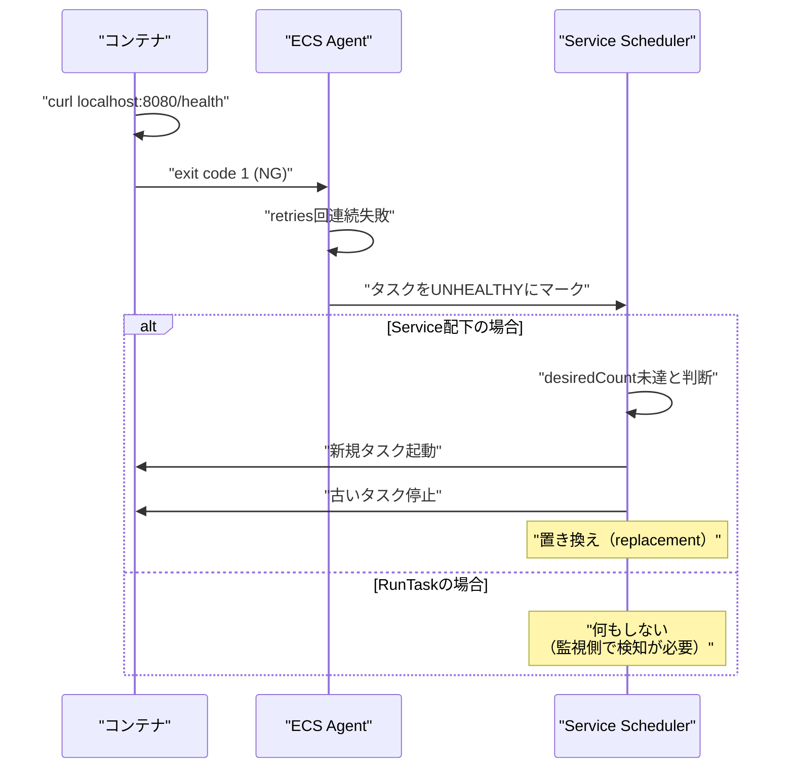

## 概要

ECS の `container_definitions.healthCheck` は、コンテナ内部でコマンドを実行してヘルス状態を判定するメカニズム。コマンドの exit code（0=OK、非0=NG）によって健全性を判断し、ECS サービススケジューラの置換判断に影響を与える。

## 動作メカニズム

### ヘルスチェックの実行

```json
{
  "healthCheck": {
    "command": ["CMD-SHELL", "curl -f http://localhost:8080/health || exit 1"],
    "interval": 30,
    "timeout": 5,
    "retries": 3,
    "startPeriod": 60
  }
}
```

- **実行場所**: コンテナ内部（localhost/127.0.0.1）
- **前提条件**: ヘルスチェックコマンド（curl, wget など）がコンテナイメージに含まれている必要がある
- **判定基準**: exit code 0 なら Healthy、非0 なら Unhealthy

### 起動方法別の挙動

#### 1. ECS Service 配下（desiredCount 管理あり）

タスクが UNHEALTHY になると、サービススケジューラが自動的にタスクを**置き換えて** desiredCount を維持しようとする。

置き換えの順序は以下のパラメータで制御：
- `maximumPercent`: 起動可能な最大タスク数の割合（200 なら desiredCount の 2 倍まで同時起動可能）
- `minimumHealthyPercent`: 維持すべき最小健全タスク数の割合（50 なら desiredCount の半分は常に Healthy を保つ）

#### 2. RunTask など単発実行（Service なし）

desiredCount を維持する主体が存在しないため、UNHEALTHY として**観測されるだけ**で自動補充はされない。監視や運用ロジック側で検知・対応する必要がある。

## 重要な誤解の修正

❌ **誤**: ヘルスチェック失敗 → 即座にコンテナ再起動  
✅ **正**: ヘルスチェック失敗 → タスクを UNHEALTHY とマーク → Service が新規タスク起動 → 古いタスク停止（置き換え）

ECS は「コンテナ再起動」ではなく「タスク置換」という単位で動作する。

## Mermaid 図



## 関連ノート

- [[20251220130053-ecs-dual-health-check-structure|ECS ヘルスチェックの二重構造]] - ECS ヘルスチェックの二重構造
- [[20251220130055-ecs-essential-container-task-health]] - Essential コンテナとタスクヘルス判定
- [[20251220130056-ecs-service-task-replacement]] - ECS Service のタスク置換動作

## 実務への示唆

- ヘルスチェックコマンドの実行環境（コマンドの有無、localhost へのアクセス可否）を事前に確認する
- `startPeriod` を適切に設定し、起動直後の失敗を猶予する
- Service 以外の起動方法では自動復旧しないことを理解し、別途監視・運用フローを構築する
- retries 回数と interval を調整し、一時的な障害での誤検知を防ぐ
