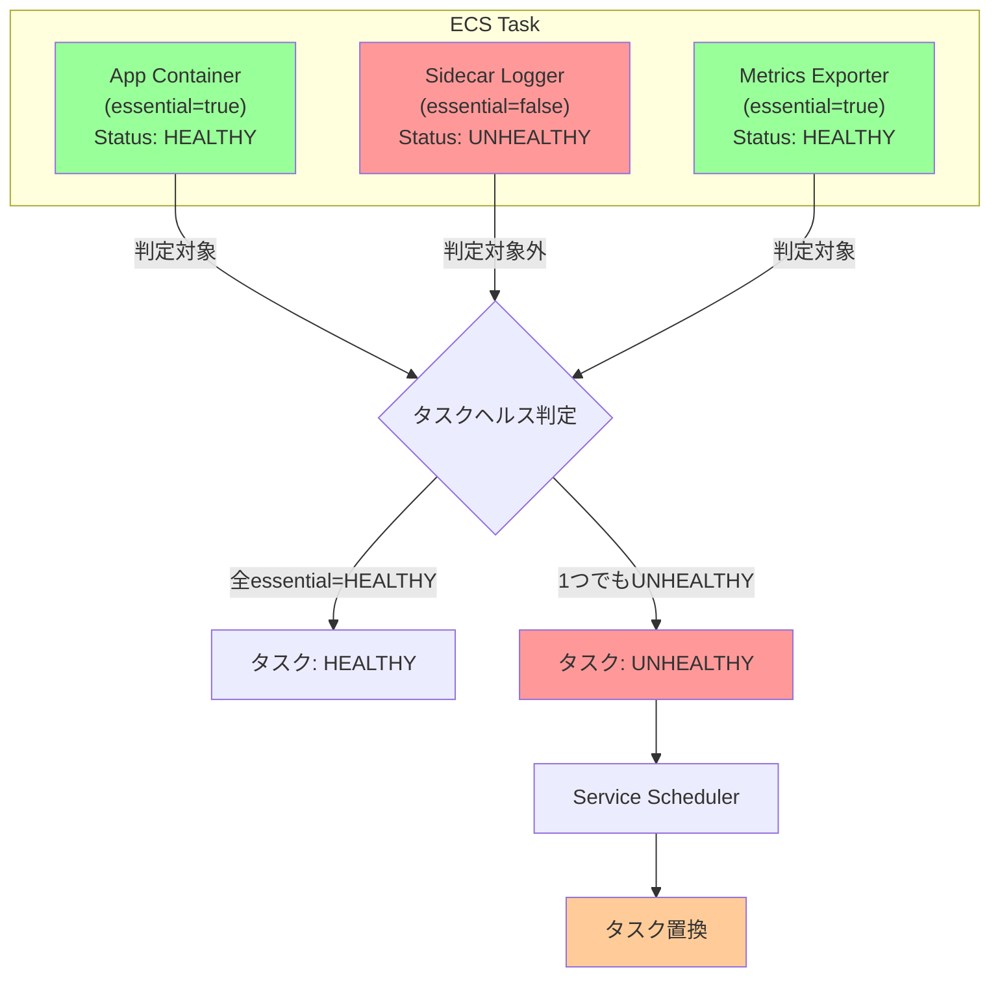

## 概要

ECS タスクは複数のコンテナを含むことができるが、タスク全体のヘルス状態は `essential=true` に設定されたコンテナのヘルスだけから判定される。**essential なコンテナが 1 つでも UNHEALTHY になると、タスク全体が UNHEALTHY** となる。

## Essential コンテナの役割

### Essential フラグの意味

```json
{
  "containerDefinitions": [
    {
      "name": "app",
      "essential": true,
      "healthCheck": { ... }
    },
    {
      "name": "sidecar-logger",
      "essential": false
    }
  ]
}
```

- **essential=true**: このコンテナが停止またはUNHEALTHYになると、タスク全体が失敗とみなされる
- **essential=false**: このコンテナが停止しても、タスク全体には影響しない（サイドカーなどの補助コンテナ向け）

### タスクヘルス判定ロジック

ECS は以下のロジックでタスクのヘルス状態を決定する：

1. **essential=true のコンテナのみ**をヘルス判定の対象とする
2. essential コンテナの**いずれか 1 つでも UNHEALTHY** なら、タスク全体を UNHEALTHY とする
3. タスクが UNHEALTHY になると、Service スケジューラがタスク置換を実行する

## 設計上の考慮点

### マルチコンテナ構成でのベストプラクティス

- **メインアプリケーション**: essential=true、ヘルスチェックあり
- **サイドカー（ログ転送、メトリクス収集など）**: essential=false
- **初期化コンテナ**: essential=false、起動完了後に終了する想定

サイドカーを essential=true にすると、サイドカーの障害でメインアプリケーションまで置き換えられてしまうため、注意が必要。

## Mermaid 図



上記例では、Sidecar Logger が UNHEALTHY だが essential=false のため、タスクは HEALTHY と判定される。しかし Metrics Exporter が UNHEALTHY になると、タスク全体が UNHEALTHY となり置換される。

## 関連ノート

- [[20251220130053-ecs-dual-health-check-structure|ECS ヘルスチェックの二重構造]] - ECS ヘルスチェックの二重構造
- [[20251220130119-ecs-container-health-check-mechanism|ECS コンテナヘルスチェックの動作メカニズム]] - ECS コンテナヘルスチェックの動作メカニズム
- [[20251220130056-ecs-service-task-replacement]] - ECS Service のタスク置換動作

## 実務への示唆

- サイドカーパターンを採用する場合、essential フラグを慎重に設計する
- 補助的なコンテナ（ログ収集、メトリクス送信など）は essential=false にし、メインアプリケーションの可用性に影響させない
- essential=true のコンテナには必ずヘルスチェックを設定し、障害検出を確実にする
- どのコンテナが「タスク全体の運命を左右するか」を明確に文書化する
