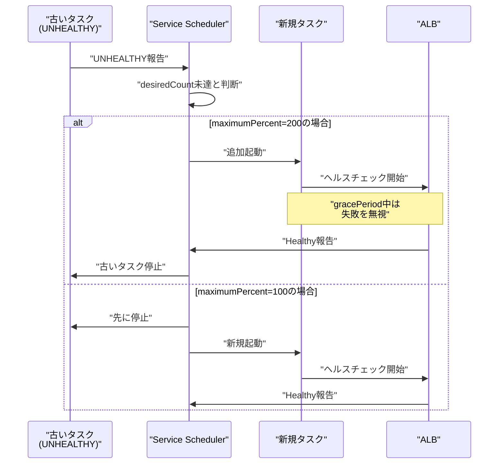

## 概要

ECS Service は desiredCount を維持するため、タスクが UNHEALTHY になると自動的にタスク置換（replacement）を実行する。置換の順序と並行度は `maximumPercent` と `minimumHealthyPercent` で制御され、これにより可用性と展開戦略をコントロールできる。

## タスク置換の基本動作

### トリガー条件

以下のいずれかでタスク置換が発生：

1. **コンテナヘルスチェック失敗**: essential コンテナが UNHEALTHY
2. **ALB ヘルスチェック失敗**: ALB が Unhealthy と判定（Service + LB 構成の場合）
3. **タスク定義の更新**: デプロイ時の意図的な置換

### 置換順序の制御パラメータ

```json
{
  "deploymentConfiguration": {
    "maximumPercent": 200,
    "minimumHealthyPercent": 100
  }
}
```

- **maximumPercent**: desiredCount に対する起動可能な最大タスク数の割合
  - 200 なら desiredCount=10 のとき、最大 20 タスクまで同時起動可能
- **minimumHealthyPercent**: 常に維持すべき健全なタスク数の最小割合
  - 100 なら desiredCount=10 のとき、常に 10 タスクは Healthy を維持

## 典型的な置換パターン

### ローリングアップデート型（maximumPercent=200, minimumHealthyPercent=100）

1. 新規タスクを追加で起動（desiredCount の 2 倍まで可能）
2. 新規タスクが Healthy になるのを待つ
3. 古いタスクを停止
4. desiredCount に収束

**メリット**: 常に desiredCount 以上のタスクが稼働（可用性重視）  
**デメリット**: 一時的にリソース使用量が 2 倍になる

### インプレース型（maximumPercent=100, minimumHealthyPercent=0）

1. 古いタスクを先に停止
2. 新規タスクを起動
3. 新規タスクが Healthy になるのを待つ

**メリット**: リソース使用量が増えない  
**デメリット**: 一時的にタスク数が減少（可用性低下）

## healthCheckGracePeriodSeconds の役割

```json
{
  "healthCheckGracePeriodSeconds": 300
}
```

起動直後の一定時間（上記例では 300 秒）、ALB およびコンテナヘルスチェックの Unhealthy 判定を**無視**する猶予期間。

### 適用シーン

- アプリケーション起動に時間がかかる（依存サービスへの接続、キャッシュのウォームアップなど）
- 起動直後のヘルスチェック失敗で即座に置換されてしまう「置換ループ」を防ぐ

## Mermaid 図



## 関連ノート

- [[20251220130053-ecs-dual-health-check-structure|ECS ヘルスチェックの二重構造]] - ECS ヘルスチェックの二重構造
- [[20251220130119-ecs-container-health-check-mechanism|ECS コンテナヘルスチェックの動作メカニズム]] - ECS コンテナヘルスチェックの動作メカニズム
- [[20251220130149-ecs-essential-container-task-health|Essential コンテナとタスクヘルス判定]] - Essential コンテナとタスクヘルス判定

## 実務への示唆

- **起動時間が長い場合**: `healthCheckGracePeriodSeconds` を十分に設定し、置換ループを回避
- **可用性重視**: maximumPercent=200 で追加起動を許可
- **コスト重視**: maximumPercent=100 で同時起動数を制限（ただし一時的なダウンタイムを許容）
- **デバッグ時**: CloudWatch Events で ECS タスク状態変化を追跡し、「何秒後に何が起きたか」を時系列で把握
- **置換ループ検知**: 短時間に複数回の置換が発生する場合、ヘルスチェック設定または起動プロセスに問題がある可能性
