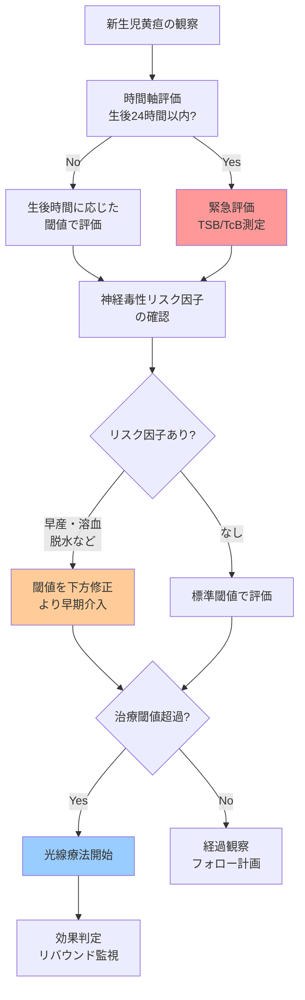

## 要約（Summary）

- 新生児黄疸のリスク評価は、**時間軸**（生後何時間か）、**ビリルビン値**、**神経毒性リスク因子**の3層で行う
- 急性ビリルビン脳症（可逆的）→核黄疸（不可逆的脳障害）への進行を予防することが目標
- リスク因子（早産・溶血・脱水など）の有無で治療介入閾値が変わる

## 本文（Body）

### 背景・問題意識

新生児黄疸は多くが生理的で自然治癒するが、一部は重篤化して脳障害（核黄疸：kernicterus）を引き起こす。問題は「黄疸そのもの」ではなく、**血中ビリルビン濃度が高すぎる状態（高ビリルビン血症）**が持続または急上昇することである。

どの黄疸が危険かを見極め、適切なタイミングで介入するための体系的なリスク評価フレームワークが必要である。

### アイデア・主張

新生児黄疸の神経毒性リスク評価は、以下の3層構造で行うべきである：

1. **時間軸による評価**：生後何時間/日かで「あるべきビリルビンレベル」が変わる（hour-specific threshold）
2. **絶対値による評価**：現在のビリルビン値が治療閾値を超えているか
3. **リスク因子による修正**：神経毒性を高める因子の有無で閾値を下方修正

このフレームワークにより、「見た目の黄疸」だけでなく、客観的数値と個別リスクを統合した判断が可能になる。

### 内容を視覚化するMermaid図

### 具体例・ケース

**ケース1：リスク因子なしの正期産児**
- 生後72時間、TSB 15 mg/dL、母乳栄養良好
- 標準閾値（正期産・リスク因子なし）では光線療法不要
- 経過観察で対応

**ケース2：早産児（35週）+ 哺乳不良**
- 生後48時間、TSB 13 mg/dL、体重減少10%
- リスク因子（早産・脱水傾向）あり→閾値下方修正
- より低い値でも光線療法を開始

**ケース3：生後24時間以内の黄疸**
- 生後12時間、肉眼的黄疸あり
- 時間的に異常（生理的黄疸は通常2-3日目以降）
- 溶血性疾患（ABO/Rh不適合など）を疑い緊急評価

### 反論・限界・条件

**限界**：
- 見た目だけでは判断できない：皮膚色による誤差が大きく、客観的測定（TcB/TSB）が必須
- 閾値は確率的：治療閾値を下回っても核黄疸が起こりうるし、超えても必ず起こるわけではない
- リスク因子の重複：複数のリスク因子が重なる場合の定量的評価は難しい

**成立条件**：
- 定期的なフォロー体制：ビリルビンピーク（生後3-5日）の時期に評価できる体制
- 測定機器へのアクセス：TcB（経皮）またはTSB（採血）測定が可能な環境
- 保護者教育：危険サインを認識し、適切なタイミングで受診できる知識

## 関連ノート（Links）

- [[20251220140610-early-onset-jaundice-clinical-significance|生後24時間以内黄疸の臨床的意義と溶血性疾患の除外]] 生後24時間以内黄疸の特殊性と溶血性疾患の除外方法
- [[20251220140611-phototherapy-bilirubin-photoisomerization|光線療法によるビリルビン光異性化のメカニズム]] リスク評価の結果として実施される光線療法のメカニズム

（注：医療系ノートは新規作成のため、既存の関連ノートは少ない。今後、小児科・新生児医療・リスク評価・臨床判断に関するノートとリンクを形成していく）

## To-Do / 次に考えること

- [ ] AAP（米国小児科学会）のhour-specific nomogramの具体的な閾値データを追加
- [ ] 核黄疸の臨床症状（急性期→慢性期）の詳細ノートを作成
- [ ] 長期的黄疸（2-3週以上）と胆汁うっ滞の鑑別に関するノートを作成
- [ ] リスク因子ごとの相対リスク（オッズ比など）のエビデンスを調査
- [ ] 実際の臨床ケースから学んだ教訓を追記
