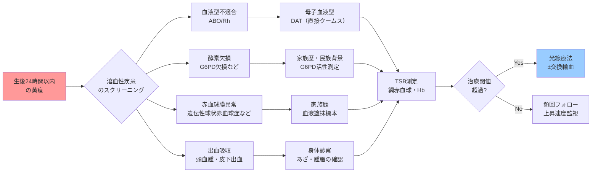

## 要約（Summary）

- 生後24時間以内に出現する黄疸は、生理的黄疸のタイムラインから逸脱しており、**病的黄疸**として緊急評価が必要
- 早期発症の主な原因は**溶血性疾患**（赤血球が異常に早く破壊される状態）であり、ビリルビンが急上昇するリスクが高い
- 評価には客観的測定（TSB/TcB）と溶血スクリーニング（血液型、DAT、血算など）が必須

## 本文（Body）

### 背景・問題意識

新生児の多くは生後2-3日目ごろから黄疸が目立ち始め、これは「生理的黄疸」として正常範囲である。しかし、**生後24時間以内**から黄疸が明らかな場合は、この生理的パターンから外れており、より深刻な病態を示唆する。

この時間的な「ずれ」を見逃すと、ビリルビンが急速に上昇し、脳障害（急性ビリルビン脳症→核黄疸）につながるリスクがある。なぜ早期発症が危険なのか、その機序と対応を理解する必要がある。

### アイデア・主張

**生後24時間以内の黄疸は、赤血球破壊（溶血）が亢進している可能性を示す時間的シグナルである。**

生理的黄疸は以下の理由で生後2-3日目にピークを迎える：
- 新生児の赤血球寿命が短い（成人の約半分）
- 肝臓のビリルビン処理能力が未熟
- 腸肝循環によるビリルビン再吸収

しかし、溶血性疾患では赤血球が**正常よりもはるかに速く破壊**され、ビリルビン産生が処理能力を大きく超える。その結果、タイムラインが前倒しになり、生後1日目から黄疸が顕在化する。

この「時間的逸脱」を認識することが、危険な黄疸の早期発見の鍵である。

### 内容を視覚化するMermaid図

```mermaid
gantt
    title 新生児黄疸の発症タイミングと病態の鑑別
    dateFormat  HH
    axisFormat %Hh

    section 生理的黄疸
    正常範囲の発症 :done, normal, 48, 72h

    section 早期発症（病的）
    溶血性黄疸 :crit, hemolysis, 00, 24h
    緊急評価領域 :crit, urgent, 00, 24h

    section 評価・介入
    TSB/TcB測定 :active, measure, 12, 6h
    溶血スクリーニング :active, screen, 12, 12h
    光線療法検討 :active, photo, 18, 12h
```

### 具体例・ケース

**ケース1：ABO血液型不適合**
- 母O型、児A型
- 生後12時間で肉眼的黄疸
- TSB 10 mg/dL（急速上昇中）、DAT陽性
- 診断：ABO不適合溶血性疾患→光線療法開始

**ケース2：G6PD欠損（地中海・アジア系に多い）**
- 家族歴に新生児黄疸あり
- 生後18時間、TSB 12 mg/dL
- G6PD活性低下を確認→光線療法、酸化ストレス回避

**ケース3：頭血腫による出血吸収**
- 吸引分娩後、頭部に大きな血腫
- 生後20時間から黄疸
- 血腫内の血液分解によるビリルビン産生増加→光線療法

### 反論・限界・条件

**すべての早期黄疸が重症化するわけではない**：
- 軽度の溶血や小さな血腫では、光線療法なしで改善することもある
- しかし、「見た目」だけでは判断不可能なため、必ず測定が必要

**溶血スクリーニングの限界**：
- DAT陰性でも溶血を完全には除外できない（ABO不適合の一部など）
- 稀な溶血性疾患（ピルビン酸キナーゼ欠損など）は通常スクリーニングで検出されない

**成立条件**：
- 24時間以内の評価体制：出生施設または早期フォロー体制が必須
- 測定・検査機器：TSB/TcB測定、血液型・DAT検査が迅速に実施可能
- 家族歴聴取：民族背景や家族の黄疸歴が診断の手がかりになる

## 関連ノート（Links）

- [[20251220140609-neonatal-jaundice-neurotoxicity-risk-assessment]] 早期黄疸が神経毒性リスク評価でどう扱われるか
- [[20251220140611-phototherapy-bilirubin-photoisomerization]] 溶血性黄疸に対する治療としての光線療法

（注：医療系ノートは新規作成のため、既存の関連ノートは少ない。今後、溶血性疾患・血液型不適合・新生児スクリーニングに関するノートとリンクを形成していく）

## To-Do / 次に考えること

- [ ] ABO不適合とRh不適合の頻度・重症度の違いに関する詳細ノートを作成
- [ ] G6PD欠損症の地域分布・診断・管理に関するノートを作成
- [ ] 交換輸血の適応基準と手技に関するノートを作成
- [ ] 「見た目で判断してはいけない」というメッセージを保護者教育の視点で整理
- [ ] 実際の臨床ケースで「24時間ルール」がどう機能したかを記録
