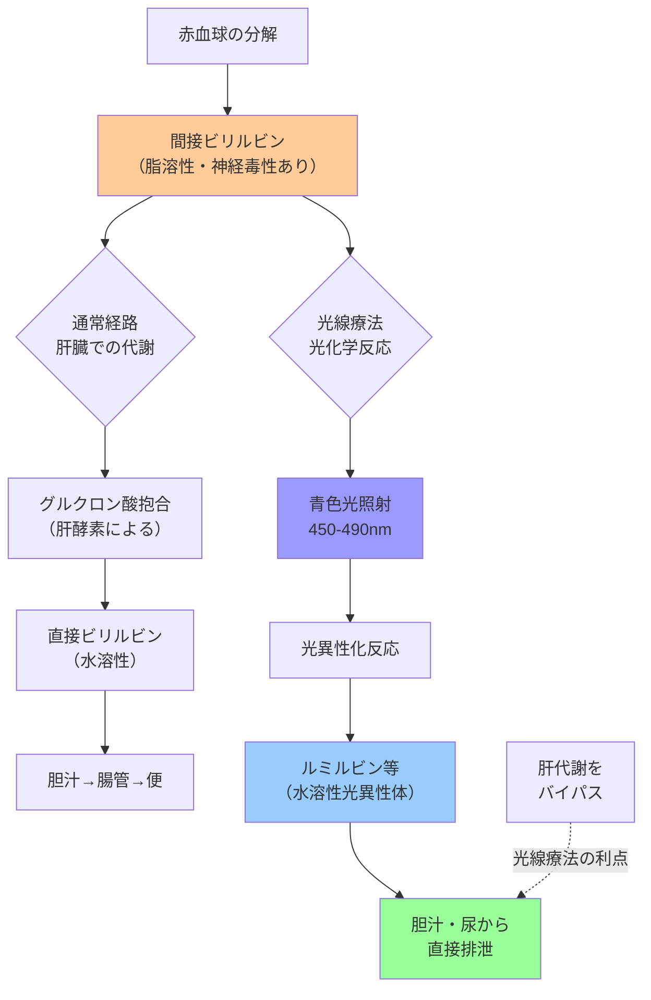
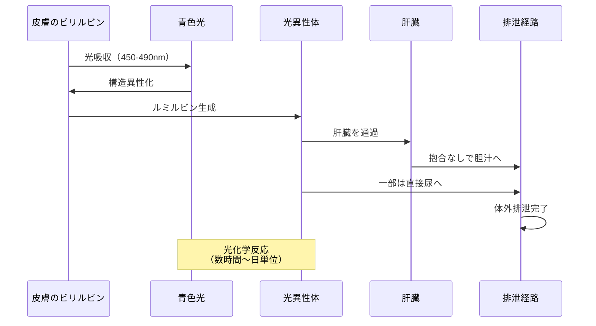

## 要約（Summary）

- 光線療法は、青〜青緑色の光を照射して**ビリルビンを化学的に変換**し、排泄しやすくする治療法
- 脂溶性（水に溶けにくい）ビリルビンが、光のエネルギーで**水溶性の光異性体**に変わり、肝臓での代謝を経ずに胆汁・尿から排泄される
- 薬剤や酵素を使わず、物理化学的な光反応を利用した非侵襲的治療である

## 本文（Body）

### 背景・問題意識

新生児の高ビリルビン血症は脳障害のリスクがあるため、ビリルビン値を速やかに下げる必要がある。しかし、新生児の肝臓は未熟で、ビリルビンを処理する能力（グルクロン酸抱合）が限られている。

薬剤投与や侵襲的処置（交換輸血）に頼らず、安全かつ効果的にビリルビンを減らす方法として、**光の化学的作用**を利用する光線療法が開発された。

なぜ光を当てるだけでビリルビンが減るのか、その分子レベルのメカニズムを理解することは、治療の適切な実施と副作用管理に不可欠である。

### アイデア・主張

**光線療法の本質は、「肝代謝のバイパス」である。**

通常、ビリルビンは以下の経路で排泄される：
1. 脂溶性の間接ビリルビン（unconjugated bilirubin）が血中を循環
2. 肝臓でグルクロン酸抱合され、水溶性の直接ビリルビン（conjugated bilirubin）に変換
3. 胆汁として腸管に排泄

しかし、光線療法では：
1. 青色光（波長450-490 nm）がビリルビンに吸収される
2. ビリルビン分子の構造が**光異性化**（photoisomerization）により変化
3. 生成された光異性体（**ルミルビン：lumirubin**など）は水溶性で、肝臓での抱合なしに胆汁・尿に直接排泄される

これにより、未熟な肝機能に依存せず、ビリルビンを体外に排出できる。

### 内容を視覚化するMermaid図

### 具体例・ケース

**ケース1：標準的な光線療法**
- 生後72時間、TSB 18 mg/dL（治療閾値超過）
- 上方照射型ライト + 下方ブランケット型で全身照射
- 24時間後：TSB 13 mg/dL（約30%減少）
- 効果確認後、治療中止→リバウンドチェック

**ケース2：集中光線療法（intensive phototherapy）**
- 溶血性黄疸、TSB急速上昇中（生後36時間で16 mg/dL）
- 複数光源を使用、照射面積・光量最大化
- 数時間ごとにTSB測定、上昇速度を抑制
- 交換輸血閾値到達を回避

**ケース3：副作用管理**
- 光線療法中、体温やや上昇（不感蒸泄増加）
- 授乳回数増やし、おしっこ回数確認→脱水予防
- 軽度の下痢・発疹出現→一時的、治療継続可能
- 目の保護具を確実に装着

### 反論・限界・条件

**光線療法の限界**：
- **極度の高ビリルビン血症には不十分**：TSBが非常に高い場合や急速上昇時は、交換輸血が必要
- **効果に個人差**：皮膚の色（メラニン量）、体格、光源の質・距離で効果が変わる
- **リバウンド現象**：治療中止後、組織に残ったビリルビンが血中に戻り、再上昇することがある

**副作用**：
- 脱水傾向（不感蒸泄増加）：授乳継続と尿量監視が必須
- 一過性の発疹・下痢：多くは軽度で治療継続可能
- 「青銅児症候群」（bronze baby syndrome）：稀だが、直接ビリルビン高値時に皮膚が灰褐色に変色（通常は可逆的）

**成立条件**：
- 適切な波長の光源：LED光源が主流（波長・照度が安定）
- 十分な照射面積：皮膚露出を最大化（おむつのみ）、多方向からの照射
- 定期的な効果判定：TSB測定で下降確認、リバウンド監視

## 関連ノート（Links）

- [[20251220140609-neonatal-jaundice-neurotoxicity-risk-assessment]] 光線療法の開始判断となる治療閾値の決定方法
- [[20251220140610-early-onset-jaundice-clinical-significance]] 溶血性黄疸など、光線療法が必要になる病態

（注：医療系ノートは新規作成のため、既存の関連ノートは少ない。今後、光化学・新生児医療・治療モニタリングに関するノートとリンクを形成していく）

## To-Do / 次に考えること

- [ ] 光線療法の光源の種類（蛍光灯・LED・ファイバーオプティック）と効果の違いを調査
- [ ] ルミルビン以外の光異性体（フォトビリルビンなど）の詳細を追記
- [ ] 交換輸血の適応基準・手技・合併症に関するノートを作成
- [ ] リバウンド現象の頻度・予測因子・対応戦略を整理
- [ ] 家庭用光線療法（home phototherapy）の適応と限界を調査
