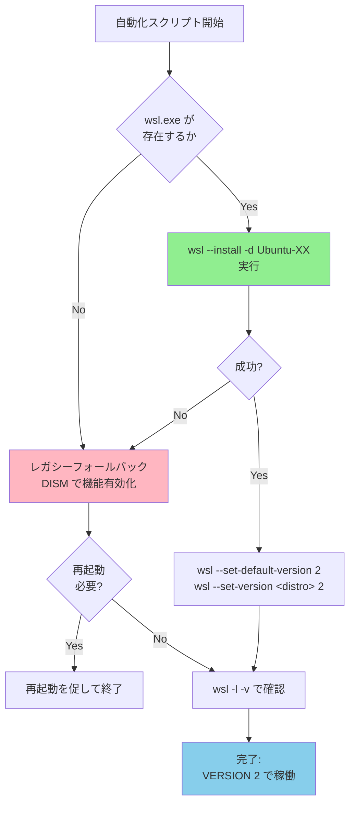

## 要約（Summary）

- `wsl --install` コマンドは、WSL導入に必要な複数の作業を一括実行できる公式の推奨手法である。
- Windows機能の有効化からディストリビューション導入までをワンライナーで完結し、手作業の介入を最小化する。
- 古い環境では失敗する可能性があり、DISMによるレガシーフォールバックが必要になる場合がある。

## 本文（Body）

### 背景・問題意識

WSL（Windows Subsystem for Linux）の導入は、従来は複数のステップを要する作業だった：

1. Windows機能の有効化（`Microsoft-Windows-Subsystem-Linux`、`VirtualMachinePlatform`）
2. WSL2カーネルの更新
3. ディストリビューション（Ubuntu等）のインストール
4. WSL2への変換（WSL1からの移行時）

これらを個別に実行すると、手順の漏れや誤りが発生しやすく、特に複数端末への展開では運用負荷が高かった。

### アイデア・主張

**`wsl --install` コマンドを基本手段として採用し、失敗時のみレガシーフォールバックに切り替える設計が、自動化スクリプトの最短ルートとなる。**

このアプローチにより：
- **手順の簡素化**：複数ステップが1コマンドに集約される
- **冪等性の実現**：既に導入済みの環境でも安全に実行できる
- **公式推奨パスの活用**：Microsoftが保守する導線に乗ることで、将来的な互換性が高まる

```powershell
# 基本形：ディストリ指定付きインストール
wsl --install -d Ubuntu-24.04

# 更新（既存環境の場合）
wsl --update
wsl --set-default-version 2
```

### 内容を視覚化するMermaid図



### 具体例・ケース

#### ケース1：新規端末（WSL未導入）

```powershell
wsl --install -d Ubuntu-24.04
# 必要機能の有効化 + Ubuntu導入 + WSL2設定を自動実行
# 初回は再起動が必要になることが多い
```

#### ケース2：既存端末（WSL1のUbuntuあり）

```powershell
wsl --update                        # WSL自体を更新
wsl --set-default-version 2         # 今後の既定をWSL2に
wsl --set-version Ubuntu-24.04 2    # 既存ディストリをWSL2に変換
```

#### ケース3：古いWindows（`wsl --install`非対応）

```powershell
# レガシーフォールバック
dism.exe /online /enable-feature /featurename:Microsoft-Windows-Subsystem-Linux /all /norestart
dism.exe /online /enable-feature /featurename:VirtualMachinePlatform /all /norestart
# → 再起動後、Microsoft Storeから手動でUbuntuを導入
```

### 反論・限界・条件

#### 完全自動化できないポイント

1. **初回Ubuntu起動時のユーザー作成**
   - WSL内のLinuxユーザー名とパスワードを設定する対話プロンプトが必須
   - Windows側のスクリプトから完全自動化する公式手段は存在しない
   - 対策：「Ubuntuを一度起動してユーザー作成後、スクリプト再実行」と明示する

2. **再起動の判断**
   - Windows機能の有効化後は再起動が必要になることが多い
   - 自動再起動は現場によってはリスクが高いため、オプション化が推奨される

3. **古い環境での制約**
   - Windows 10の古いビルド（1903以前など）では `wsl --install` が利用できない
   - Microsoft Storeが無効化されている企業環境では、`.wsl`イメージからの手動導入が必要

#### コマンドの冪等性

`wsl --install` や `wsl --set-version` は、既に条件を満たしている場合は無害に終了する設計になっている：

```powershell
# 既にWSL2の場合
PS> wsl --set-version Ubuntu-24.04 2
The requested operation was already completed.
```

この性質により、「何度実行しても安全なスクリプト」を実現できる。

### 関連リンク

- [[20251129165838-initializer-agent-environment-setup|Initializer agentによる環境初期化]]：環境セットアップの自動化パターン一般論
- [[20251129164131-control-expansion-task-management|タスク管理におけるコントロールの拡大]]：自動化範囲の設計判断

### 実務への示唆

- **公式コマンドを優先**：独自の複雑なスクリプトを書く前に、公式が提供する高レベルコマンドの存在を確認する
- **フォールバックの設計**：最新環境と古い環境の両方をカバーする多段構成が、実運用では必須
- **対話的ステップの明示**：完全自動化できない箇所を隠さず、利用者に明示的に伝える設計がトラブル時の切り分けを速くする
