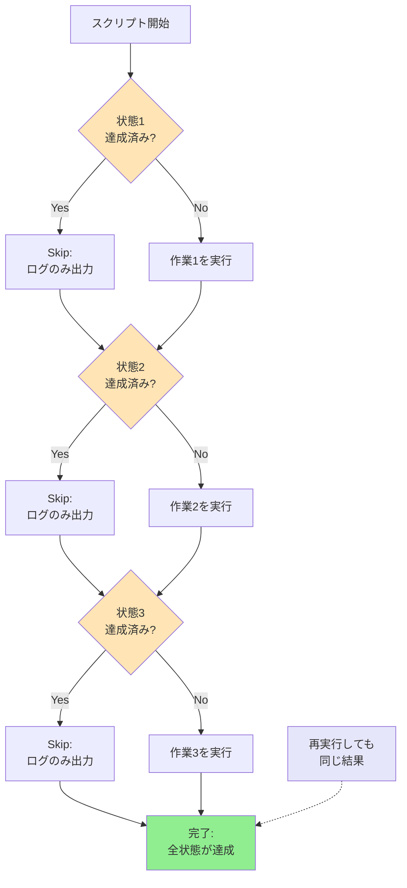

## 要約（Summary）

- 冪等性（idempotence）とは、同じ操作を複数回実行しても、1回実行した時と同じ結果になる性質である。
- 配布スクリプトが冪等であれば、「途中で失敗→再実行」や「既に完了済み→安全に実行」が保証される。
- 状態確認→条件分岐→必要な作業のみ実行、という設計パターンで実現する。

## 本文（Body）

### 背景・問題意識

組織内に配布する自動化スクリプトは、多様な実行環境に直面する：

- **未導入端末**：すべての作業が必要
- **部分導入済み端末**：一部のステップだけ必要
- **完了済み端末**：何もする必要がない（が、誤って実行される可能性がある）
- **途中失敗端末**：ネットワークエラーや権限不足で中断した状態

この多様性に対して、「環境ごとに異なるスクリプトを配る」運用はスケールしない。また、「既に完了している作業を再度実行すると壊れる」スクリプトは、トラブルシューティング時のリスクが高い。

### アイデア・主張

**「何度実行しても安全」な冪等スクリプトを設計原則とすることで、配布運用の複雑さと失敗時の対応コストを大幅に削減できる。**

冪等性の実現には3つの要素が必要：

1. **現状確認**：目的の状態が既に達成されているか判定する
2. **条件分岐**：未達成の場合のみ作業を実行する
3. **安全な操作**：公式コマンドや、既に冪等性を持つツールを活用する

### 内容を視覚化するMermaid図



### 具体例・ケース

#### 例1：WSL導入スクリプトにおける冪等性

```powershell
# 非冪等な書き方（悪い例）
wsl --install -d Ubuntu-24.04  # 既に導入済みなら失敗する

# 冪等な書き方（良い例）
$distros = Get-WSLDistros
if (-not ($distros -contains "Ubuntu-24.04")) {
    wsl --install -d Ubuntu-24.04
} else {
    Write-Host "Ubuntu-24.04 は既に導入済みです（スキップ）"
}
```

#### 例2：パッケージインストールにおける冪等性

```bash
# 非冪等な書き方（悪い例）
curl -fsSL https://example.com/install.sh | bash
# 既にインストール済みなら、重複や競合のリスクがある

# 冪等な書き方（良い例）
if ! command -v target-command >/dev/null 2>&1; then
    echo "Installing..."
    curl -fsSL https://example.com/install.sh | bash
else
    echo "Already installed（スキップ）"
fi
```

#### 例3：WSL2への変換における冪等性

```powershell
# WSLのコマンド自体が冪等である例
wsl --set-version Ubuntu-24.04 2
# 既にWSL2なら "The requested operation was already completed." となり、無害
```

### 反論・限界・条件

#### 冪等性を実現しにくいケース

1. **外部APIやサービスへの登録**
   - 「既に登録済みか」の判定が複雑（APIキーの確認、レスポンスコードの解釈など）
   - 対策：登録後にローカルにマーカーファイルを残し、それを判定に使う

2. **対話的な操作**
   - ユーザー入力を要求する処理（パスワード設定、利用規約への同意など）
   - 完全な冪等化は困難。「初回のみ対話、以降はスキップ」の設計にする

3. **破壊的な操作**
   - ファイル削除、データベースの初期化など
   - 冪等にすること自体が不適切な場合もある（意図的な再実行防止）

#### 冪等性とパフォーマンスのトレードオフ

状態確認のコストが高い場合、毎回の確認がオーバーヘッドになる：

```powershell
# 状態確認にコストがかかる例
$installedPackages = Get-InstalledSoftware  # 数秒かかる
if ($installedPackages -notcontains "TargetSoftware") {
    Install-Software "TargetSoftware"
}
```

対策：
- 確認処理を軽量にする（例：ファイル存在確認、レジストリキー確認）
- 状態確認自体も冪等にし、キャッシュを活用する

#### 冪等性のテスト

冪等スクリプトの品質を保証するには、以下のテストが必要：

1. **初回実行テスト**：何もない状態から正しく完了するか
2. **2回目実行テスト**：完了済み状態で再実行して、エラーが出ないか
3. **部分完了テスト**：途中まで完了した状態から再実行して、残りが完了するか

### 関連リンク

- [[20251221114658-wsl-official-install-command-pattern|WSL公式インストールコマンドの活用パターン]]：冪等なコマンドを活用した実装例
- [[20251129165838-initializer-agent-environment-setup|Initializer agentによる環境初期化]]：自動化された環境セットアップの設計
- [[20251220050704-code-delivery-with-proof-of-work|エンジニアの責任は動作証明されたコードを届けることである]]：スクリプトの品質保証の重要性

### 実務への示唆

- **再実行前提の設計**：「一度で成功する」ではなく「失敗したら再実行する」運用を前提にスクリプトを設計する
- **ログの充実**：何がスキップされ、何が実行されたかを明確に記録することで、トラブルシューティングが容易になる
- **公式ツールの冪等性を調査**：車輪の再発明を避け、既に冪等性を持つコマンドやツールを積極的に活用する
- **段階的な状態遷移**：大きな作業を小さなステップに分割し、各ステップで状態確認を行うことで、部分的な再実行が可能になる
