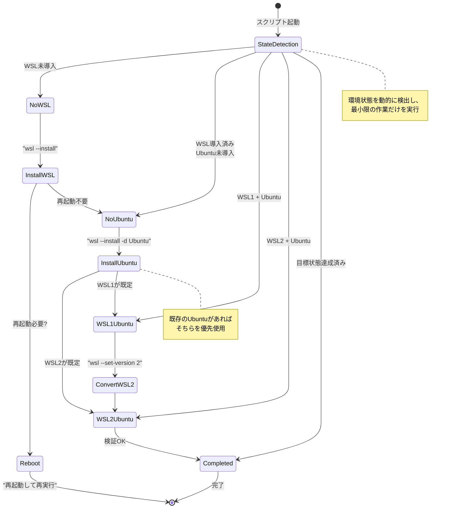

## 要約（Summary）

- 組織内の端末は「未導入/部分導入/完了済み」が混在しており、全端末に同じスクリプトを配布する必要がある。
- 状態吸収パターンとは、実行時に現在の状態を検出し、その状態に応じて必要な作業だけを実行する設計手法である。
- 状態判定→分岐→最小限の作業という流れで、多様な環境を単一スクリプトで統一的に扱える。

## 本文（Body）

### 背景・問題意識

企業や組織で自動化スクリプトを展開する際、以下のような多様な端末状態が混在する：

**WSL導入の例：**
- 端末A：WSL未導入、Ubuntu未導入
- 端末B：WSL1 + Ubuntu 20.04 が導入済み
- 端末C：WSL2 + Ubuntu 24.04 が導入済み
- 端末D：WSL2 + 別ディストリ（Debian等）が導入済み

この状況で「環境ごとに異なるスクリプトを配る」運用は破綻しやすい：
- 各端末の状態を事前調査する手間が膨大
- 状態判定ミスによる不適切なスクリプト適用
- スクリプトバージョン管理の複雑化

### アイデア・主張

**単一のスクリプトが実行時に環境状態を検出し、必要な作業のみを自動判定して実行する「状態吸収パターン」により、配布運用を大幅に簡素化できる。**

状態吸収パターンの3要素：

1. **状態の多段階判定**：複数の判定ポイントで現在の状態を確認
2. **優先順位付き分岐**：既存リソースを優先し、新規導入は最後の手段
3. **安全な状態遷移**：現在地から目標状態への最短かつ安全なパス選択

### 内容を視覚化するMermaid図



### 具体例・ケース

#### 実装例：WSL状態吸収スクリプト

```powershell
function Get-WSLDistros {
    try {
        $list = & wsl.exe -l -q 2>$null
        return @($list | Where-Object { $_ -and $_.Trim() })
    } catch {
        return @()  # WSL未導入
    }
}

function Choose-DistroToUse([string[]]$distros, [string]$preferred) {
    # 既存のUbuntuを優先（破壊的変更を避ける）
    $ubuntu = $distros | Where-Object { $_ -like "Ubuntu*" } | Select-Object -First 1
    if ($ubuntu) { return $ubuntu }
    return $preferred  # 既存が無ければ新規導入
}

# メインロジック
$distros = Get-WSLDistros

if ($distros.Count -eq 0) {
    # 状態1：WSL未導入 → フル導入
    Write-Host "WSL未導入: wsl --install を実行"
    wsl --install -d Ubuntu-24.04
} elseif (-not ($distros | Where-Object { $_ -like "Ubuntu*" })) {
    # 状態2：WSL導入済み、Ubuntu未導入 → Ubuntu追加
    Write-Host "Ubuntu未導入: 追加インストール"
    wsl --install -d Ubuntu-24.04
} else {
    # 状態3：Ubuntu導入済み → WSL2への変換確認
    $targetDistro = Choose-DistroToUse -distros $distros -preferred "Ubuntu-24.04"
    Write-Host "既存のUbuntu検出: $targetDistro"
    wsl --set-version $targetDistro 2  # 既にWSL2なら無害
}
```

#### パターンの応用：パッケージ管理

```bash
# Python環境の状態吸収
if ! command -v python3 >/dev/null 2>&1; then
    echo "状態1: Python未導入 → インストール"
    sudo apt-get install -y python3 python3-pip
elif ! command -v pip3 >/dev/null 2>&1; then
    echo "状態2: Python導入済み、pip未導入 → pip追加"
    sudo apt-get install -y python3-pip
else
    echo "状態3: Python/pip導入済み → バージョン確認"
    python3 --version
    pip3 --version
fi
```

### 反論・限界・条件

#### 状態判定の複雑さ

状態パターンが増えると、判定ロジックが複雑化する：

```powershell
# 判定パターンが多い例
if (A and B and not C) { ... }
elseif (A and not B and C) { ... }
elseif (not A and B and C) { ... }
# → 組み合わせ爆発のリスク
```

対策：
- **状態を階層化**：大分類→中分類→小分類という段階的な判定
- **状態マトリクスの文書化**：どの状態がどの処理に対応するか、表で整理
- **テストケースの網羅**：主要な状態パターンごとに実機テスト

#### 既存環境の尊重とトレードオフ

「既存のUbuntu 20.04を使う」と「最新のUbuntu 24.04に統一する」のどちらを優先するか：

- **既存優先**（保守的）：破壊的変更を避け、安全性を重視
- **最新優先**（積極的）：将来的なサポートや機能を重視

状態吸収パターンでは、通常は既存優先が推奨される（運用の安定性）。ただし、セキュリティや互換性の理由で強制更新が必要な場合は、その旨を明示的にログ出力し、ユーザーに通知すべきである。

#### エラーリカバリーとの組み合わせ

状態吸収パターンは、[[20251221114746-idempotent-deployment-script-design|冪等性のある配布スクリプト設計原則]]と組み合わせることで真価を発揮する：

- 状態吸収：「どの状態からでも目標に到達できる」
- 冪等性：「何度実行しても安全」

両者を組み合わせると、「どの状態から、何度実行しても、安全に目標状態に到達できる」スクリプトが実現する。

### 関連リンク

- [[20251221114746-idempotent-deployment-script-design|冪等性のある配布スクリプト設計原則]]：状態吸収と冪等性の組み合わせ
- [[20251221114658-wsl-official-install-command-pattern|WSL公式インストールコマンドの活用パターン]]：状態吸収の具体的実装例
- [[20251129164131-control-expansion-task-management|タスク管理におけるコントロールの拡大]]：自動化範囲の設計判断

### 実務への示唆

- **事前調査を不要にする**：「端末ごとの状態調査→スクリプト選定」ではなく、「スクリプトが状態を判定」する設計により、配布作業が単純化される
- **ログの重要性**：どの状態が検出され、どの処理が実行されたかを詳細にログ出力することで、トラブル時の切り分けが容易になる
- **デフォルト値の慎重な設計**：既存リソースがない場合の「新規導入」における選択（バージョン、設定など）は、組織の標準に合わせて慎重に決める
- **段階的なロールアウト**：新しい状態吸収ロジックは、まず小規模な端末群でテストしてから全体展開する
