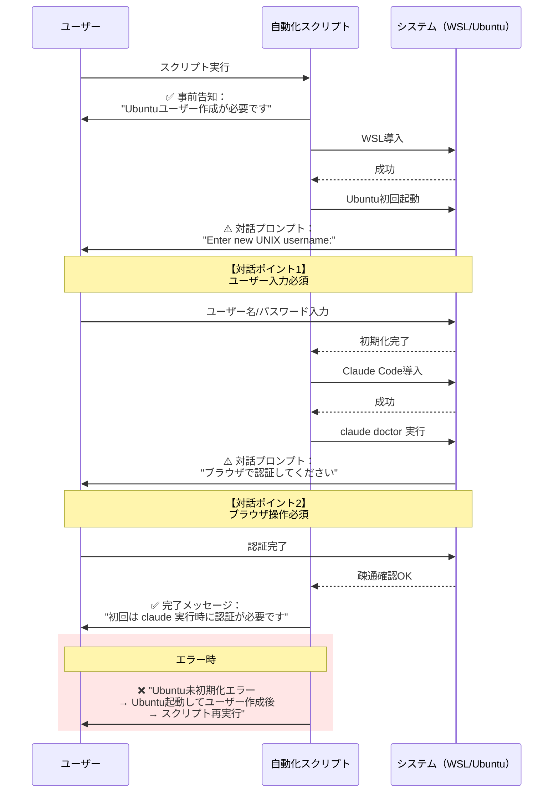

## 要約（Summary）

- 技術的制約やセキュリティ要件により、すべてのセットアップ作業を完全自動化できるわけではない。
- 対話的な操作（ユーザー入力、認証、利用規約への同意など）が必要な箇所を隠さず明示することが、UX設計の原則である。
- 「ここだけは手動が必要」を事前に伝えることで、ユーザーの期待値を調整し、トラブル時の切り分けを容易にする。

## 本文（Body）

### 背景・問題意識

自動化ツールやスクリプトは、「ボタン一つで全て完了」を理想とするが、現実には以下のような対話的な介入が必要になることが多い：

**WSL + Claude Code セットアップの例：**
1. **Ubuntu初回起動時のユーザー作成**：Linuxユーザー名とパスワードの設定
2. **Claude Code初回認証**：ブラウザでのログインとトークン取得
3. **Windows機能有効化後の再起動**：Windowsの仕様として必須

これらを「できるはず」と期待させたまま実行すると、以下の問題が発生する：
- ユーザーが「スクリプトが固まった」と誤認する
- サポート問い合わせが増加する
- トラブルシューティング時に「どこまで進んだか」が分からない

### アイデア・主張

**完全自動化できない箇所は、実行前・実行中・エラー時の3段階で明示的に伝えることで、ユーザー体験を向上させ、サポートコストを削減できる。**

明示設計の3原則：

1. **事前告知（Pre-disclosure）**：ドキュメントや実行前メッセージで「手動が必要な箇所」を列挙
2. **実行中ガイド（In-progress guidance）**：対話が必要になった瞬間に、何をすべきか明確な指示を出す
3. **エラー時の切り分け（Error contextualization）**：失敗時に「どのステップで止まったか」「次に何をすべきか」を提示

### 内容を視覚化するMermaid図



### 具体例・ケース

#### 例1：WSL Ubuntu初回起動（対話必須）

```powershell
# 悪い例：対話ポイントを隠す
wsl -d Ubuntu-24.04 -- bash -lc "echo 'Setup complete'"
# → ユーザー作成プロンプトが出ても、何も説明がない

# 良い例：事前告知 + エラー時の明示
Write-Host ""
Write-Host "=========================================="
Write-Host "【対話が必要な箇所】"
Write-Host "Ubuntu を初めて起動する場合、以下の入力が必要です："
Write-Host "  1) UNIX ユーザー名"
Write-Host "  2) パスワード（2回）"
Write-Host "=========================================="
Write-Host ""

try {
    wsl -d Ubuntu-24.04 -- bash -lc "sudo apt-get update"
} catch {
    Write-Host ""
    Write-Host "エラー：Ubuntu が未初期化の可能性があります。"
    Write-Host ""
    Write-Host "【対処方法】"
    Write-Host "  1) スタートメニューから Ubuntu を起動"
    Write-Host "  2) ユーザー作成を完了"
    Write-Host "  3) このスクリプトを再実行"
    throw
}
```

#### 例2：Claude Code初回認証（対話必須）

```bash
# install.sh実行後のメッセージ（良い例）
echo ""
echo "=========================================="
echo "✅ Claude Code のインストールが完了しました"
echo ""
echo "【初回利用時の手順】"
echo "  1) 'claude' コマンドを実行"
echo "  2) ブラウザで認証リンクを開く"
echo "  3) Anthropic アカウントでログイン"
echo ""
echo "この認証は初回のみ必要です。"
echo "=========================================="
```

#### 例3：再起動の必要性（対話必須）

```powershell
if (Test-RebootPending) {
    Write-Host ""
    Write-Host "=========================================="
    Write-Host "⚠️  再起動が必要です"
    Write-Host ""
    Write-Host "Windows機能の有効化により、再起動が必要になりました。"
    Write-Host ""
    Write-Host "【次のステップ】"
    Write-Host "  1) 作業を保存してください"
    Write-Host "  2) 再起動してください"
    Write-Host "  3) 再起動後、このスクリプトを再実行してください"
    Write-Host ""
    Write-Host "自動再起動する場合は -AutoReboot オプションを使用してください。"
    Write-Host "=========================================="
    exit 0
}
```

### 反論・限界・条件

#### 対話の完全排除は可能か？

技術的には一部の対話は自動化できる：

**ケース1：Ubuntuユーザー作成**
- Windows 11の最新ビルドでは、`wsl --install --user <username>` のようなオプションが検討されている
- ただし、執筆時点（2025年12月）では公式サポートされていない
- パスワードレス認証（公開鍵認証）への切り替えは可能だが、初期設定が複雑化する

**ケース2：認証トークン**
- 環境変数や設定ファイルに事前配置すれば自動化可能
- ただし、セキュリティリスク（トークン漏洩）とのトレードオフ
- 組織によっては、個人アカウントでの認証を方針として要求される

**結論**：完全自動化の追求よりも、「どこが対話的か」を明示する設計の方が、実運用では有効である。

#### 過度な説明によるノイズ

説明が多すぎると、逆にユーザーが読まなくなる：

```powershell
# 悪い例：冗長すぎる説明
Write-Host "============================================================"
Write-Host "このスクリプトは、Windows Subsystem for Linux (WSL) および"
Write-Host "Ubuntu ディストリビューションを導入し、その上で Claude Code"
Write-Host "という AI アシスタントツールをインストールします。"
Write-Host "途中、以下の3つの対話的な操作が必要になります："
Write-Host "  1) Ubuntu のユーザー名とパスワードの設定"
Write-Host "     これは Linux システムのセキュリティ要件です..."
Write-Host "（以下延々と続く）"
Write-Host "============================================================"
```

対策：
- **段階的開示（Progressive Disclosure）**：詳細は必要になった時に表示
- **要点の箇条書き**：2〜3行で核心を伝える
- **詳細ドキュメントへのリンク**：「詳しくは〇〇を参照」で逃がす

### 関連リンク

- [[20251221114746-idempotent-deployment-script-design|冪等性のある配布スクリプト設計原則]]：再実行時のメッセージ設計
- [[20251214140010-progressive-disclosure-agent-context|Progressive Disclosureによる段階的コンテキスト開示]]：情報提示の原則
- [[20251129164130-active-deadline-communication|タスク管理における能動的な期限コミュニケーション]]：コミュニケーション設計の一般論

### 実務への示唆

- **README.mdに「対話ポイント一覧」を明記**：スクリプトを配布する際、必ず「手動操作が必要な箇所」をドキュメント化する
- **スクリプト実行前のサマリー表示**：実行開始時に「このスクリプトは3つの対話ポイントがあります」と事前通知
- **エラーメッセージは「次のアクション」を含める**：「エラーが起きました」だけでなく、「〇〇してから再実行してください」まで書く
- **ログレベルの設計**：通常実行時は要点のみ、`-Verbose` 時に詳細を出力する設計で、ノイズを抑える
- **FAQ/トラブルシューティング**：「よくある質問」として、対話ポイントでの失敗パターンと対処法を事前に用意
