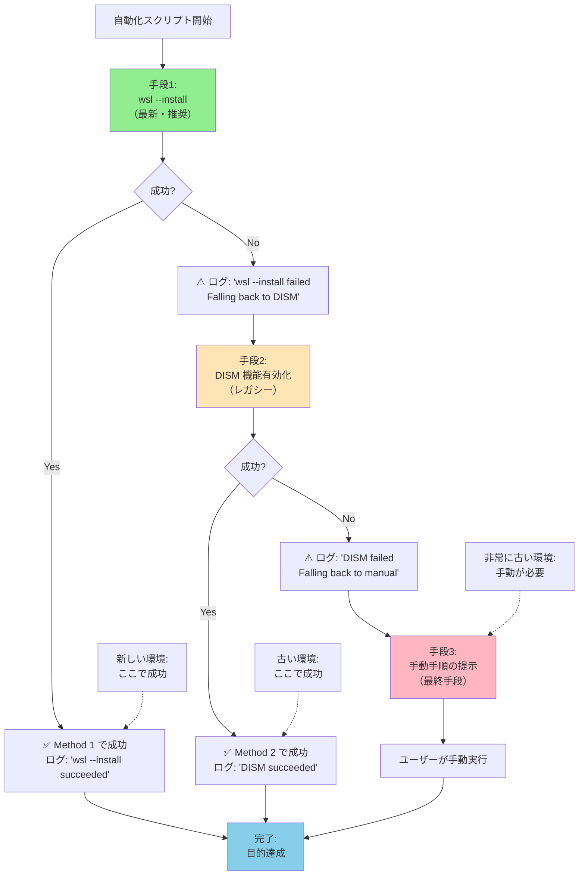

## 要約（Summary）

- 段階的フォールバックとは、推奨手段が失敗した際に、古い・より保守的な手段に自動的に切り替える設計パターンである。
- 新しいAPIやコマンドが使えない古い環境でも、レガシーな方法で同じ目的を達成することで、幅広い環境に対応できる。
- フォールバックの各段階で明確なログを出力することで、どの手段で成功したかを追跡できる。

## 本文（Body）

### 背景・問題意識

ソフトウェアの自動化において、以下のような環境の多様性が問題になる：

**WSL導入の例：**
- **最新環境（Windows 11）**：`wsl --install` が利用可能で、ワンライナーで完結
- **やや古い環境（Windows 10 バージョン 1903〜）**：`wsl --install` は使えないが、DISMによる機能有効化は可能
- **かなり古い環境（Windows 10 バージョン 1903未満）**：WSL2自体が非対応、WSL1のみ

この多様性に対して、以下のアプローチが取られることが多い：

1. **最新のみ対応**：古い環境は「サポート外」として切り捨て
2. **環境ごとに別スクリプト**：事前調査して適切なスクリプトを選定
3. **段階的フォールバック**：スクリプト内で自動判定して最適な手段を選択

3番目のアプローチが、運用コストと対応範囲のバランスが最も良い。

### アイデア・主張

**推奨手段→代替手段→最終手段という段階的なフォールバック構造を組み込むことで、単一スクリプトで幅広い環境に対応でき、トラブル時の切り分けも容易になる。**

段階的フォールバックの設計原則：

1. **最新・推奨手段を最初に試す**：公式が推奨する方法を優先（将来的なサポート、セキュリティ）
2. **失敗を検出してログ出力**：なぜ失敗したか（コマンド不在、権限不足など）を記録
3. **代替手段に自動切り替え**：より古い、より保守的な方法を試行
4. **最終的な失敗は明確に通知**：全手段が失敗した場合、原因と対処法を提示

### 内容を視覚化するMermaid図



### 具体例・ケース

#### 実装例：WSL導入の段階的フォールバック

```powershell
function Install-WSL {
    Write-Host "== WSL 導入開始 =="
    
    # 手段1：wsl --install（最新・推奨）
    Write-Host "試行1: wsl --install を使用"
    try {
        $result = & wsl.exe --install -d Ubuntu-24.04 2>&1
        if ($LASTEXITCODE -eq 0) {
            Write-Host "✅ wsl --install で成功しました"
            return $true
        }
    } catch {
        Write-Host "⚠️  wsl --install が失敗しました"
        Write-Host "理由: $($_.Exception.Message)"
    }
    
    # 手段2：DISM による機能有効化（レガシー）
    Write-Host ""
    Write-Host "試行2: DISM によるレガシー導入"
    try {
        & dism.exe /online /enable-feature `
            /featurename:Microsoft-Windows-Subsystem-Linux /all /norestart | Out-Null
        & dism.exe /online /enable-feature `
            /featurename:VirtualMachinePlatform /all /norestart | Out-Null
        
        Write-Host "✅ DISM で機能を有効化しました"
        Write-Host "注意: 再起動後、Microsoft Store から Ubuntu を手動導入してください"
        return $true
    } catch {
        Write-Host "⚠️  DISM も失敗しました"
        Write-Host "理由: $($_.Exception.Message)"
    }
    
    # 手段3：完全に失敗（手動手順の提示）
    Write-Host ""
    Write-Host "❌ 自動導入に失敗しました"
    Write-Host ""
    Write-Host "【手動での対処方法】"
    Write-Host "  1) Windows のバージョンを確認: winver"
    Write-Host "     → Windows 10 1903 以降、または Windows 11 が必要"
    Write-Host "  2) Microsoft Store から 'Ubuntu' を検索してインストール"
    Write-Host "  3) PowerShell（管理者）で以下を実行："
    Write-Host "     wsl --set-default-version 2"
    Write-Host ""
    Write-Host "参考: https://learn.microsoft.com/windows/wsl/install"
    return $false
}
```

#### パターンの応用：パッケージマネージャーの選択

```bash
# 段階的フォールバック：パッケージマネージャー
install_package() {
    local package=$1
    
    # 手段1：apt（Debian/Ubuntu系）
    if command -v apt-get >/dev/null 2>&1; then
        echo "試行1: apt-get を使用"
        sudo apt-get install -y "$package" && return 0
    fi
    
    # 手段2：yum（RHEL/CentOS系）
    if command -v yum >/dev/null 2>&1; then
        echo "試行2: yum を使用"
        sudo yum install -y "$package" && return 0
    fi
    
    # 手段3：brew（macOS）
    if command -v brew >/dev/null 2>&1; then
        echo "試行3: brew を使用"
        brew install "$package" && return 0
    fi
    
    # 失敗
    echo "❌ どのパッケージマネージャーも利用できません"
    return 1
}
```

### 反論・限界・条件

#### フォールバックの複雑さ

段階的フォールバックは、以下のコストを伴う：

1. **コードの肥大化**：複数の実装パスを維持する必要がある
2. **テストコスト**：各フォールバックパスを実際の環境で検証する必要がある
3. **保守コスト**：古い手段のサポートが続く限り、保守が必要

**判断基準：**
- 対象環境の多様性が高い → フォールバックの価値が高い
- 対象環境が統一されている → シンプルな単一実装で十分

#### フォールバックの終了判断

「どこまで古い環境をサポートするか」は、組織の方針による：

```powershell
# 例：Windows 10 1809 以前は切り捨てる判断
$osVersion = [System.Environment]::OSVersion.Version
if ($osVersion.Build -lt 17763) {  # 1809 = build 17763
    Write-Host "❌ このスクリプトは Windows 10 1809 以降が必要です"
    Write-Host "現在のバージョン: $osVersion"
    exit 1
}
```

明確な「サポート終了ライン」を引くことで、無限のフォールバックを防ぐ。

#### レガシー手段の副作用

古い手段は、新しい手段と完全に同じ結果を保証しない場合がある：

- `wsl --install`：WSL2が既定、自動更新が有効
- DISM：WSL1が既定、手動で設定変更が必要

この違いを吸収するために、フォールバック後に「追加の調整処理」が必要になることがある：

```powershell
if ($usedLegacyMethod) {
    # WSL2 を既定に設定（DISM後に必要）
    wsl --set-default-version 2
}
```

### 関連リンク

- [[20251221114658-wsl-official-install-command-pattern|WSL公式インストールコマンドの活用パターン]]：推奨手段の詳細
- [[20251221114834-mixed-environment-state-absorption|混在環境の状態吸収パターン]]：環境多様性への対応
- [[20251221114928-explicit-manual-intervention-design|完全自動化できない対話ポイントの明示設計]]：最終手段としての手動手順

### 実務への示唆

- **推奨手段を最初に試す**：将来的なサポートやセキュリティを考慮し、公式推奨の方法を優先
- **フォールバックをログに明記**：「どの手段で成功したか」を記録することで、環境の特性を把握できる
- **手動手順の準備**：すべてのフォールバックが失敗した場合の「最終的な逃げ道」を用意しておく
- **サポート範囲の明文化**：どこまでの環境をサポートするかをドキュメント化し、組織で合意を取る
- **段階的な廃止**：古いフォールバックは、一定期間後に廃止する計画を立てる（deprecation policy）
