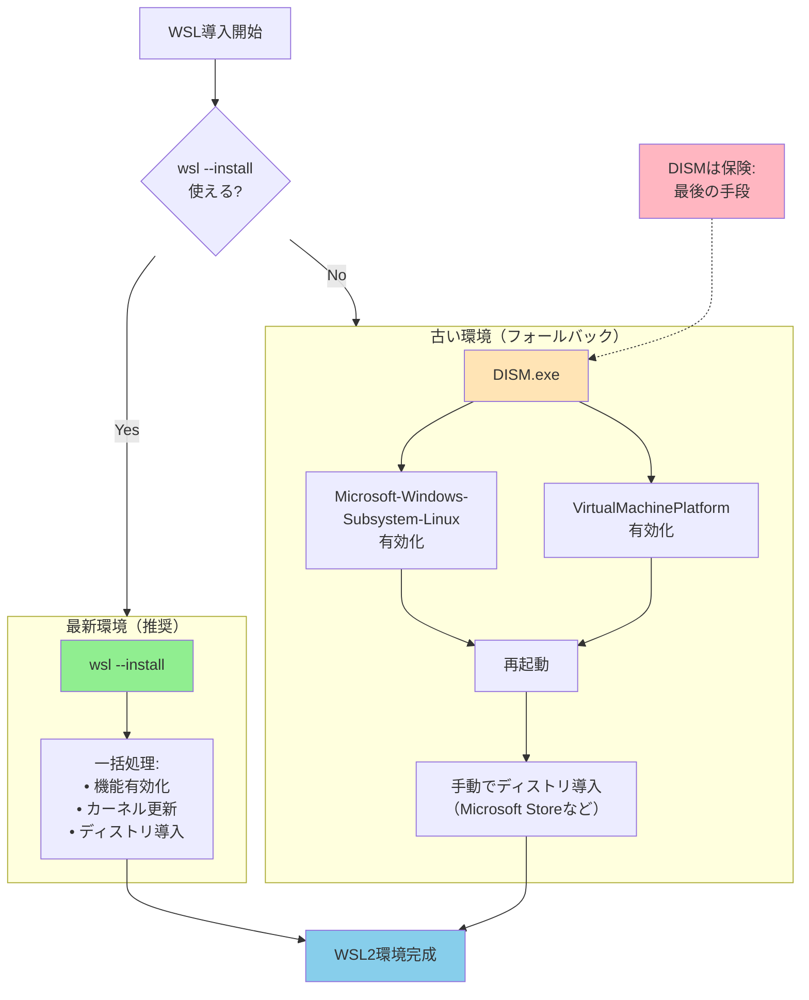

## 要約（Summary）

- DISM（Deployment Image Servicing and Management）は、Windows標準の機能管理ツールで、OSの機能有効化/無効化やイメージ保守を行う。
- WSL導入において、`wsl --install`が使えない古い環境でのフォールバック手段として、DISMで必要なWindows機能を手動有効化できる。
- 現代の推奨は`wsl --install`であり、DISMはあくまで「保険」としての位置づけである。

## 本文（Body）

### 背景・問題意識

Windows Subsystem for Linux（WSL）を導入する際、理想的には`wsl --install`というワンライナーで完結する。しかし、以下のような環境では、このコマンドが利用できない：

- **古いWindowsバージョン**（Windows 10 1903以前など）
- **企業ポリシーで制限された環境**（Microsoft Storeへのアクセス制限など）
- **Windows Updateが適用されていない環境**

このような場合でも、WSLの基盤となるWindows機能を個別に有効化できれば、手動でWSLを動作させることが可能になる。その手段がDISMである。

### アイデア・主張

**DISMは、Windows標準の機能管理ツールとして、新しいコマンドが使えない環境でもOSレベルの機能を確実に制御できる「最後の砦」である。**

DISMの特徴：

1. **Windows標準搭載**：追加インストール不要、すべてのWindows環境で利用可能
2. **低レベルな制御**：Windows機能の直接的な有効化/無効化が可能
3. **スクリプト可能**：コマンドライン経由で自動化に組み込める
4. **再起動制御**：`/norestart`オプションで再起動タイミングを制御可能

### 内容を視覚化するMermaid図



### 具体例・ケース

#### DISMの基本構文

```powershell
# 一般的な構文
dism.exe /online /enable-feature /featurename:<機能名> [オプション]

# パラメータ説明：
# /online        : 現在稼働中のWindowsを対象にする
# /enable-feature: 機能を有効化する
# /featurename   : 有効化する機能の名前
# /all           : すべての依存機能も有効化
# /norestart     : 自動再起動を抑制（手動で再起動タイミングを制御）
```

#### WSL導入に必要な2つの機能

```powershell
# 機能1：WSL本体
dism.exe /online /enable-feature `
    /featurename:Microsoft-Windows-Subsystem-Linux /all /norestart

# 機能2：WSL2用の仮想化基盤
dism.exe /online /enable-feature `
    /featurename:VirtualMachinePlatform /all /norestart
```

**Microsoft-Windows-Subsystem-Linux**
- WSLのコア機能を提供
- WSL1の実行に必須
- WSL2の前提条件でもある

**VirtualMachinePlatform**
- Hyper-Vベースの軽量仮想化機能
- WSL2が使う仮想マシン環境を提供
- WSL1だけなら不要だが、WSL2には必須

#### 実際のスクリプト例

```powershell
function Enable-WSLFeaturesLegacy {
    Write-Host "DISMによるWSL機能有効化（レガシーフォールバック）"
    
    try {
        # 両方の機能を有効化
        & dism.exe /online /enable-feature `
            /featurename:Microsoft-Windows-Subsystem-Linux /all /norestart | Out-Null
        & dism.exe /online /enable-feature `
            /featurename:VirtualMachinePlatform /all /norestart | Out-Null
        
        Write-Host "✅ 機能の有効化が完了しました"
        Write-Host ""
        Write-Host "【次のステップ】"
        Write-Host "  1) 再起動してください"
        Write-Host "  2) Microsoft Store から Ubuntu を検索してインストール"
        Write-Host "  3) wsl --set-default-version 2 を実行"
        
        return $true
    } catch {
        Write-Host "❌ DISM による機能有効化に失敗しました"
        Write-Host "理由: $($_.Exception.Message)"
        return $false
    }
}
```

### 反論・限界・条件

#### DISMだけでは完結しない

DISMはあくまで「Windows機能の有効化」までしかできない：

| 作業 | `wsl --install` | DISM |
|------|----------------|------|
| Windows機能有効化 | ✅ 自動 | ✅ 手動 |
| WSLカーネル更新 | ✅ 自動 | ❌ 別途必要 |
| ディストリ導入 | ✅ 自動 | ❌ 別途必要 |
| WSL2設定 | ✅ 自動 | ❌ 別途必要 |

つまり、DISMを使った場合、以降の作業は手動またはスクリプトで別途実施する必要がある。

#### 再起動の必要性

DISMで機能を有効化した後は、ほぼ必ず再起動が必要：

```powershell
# 再起動が必要かチェック（簡易版）
function Test-RebootPending {
    $keys = @(
        "HKLM:\SOFTWARE\Microsoft\Windows\CurrentVersion\Component Based Servicing\RebootPending"
    )
    foreach ($k in $keys) { if (Test-Path $k) { return $true } }
    return $false
}

if (Test-RebootPending) {
    Write-Host "⚠️  再起動が必要です"
}
```

`/norestart`オプションは便利だが、実際には「再起動を後回しにしているだけ」であり、機能は再起動後に初めて利用可能になる。

#### 権限要件

DISMは管理者権限が必須：

```powershell
# 管理者チェック
$isAdmin = ([Security.Principal.WindowsPrincipal] `
    [Security.Principal.WindowsIdentity]::GetCurrent() `
).IsInRole([Security.Principal.WindowsBuiltInRole]::Administrator)

if (-not $isAdmin) {
    throw "DISMの実行には管理者権限が必要です"
}
```

#### 企業環境での制約

企業ポリシーによっては、DISMの実行自体が制限されている場合がある：
- グループポリシーによる機能制限
- セキュリティソフトによるブロック
- 社内規定による変更禁止

この場合、IT部門への申請や例外承認が必要になる。

### 関連リンク

- [[20251221115031-gradual-fallback-error-handling|段階的フォールバックによるエラーハンドリング]]：DISMをフォールバック手段として位置づける設計
- [[20251221114658-wsl-official-install-command-pattern|WSL公式インストールコマンドの活用パターン]]：DISMより優先すべき推奨手段
- [[20251221114834-mixed-environment-state-absorption|混在環境の状態吸収パターン]]：新旧環境を単一スクリプトで扱う

### 実務への示唆

- **推奨手段を優先**：DISMはあくまで「最後の手段」として位置づけ、まず`wsl --install`を試すべき
- **完了後のステップを明示**：DISMだけでは不完全であることをユーザーに明確に伝える
- **再起動タイミングの制御**：`/norestart`で再起動を抑制し、ユーザーに適切なタイミングを選ばせる
- **エラーハンドリング**：DISM実行時のエラー（権限不足、ポリシー制限など）を適切に検出して通知
- **ログの保存**：DISM実行結果をログファイルに保存しておくことで、トラブル時の切り分けが容易になる

```powershell
# ログ付きDISM実行例
$logPath = "$env:TEMP\dism_wsl_install.log"
& dism.exe /online /enable-feature `
    /featurename:Microsoft-Windows-Subsystem-Linux `
    /all /norestart /logpath:$logPath
```

- **代替手段の案内**：DISMも失敗する場合の「完全手動手順」を準備しておく
