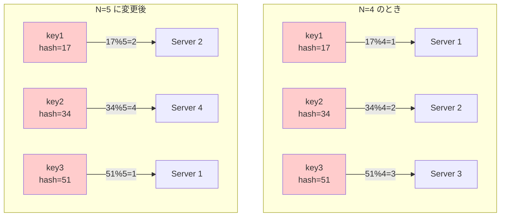

## 要約（Summary）

- `serverIndex = hash(key) % N` という単純なモジュロ法は、サーバ台数 N が変わると全キーの割り当てが大崩れする。
- サーバを1台追加・削除するだけで、ほぼ全キーの割り当て先が変わり、キャッシュミスやデータ再配置のコストが極めて大きくなる。
- この問題が [[20251221152241-consistent-hashing-design-goal|Consistent Hashingの設計目的]] を生み出した。

## 本文（Body）

分散システムでキー（traceID、userID、cache key など）をサーバに割り当てる最も単純な方法は、モジュロ演算を使うことである。

### 背景・問題意識

N 台のサーバがあるとき、どのキーをどのサーバに送るかを決定する必要がある。この問題は以下のような場面で頻繁に発生する：

- **分散キャッシュ**: キャッシュキーをどのサーバに保存するか
- **分散トレーシング**: トレースIDをどのコレクターに送るか
- **データシャーディング**: ユーザーIDをどのDBシャードに配置するか

### 単純モジュロ法のアルゴリズム

最も素朴な解決策は次の式である：

```
serverIndex = hash(key) % N
```

- `hash(key)`: キーをハッシュ関数に通して数値化
- `% N`: サーバ台数 N で割った余りを計算
- 結果は 0 から N-1 の範囲になり、これがサーバのインデックスになる

例：N=4 の場合
- `hash("user123") = 17` → `17 % 4 = 1` → サーバ1
- `hash("user456") = 34` → `34 % 4 = 2` → サーバ2

### 致命的な問題：サーバ増減時の全面的な再配置

この方式の問題は、**N が変わると割り当てが全面的に崩れる**ことである。

**例：N=4 → N=5 に変更**

| キー | hash値 | N=4 での割り当て | N=5 での割り当て |
|------|--------|------------------|------------------|
| user123 | 17 | 17%4=1 (サーバ1) | 17%5=2 (サーバ2) |
| user456 | 34 | 34%4=2 (サーバ2) | 34%5=4 (サーバ4) |
| user789 | 51 | 51%4=3 (サーバ3) | 51%5=1 (サーバ1) |

サーバを1台追加しただけで、ほぼ全キーの割り当て先が変わってしまう。

### 内容を視覚化するMermaid図



### 具体例・ケース

**分散キャッシュでの影響**：
- 4台から5台に増やすと、キャッシュの割り当てがほぼ全て変わる
- 結果として「ほぼ全キャッシュミス」が発生
- システム全体のパフォーマンスが一時的に激しく劣化

**分散トレーシングでの影響**：
- OpenTelemetry Collectorを1台追加すると、全トレースの担当が変わる
- データの連続性が失われ、トレース分析が困難になる

### 数学的な分析

N=4 から N=5 に変更したとき、割り当てが変わらないキーは、以下の条件を満たすものだけである：

```
hash(key) % 4 = hash(key) % 5
```

この条件を満たすのは、`hash(key)` が 20 の倍数（lcm(4,5)=20）のときのみ。つまり、**約 95% のキーで割り当てが変わる**。

### 反論・限界・条件

この問題が「許容できる」場面もある：

- **サーバ構成が完全に固定**されている場合
- **データが永続化されず**、割り当てがリセットされても問題ない場合（例：セッションレスなリクエスト振り分け）
- システムの規模が小さく、全データの再配置コストが無視できる場合

しかし、スケーラブルな分散システムでは、サーバの増減は日常的に発生するため、この方式は実用的ではない。

## 関連ノート（Related Notes）

- [[20251221152241-consistent-hashing-design-goal|Consistent Hashingの設計目的とキー移動最小化]] - この問題を解決するConsistent Hashingの設計目的
- [[20251221152242-hash-ring-structure|Hash Ring（ハッシュリング）の構造と円環ハッシュ空間]] - Consistent Hashingの基盤となるリング構造

## メタ情報

- **現在の理解度**: 5/5（基本的な問題として確立）
- **実務での重要度**: 高（分散システム設計の基礎知識）
