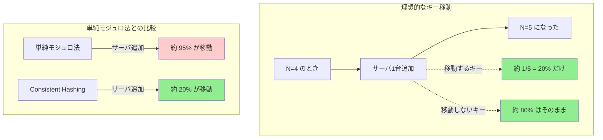

## 要約（Summary）

- Consistent Hashingは、サーバを追加・削除しても**移動するキーを最小限にする**ことを目的とした分散アルゴリズム。
- 理想的には、サーバ1台追加で全キーの約 `1/(N+1)` だけが移動し、削除時はそのサーバ担当分だけが移動する。
- [[20251221152240-simple-modulo-load-balancing-problem|単純モジュロ法の問題]] を解決し、スケーラブルな分散システムを実現する。

## 本文（Body）

Consistent Hashing（一貫性ハッシュ）は、分散システムにおけるキー割り当て問題を解決するために設計されたアルゴリズムである。その核心は「サーバ構成の変更時に、影響を受けるキーを最小限にする」ことにある。

### 背景・問題意識

[[20251221152240-simple-modulo-load-balancing-problem|単純モジュロ法]] では、サーバを1台追加・削除するだけで、ほぼ全キーの割り当てが変わってしまう。この問題は以下のような実害を引き起こす：

- **分散キャッシュ**: 全キャッシュミスによる性能劣化
- **データシャーディング**: 大量のデータ移動によるネットワーク負荷
- **分散トレーシング**: データの連続性喪失

スケーラブルな分散システムでは、サーバの増減は日常的に発生するため、この問題を解決する必要があった。

### アイデア・主張

Consistent Hashingの核心的な設計目標は、次の2つである：

**1. サーバ追加時の局所的影響**
- サーバを1台追加 → 全キーのうち約 `1/(N+1)` だけが移動
- N=4 → N=5 なら、約 20% のキーだけが移動すればよい

**2. サーバ削除時の局所的影響**
- サーバを1台削除 → そのサーバが担当していたキーだけが再配置される
- 他のサーバ間でのキー移動は発生しない

この性質により、「スケールアウト/スケールイン時のコストが予測可能」になる。

### 内容を視覚化するMermaid図



### 数学的な分析

**サーバ追加時の理想的な挙動**：

N 台のサーバで全キーが均等に分散されている場合、各サーバは全体の `1/N` を担当している。

N+1 台に増やすと、各サーバは `1/(N+1)` を担当すべきである。

したがって、各既存サーバから新サーバに渡すべきキーは：
```
1/N - 1/(N+1) = 1/(N(N+1))
```

これを N 台分合計すると：
```
N × 1/(N(N+1)) = 1/(N+1)
```

つまり、**全キーの `1/(N+1)` だけが新サーバに移動すればよい**。

### 具体例・ケース

**分散キャッシュの例**：
- 現在4台で100万キーを管理（各25万キー）
- 5台に増やすと、各サーバは20万キーを担当すべき
- 移動するキーは合計20万（全体の20%）
- 80万キーはキャッシュヒットを維持

**分散トレーシングの例（OpenTelemetry Collector）**：
- [[202511291440-load-balancing-exporter|Load Balancing Exporter]] でConsistent Hashingを使用
- Collectorを1台追加しても、約20%のトレースだけがルーティング変更される
- 80%のトレースは同じCollectorに送られ続け、データの連続性を維持

### 実装の鍵：Hash Ring

この理想的な挙動を実現する鍵が [[20251221152242-hash-ring-structure|Hash Ring（ハッシュリング）]] という構造である。リング上にサーバとキーを配置することで、局所的な影響だけで済むようになる。

### 反論・限界・条件

**理論と実装のギャップ**：
- 上記の理想的な分布は、ハッシュ関数が完全にランダムであることを前提としている
- 実際には、サーバ数が少ないと偏りが生じる
- この問題は [[20251221152245-virtual-nodes|仮想ノード（Virtual Nodes）]] で緩和される

**オーバーヘッド**：
- 単純モジュロ法（O(1)）に比べて、ルックアップが O(log N) になる
- ただし、この差は実用上ほとんど問題にならない

## 関連ノート（Related Notes）

- [[20251221152240-simple-modulo-load-balancing-problem|単純モジュロ法による負荷分散の問題]] - Consistent Hashingが解決する問題
- [[20251221152242-hash-ring-structure|Hash Ring（ハッシュリング）の構造と円環ハッシュ空間]] - 実装の基盤となるリング構造
- [[20251221152243-consistent-hash-ring-algorithm|Consistent Hash Ringのアルゴリズム（サーバとキーの配置）]] - 具体的なアルゴリズム
- [[202511291440-load-balancing-exporter|OpenTelemetry Collector Load Balancing Exporterの概要]] - OpenTelemetryでの実装例

## メタ情報

- **現在の理解度**: 5/5（設計目的は明確）
- **実務での重要度**: 高（分散システム設計の基礎パターン）
