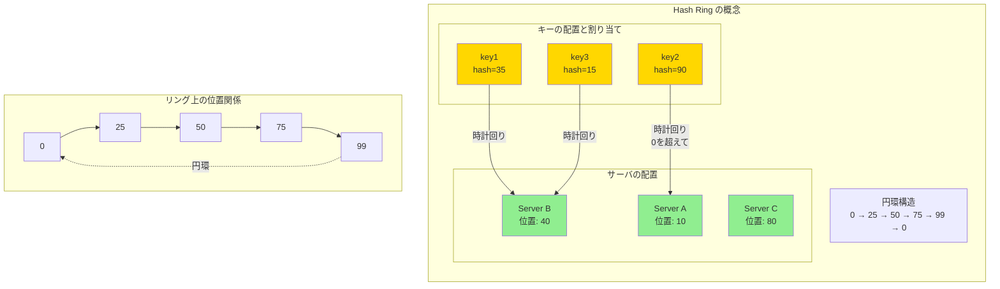

## 要約（Summary）

- Hash Ringは、ハッシュ値の空間を**円環（最大値の次が0に戻る）**として扱う概念。
- 通常は 0 〜 2³²-1 のような巨大な空間を想定し、この空間上にサーバとキーを配置する。
- この「リング構造」が [[20251221152241-consistent-hashing-design-goal|Consistent Hashingの局所的影響]] を実現する基盤となる。

## 本文（Body）

Hash Ring（ハッシュリング）は、Consistent Hashingの実装において中核となるデータ構造である。その本質は「ハッシュ値の空間を円（リング）として扱う」ことにある。

### 背景・問題意識

[[20251221152241-consistent-hashing-design-goal|Consistent Hashing]] は「サーバ増減時にキー移動を最小化する」ことを目的とする。しかし、単純に「サーバとキーをハッシュ値で並べる」だけでは、この目的を達成できない。

鍵となるのは「**空間の両端をつなげる**」という発想である。

### アイデア・主張

Hash Ringの核心は、次の2点である：

**1. 円環構造（Circular Structure）**
- ハッシュ値の空間（例：0 〜 2³²-1）を直線ではなく円として扱う
- 最大値（2³²-1）の次は 0 に戻る
- これにより「始点」と「終点」の特別扱いが不要になる

**2. 時計回り探索（Clockwise Lookup）**
- キーの位置から時計回りに進んで、最初に出会うサーバが担当する
- この単純なルールが、局所的な影響を生み出す

### 内容を視覚化するMermaid図



### 具体例：小さなリングで理解する

**設定**：
- ハッシュ空間：0 〜 99（実際は 0 〜 2³²-1 だが、説明のため簡略化）
- サーバ：A(10), B(40), C(80)

**キーの割り当て**：

| キー | ハッシュ値 | 時計回りで最初のサーバ | 担当サーバ |
|------|-----------|----------------------|-----------|
| key1 | 35 | 40 | B |
| key2 | 15 | 40 | B |
| key3 | 45 | 80 | C |
| key4 | 90 | 10（0を超えて） | A |
| key5 | 5 | 10 | A |

**重要な観察**：
- key4（90）は、99を超えて0に戻り、時計回りで最初に出会うA(10)が担当
- これが「円環」の意味：空間に始点・終点がない

### 実装上のバリエーション

**1. ハッシュ空間のサイズ**：
- 標準的には 2³² または 2⁶⁴
- OpenTelemetry Collectorの実装例では `maxPositions=36000`（0〜35999）を使用
- 小さい空間でも原理は同じ

**2. 離散リングと連続リング**：
- **離散リング**：固定数の位置（例：36000）にサーバを配置
- **連続リング**：任意のハッシュ値の位置を許容
- 実装の簡便性から離散リングが使われることが多い

### 数学的な性質

**円環の数学的表現**：
```
position = hash(key) % maxPositions
```

**時計回り探索**：
- キーの位置 `k` から始めて、`k, k+1, k+2, ...` と探索
- `maxPositions-1` の次は 0 に戻る（モジュロ演算）

**距離の計算**：
サーバ位置 `s`、キー位置 `k` のとき、時計回りの距離は：
```
distance = (s - k + maxPositions) % maxPositions
```

### 関連：OpenTelemetry での実装

[[202511291440-load-balancing-exporter|Load Balancing Exporter]] では、次のような実装になっている：

- `maxPositions = 36000`
- 各サーバは `defaultWeight = 100` 個の位置を占める（[[20251221152245-virtual-nodes|仮想ノード]]）
- 衝突時は linear probing で次の空き位置を探す

### 反論・限界・条件

**円環である必要性**：
- 実は「円環」でなくても、始点・終点を特別扱いすれば同じ効果は得られる
- しかし、円環として扱うことで実装が単純化され、エッジケースが減る

**ハッシュ空間のサイズ**：
- 小さすぎると衝突が増える
- 大きすぎるとメモリ効率が悪化（離散リングの場合）
- 実用上は 2¹⁶ 〜 2³² 程度が多い

## 関連ノート（Related Notes）

- [[20251221152241-consistent-hashing-design-goal|Consistent Hashingの設計目的とキー移動最小化]] - このリング構造が実現する目的
- [[20251221152243-consistent-hash-ring-algorithm|Consistent Hash Ringのアルゴリズム（サーバとキーの配置）]] - リング上でのサーバとキーの配置アルゴリズム
- [[20251221152245-virtual-nodes|仮想ノード（Virtual Nodes）による負荷分散の均一化]] - リング上に複数の点を置く仮想ノード
- [[202511291440-load-balancing-exporter|OpenTelemetry Collector Load Balancing Exporterの概要]] - OpenTelemetryでの実装例

## メタ情報

- **現在の理解度**: 5/5（基本構造として確立）
- **実務での重要度**: 高（Consistent Hashingの基盤）
