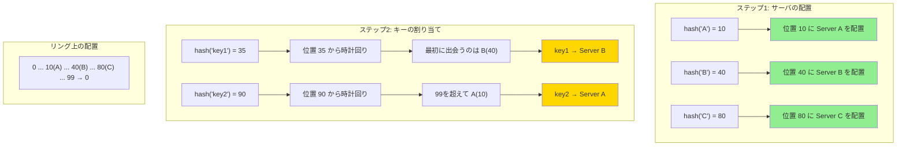

## 要約（Summary）

- Consistent Hash Ringのアルゴリズムは、サーバとキーをリング上に配置し、時計回りで探索する2段階の手順。
- ステップ1：各サーバをハッシュしてリング上に配置する。
- ステップ2：各キーをハッシュしてリング上に配置し、時計回りで最初に出会うサーバを担当とする。

## 本文（Body）

[[20251221152242-hash-ring-structure|Hash Ring]] 上でサーバとキーを配置する具体的なアルゴリズムは、驚くほどシンプルである。

### 背景・問題意識

[[20251221152241-consistent-hashing-design-goal|Consistent Hashingの目的]] は、サーバ増減時のキー移動を最小化することである。[[20251221152242-hash-ring-structure|Hash Ring]] という構造を用意したが、具体的にどうサーバとキーを配置するのか？

### アルゴリズム：2段階の手順

**ステップ1：サーバをリング上に配置（Setup Phase）**

各サーバ名（例："A", "B", "C"）をハッシュ関数に通して、リング上の位置を決める。

```
position(server) = hash(server_name) % maxPositions
```

例（maxPositions=100 の場合）：
- Server A → hash("A") % 100 = 10
- Server B → hash("B") % 100 = 40
- Server C → hash("C") % 100 = 80

これでリング上に3つの点が決まった。

**ステップ2：キーの担当サーバを探す（Lookup Phase）**

キー（例："key1"）をハッシュ関数に通して、リング上の位置を決める。

```
position(key) = hash(key) % maxPositions
```

その位置から時計回りに進んで、**最初に出会うサーバ**が担当する。

例：
- key1 → hash("key1") % 100 = 35
- 35から時計回りに進むと、最初に出会うのは B(40)
- **key1 の担当は Server B**

### 内容を視覚化するMermaid図



### 具体例：完全な手順

**設定**：
- maxPositions = 100
- サーバ：A, B, C
- キー：key1, key2, key3, key4

**ステップ1：サーバを配置**

```python
servers = ["A", "B", "C"]
ring = {}

for server in servers:
    position = hash(server) % 100
    ring[position] = server

# 結果: {10: "A", 40: "B", 80: "C"}
```

**ステップ2：キーの担当を決定**

```python
keys = ["key1", "key2", "key3", "key4"]

for key in keys:
    key_position = hash(key) % 100
    
    # 時計回りで最初のサーバを探す
    for pos in range(key_position, key_position + 100):
        actual_pos = pos % 100
        if actual_pos in ring:
            assigned_server = ring[actual_pos]
            print(f"{key} → {assigned_server}")
            break
```

**結果**：
| キー | ハッシュ値 | 担当サーバ | 理由 |
|------|-----------|-----------|------|
| key1 | 35 | B | 35→40（B） |
| key2 | 90 | A | 90→99→0→10（A） |
| key3 | 15 | B | 15→40（B） |
| key4 | 75 | C | 75→80（C） |

### 時計回り探索の実装

**ナイーブな実装**：
```python
def find_server(key_position, ring_positions):
    # ring_positions はソート済みのサーバ位置リスト
    for server_pos in ring_positions:
        if server_pos >= key_position:
            return server_pos
    # リング上でラップアラウンド
    return ring_positions[0]
```

**効率的な実装（二分探索）**：
```python
def find_server(key_position, ring_positions):
    # O(log N) での探索
    idx = bisect.bisect_left(ring_positions, key_position)
    if idx == len(ring_positions):
        return ring_positions[0]  # ラップアラウンド
    return ring_positions[idx]
```

### 関連：OpenTelemetry での実装詳細

[[202511291440-load-balancing-exporter|Load Balancing Exporter]] では：

1. **サーバ配置**：各 endpoint を `weight` 回（デフォルト100回）ハッシュして配置（[[20251221152245-virtual-nodes|仮想ノード]]）
2. **衝突処理**：linear probing で次の空き位置を探す
3. **キー探索**：traceID をハッシュして、最も近いサーバを二分探索で発見

### 反論・限界・条件

**ハッシュ関数の選択**：
- 分布が偏ったハッシュ関数を使うと、負荷が偏る
- 実用上は MD5、SHA-1、MurmurHash などの均等分布ハッシュを使う

**サーバが少ない場合の偏り**：
- サーバが3台しかない場合、各サーバの担当範囲がバラバラになりやすい
- 例：A が 5%、B が 60%、C が 35% のようなケース
- この問題は [[20251221152245-virtual-nodes|仮想ノード]] で解決される

## 関連ノート（Related Notes）

- [[20251221152242-hash-ring-structure|Hash Ring（ハッシュリング）の構造と円環ハッシュ空間]] - このアルゴリズムが動作する基盤
- [[20251221152244-consistent-hashing-locality-principle|Consistent Hashingの局所的影響の原理]] - なぜこのアルゴリズムが局所的影響を生むのか
- [[20251221152245-virtual-nodes|仮想ノード（Virtual Nodes）による負荷分散の均一化]] - 負荷偏りを解消する拡張
- [[202511291440-load-balancing-exporter|OpenTelemetry Collector Load Balancing Exporterの概要]] - OpenTelemetryでの実装例

## メタ情報

- **現在の理解度**: 5/5（基本アルゴリズムとして確立）
- **実務での重要度**: 高（実装の起点）
