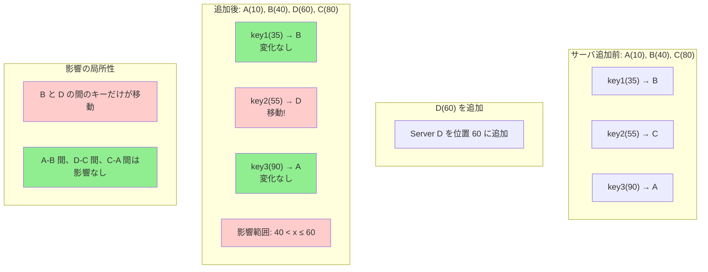

## 要約（Summary）

- Consistent Hashingがスケーラブルな理由は、サーバ追加・削除時に**影響が局所的**であること。
- サーバを1台追加すると、リング上でそのサーバが「割り込んだ区間」のキーだけが移動する。
- それ以外のキーは元の担当サーバのままで、全面的なシャッフルが起きない。

## 本文（Body）

[[20251221152241-consistent-hashing-design-goal|Consistent Hashingの設計目的]] は「サーバ増減時のキー移動を最小化すること」である。その目的を達成する鍵が「局所的影響（Locality）」の原理である。

### 背景・問題意識

[[20251221152240-simple-modulo-load-balancing-problem|単純モジュロ法]] では、サーバを1台追加するだけで、ほぼ全キーの割り当てが変わってしまう。これは「**グローバルな影響**」と呼べる。

対照的に、Consistent Hashingでは影響が「**局所的**」に留まる。なぜそうなるのか？

### アイデア・主張

局所的影響の本質は、[[20251221152242-hash-ring-structure|Hash Ring]] の構造に由来する：

**サーバ追加時の影響範囲**：
- 新サーバがリング上の位置 `p` に追加される
- 影響を受けるのは「時計回りで直前のサーバから `p` まで」の区間のキーだけ
- それ以外の区間のキーは、元の担当サーバのまま変化しない

**サーバ削除時の影響範囲**：
- サーバ `S` を削除すると、`S` が担当していたキーが次のサーバに移る
- `S` 以外のサーバ間でのキー移動は発生しない

### 内容を視覚化するMermaid図



### 具体例：サーバ追加のステップバイステップ

**初期状態**：
- サーバ：A(10), B(40), C(80)
- ハッシュ空間：0〜99

各サーバの担当範囲：
- A：81〜10（リングをまたぐ）
- B：11〜40
- C：41〜80

**サーバ D(60) を追加**：

新しい担当範囲：
- A：81〜10（**変化なし**）
- B：11〜40（**変化なし**）
- **D：41〜60（新規）** ← Cから奪う
- C：61〜80（Cの範囲が縮小）

**キーの移動**：
| キー | ハッシュ値 | 追加前 | 追加後 | 移動？ |
|------|-----------|--------|--------|--------|
| key1 | 35 | B | B | ✗ |
| key2 | 55 | C | D | ✓ |
| key3 | 65 | C | C | ✗ |
| key4 | 90 | A | A | ✗ |

**観察**：
- 影響を受けるのは「40 < hash ≤ 60」のキーだけ（全体の20%）
- key1, key3, key4 は担当が変わらない（80%）

### 数学的な分析

**サーバ追加時の影響範囲**：

新サーバ `D` が位置 `d` に追加されるとき、影響を受けるのは：
- 時計回りで `D` の直前のサーバ（`B` とする）の位置を `b` とする
- 範囲 `(b, d]` のキーだけが `B → D` に移動

影響を受けるキーの割合：
```
(d - b) / maxPositions
```

例：B(40)、D(60)、maxPositions=100 の場合：
```
(60 - 40) / 100 = 20%
```

**一般的なケース**：
サーバが N 台で均等分布している場合、各サーバの担当範囲は約 `1/N`。
新サーバを追加すると、影響を受けるのは約 `1/(N+1)` のキーだけ。

### サーバ削除時の局所性

**サーバ B(40) を削除**：

削除前の担当範囲：
- A：81〜10
- B：11〜40
- C：41〜80

削除後：
- A：81〜10（**変化なし**）
- C：41〜80 → 11〜80（Bの範囲を引き継ぐ）

**キーの移動**：
- Bが担当していたキー（11〜40）は、全てCに移動
- A-C 間の境界には影響なし

### 対比：単純モジュロ法の非局所性

[[20251221152240-simple-modulo-load-balancing-problem|単純モジュロ法]] では：
- サーバ追加で `% N` が `% (N+1)` に変わる
- 全キーで余りの計算結果が変わる可能性がある
- **影響がグローバル**

Consistent Hashingでは：
- サーバ追加でリング上の1点が増える
- 影響は「その点の前後の区間」だけ
- **影響が局所的**

### 反論・限界・条件

**完全な局所性ではない**：
- 上記の例では「きれいに20%」だが、実際はハッシュ関数の分布に依存
- サーバ数が少ないと、1台の追加でも30〜40%が移動することもある

**[[20251221152245-virtual-nodes|仮想ノード]]の効果**：
- 仮想ノードを使うと、1つの物理サーバが複数の点を占める
- これにより影響がさらに分散され、局所性が強化される

## 関連ノート（Related Notes）

- [[20251221152241-consistent-hashing-design-goal|Consistent Hashingの設計目的とキー移動最小化]] - この局所性が実現する目的
- [[20251221152242-hash-ring-structure|Hash Ring（ハッシュリング）の構造と円環ハッシュ空間]] - 局所性を生み出す構造
- [[20251221152243-consistent-hash-ring-algorithm|Consistent Hash Ringのアルゴリズム（サーバとキーの配置）]] - 具体的なアルゴリズム
- [[20251221152245-virtual-nodes|仮想ノード（Virtual Nodes）による負荷分散の均一化]] - 局所性をさらに改善する手法
- [[20251221152240-simple-modulo-load-balancing-problem|単純モジュロ法による負荷分散の問題]] - 局所性がない場合の問題

## メタ情報

- **現在の理解度**: 5/5（原理として明確）
- **実務での重要度**: 高（Consistent Hashingの核心的利点）
