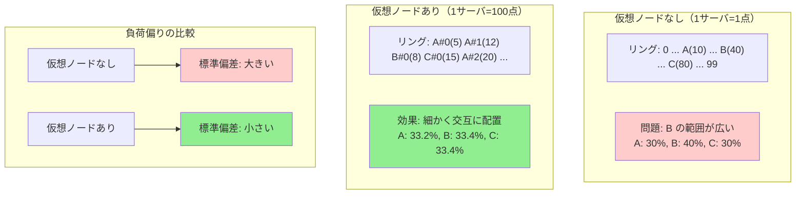

## 要約（Summary）

- 仮想ノード（Virtual Nodes）は、1つの物理サーバを複数の点としてリング上に配置する手法。
- サーバをリング上に1点だけ置くと、区間の長さがバラついて負荷が偏りやすい問題を解決する。
- 例えば1サーバあたり100点配置すると、担当範囲が細かく分割され、負荷が均等化される。

## 本文（Body）

[[20251221152243-consistent-hash-ring-algorithm|Consistent Hash Ringの基本アルゴリズム]] では、各サーバをリング上の1点に配置する。しかし、これには**負荷偏り（Load Imbalance）**という問題がある。

### 背景・問題意識

**基本アルゴリズムの問題**：

サーバを3台（A, B, C）だけ配置した場合：
- ハッシュ関数の結果次第で、各サーバの担当範囲がバラバラになる
- 例：A が5%、B が60%、C が35% のような偏りが起きやすい

これは特に**サーバ数が少ない場合**に顕著である。

**理想的な状態**：
- 各サーバの担当範囲が均等（N 台なら各 1/N）
- 負荷が公平に分散される

しかし、各サーバを1点だけに配置すると、この理想には届かない。

### アイデア・主張

仮想ノード（Virtual Nodes）の核心的なアイデアは：

**1つの物理サーバを複数の「仮想サーバ」として扱う**

- 物理サーバ A を、A#0, A#1, A#2, ..., A#99 という100個の仮想ノードに分身させる
- 各仮想ノードを独立にハッシュして、リング上の異なる位置に配置する
- キーが割り当てられるのは「仮想ノード」だが、実際の処理は「物理サーバ」が行う

この手法により、担当範囲が細かく分割され、負荷が均等化される。

### 内容を視覚化するMermaid図



### 具体例：3サーバで仮想ノードの効果を見る

**設定**：
- 物理サーバ：A, B, C（3台）
- ハッシュ空間：0〜99

**ケース1：仮想ノードなし（各サーバ1点）**

```
A(10), B(40), C(80)
```

各サーバの担当範囲：
- A：81〜10 = 30 単位（30%）
- B：11〜40 = 30 単位（30%）
- C：41〜80 = 40 単位（40%）

→ Cが過負荷

**ケース2：仮想ノード100個（各サーバ100点）**

```python
for server in ["A", "B", "C"]:
    for i in range(100):
        virtual_name = f"{server}#{i}"
        position = hash(virtual_name) % 100
        ring[position] = server  # 物理サーバを記録
```

結果（概算）：
- リング上に約300点が（ほぼ）ランダムに配置される
- 各サーバの担当範囲：約33点ずつ（33%ずつ）

→ 負荷が均等化

### 数学的な分析

**負荷偏りの標準偏差**：

仮想ノード数を $v$ とすると、負荷偏りの標準偏差は：

$$\sigma \propto \frac{1}{\sqrt{v}}$$

つまり、仮想ノード数を増やすほど偏りが減る。

**具体的な数値**：
- $v = 1$（仮想ノードなし）：標準偏差 約15%
- $v = 10$：標準偏差 約5%
- $v = 100$：標準偏差 約1.5%
- $v = 1000$：標準偏差 約0.5%

### 実装上のトレードオフ

**メリット**：
- 負荷が均等化される
- [[20251221152244-consistent-hashing-locality-principle|局所的影響]] がさらに細かく分散される

**デメリット**：
- メモリ使用量が増える（N サーバ × v 仮想ノード分のエントリ）
- ルックアップの計算量が O(log(N×v)) になる（ただし実用上問題なし）

**実用的な値**：
- v = 100〜150 が一般的
- これで十分な均等化が得られ、メモリ・計算コストも許容範囲

### 関連：OpenTelemetry での実装

[[202511291440-load-balancing-exporter|Load Balancing Exporter]] では：

```go
const defaultWeight = 100  // 各endpointを100点配置
```

- 各 OpenTelemetry Collector エンドポイントを100個の仮想ノードとして配置
- これにより、トレースの負荷が均等に分散される
- コード例：
  ```go
  for i := 0; i < endpoint.weight; i++ {
      virtualName := fmt.Sprintf("%s-%d", endpoint.name, i)
      position := hash(virtualName) % maxPositions
      ring[position] = endpoint
  }
  ```

### 仮想ノード数の選び方

**経験則**：
- **サーバ数が少ない**（〜10台）：v = 100〜150
- **サーバ数が中程度**（10〜100台）：v = 50〜100
- **サーバ数が多い**（100台〜）：v = 10〜50

サーバ数が多いほど、仮想ノードなしでもある程度均等化されるため、v を小さくできる。

### 反論・限界・条件

**完全な均等化ではない**：
- 仮想ノードを使っても、確率的な偏りは残る
- ただし、実用上は v = 100 で十分

**動的な重み付け**：
- サーバのスペックが異なる場合、仮想ノード数を変えることで重み付けできる
- 例：高スペックサーバは v = 200、低スペックサーバは v = 50
- これにより「能力に応じた負荷分散」が可能

**代替手法：Bounded Load Consistent Hashing**：
- 各サーバの負荷に上限を設ける拡張版
- より厳密な負荷制御が可能だが、実装が複雑

## 関連ノート（Related Notes）

- [[20251221152243-consistent-hash-ring-algorithm|Consistent Hash Ringのアルゴリズム（サーバとキーの配置）]] - 仮想ノードの基盤となるアルゴリズム
- [[20251221152244-consistent-hashing-locality-principle|Consistent Hashingの局所的影響の原理]] - 仮想ノードで強化される局所性
- [[202511291440-load-balancing-exporter|OpenTelemetry Collector Load Balancing Exporterの概要]] - OpenTelemetryでの実装例
- [[20251221152241-consistent-hashing-design-goal|Consistent Hashingの設計目的とキー移動最小化]] - 負荷均等化も重要な目的の1つ

## メタ情報

- **現在の理解度**: 5/5（定番テクニックとして確立）
- **実務での重要度**: 高（実用的なConsistent Hashingには必須）
