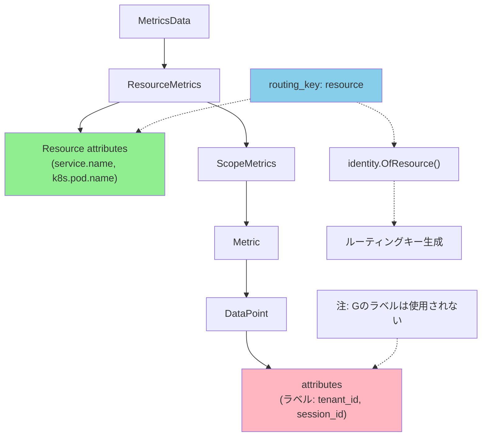

## 要約（Summary）

- loadbalancingexporterの`routing_key: resource`は、メトリクスのラベル（data point attributes）ではなく、ResourceMetricsのresource attributes側でルーティングする
- 同じリソース（Pod、サービスインスタンス等）から来るメトリクスは、data pointのラベル値が異なっても同じバックエンドに送信される
- ラベル値でルーティングしたい場合は`routing_key: streamID`を使う必要がある

## 本文（Body）

### 背景・問題意識

OpenTelemetry Collectorのloadbalancingexporterで、メトリクスのラベル（例: `tenant_id`、`session_id`など）でルーティングしたい場合、どのrouting_keyを選ぶべきか。`routing_key: resource`を使った場合、期待通りにラベル値で分散されないことがある。

### アイデア・主張

`routing_key: resource`は**Resource attributes**（service.name、k8s.pod.name、host.nameなど）のみを見てルーティングキーを生成する。コード実装上は`splitMetricsByResourceID`関数が呼ばれ、ResourceMetricsの`resource`フィールドから`identity.OfResource(rm.Resource())`でキーを作成する。

```go
// routing_key: resource の場合
case resourceRouting:
  batches = splitMetricsByResourceID(md)

// splitMetricsByResourceID の実装
rm := md.ResourceMetrics().At(i)
key := identity.OfResource(rm.Resource()).String()
```

この実装では、各DataPointの`attributes`（いわゆるラベル）には一切触れていないため、**data point attributes（ラベル値）でルーティングされることはない**。

### 内容を視覚化するMermaid図



### 具体例・ケース

**例1: 同じPodから送信される複数の時系列**
- Resource attributes: `service.name=api-server`, `k8s.pod.name=api-server-abc123`
- Metric 1: `http_requests_total{method=GET, status=200}`
- Metric 2: `http_requests_total{method=POST, status=500}`

→ `routing_key: resource`では、どちらも同じバックエンドに送信される（resourceが同じため）

**例2: ラベル値でルーティングしたい場合**
- `tenant_id=A`のメトリクスと`tenant_id=B`のメトリクスを異なるバックエンドに送りたい
- しかし、両方とも同じPod（同じresource）から来る場合、`routing_key: resource`では分散されない

### 反論・限界・条件

**メリット（resource routingが適している場面）**:
- 同じPod/サービスインスタンスから来るメトリクス全体を同じバックエンドに集約したい場合
- Resourceが比較的安定している環境（カーディナリティが低い）

**デメリット・制約**:
- ラベル値でのルーティングができない
- Resourceのカーディナリティが低いと、負荷分散が偏る可能性がある
- 特定のラベルだけでルーティングする仕組みは標準では提供されていない

**回避策**:
1. 目的のラベル（例: `tenant_id`）をResource attributes側に昇格させる（例: `groupbyattrs` processorを使用）
2. `routing_key: streamID`を使用して時系列単位で分散する

## 関連ノート（Links）

- [[202511291440-load-balancing-exporter|OpenTelemetry Collector Load Balancing Exporterの概要]] - Load Balancing Exporterの全体像
- [[20251221154500-loadbalancing-exporter-routing-key-streamid|loadbalancingexporter の routing_key:streamID は時系列単位でルーティングする]] - streamIDによるルーティング
- [[20251221154501-otel-resource-attributes-vs-datapoint-attributes|OpenTelemetry メトリクスの Resource attributes と Data point attributes の違い]] - 2階層の属性の違い
- [[202511291430-delta-to-cumulative-processor|OpenTelemetry DeltaToCumulative Processorの概要]] - ステートフル処理とルーティングの関係
- [[202511291450-deltatocumulative-spof-design|OpenTelemetry DeltaToCumulative ProcessorのSPOF回避設計]] - SPOF回避におけるルーティングの重要性

## To-Do / 次に考えること

- [ ] identity.OfResource() の実装を確認し、どの属性が含まれるか詳細を調べる
- [ ] groupbyattrs processorを使った属性昇格の実装例を作成
- [ ] resource routingとstreamID routingの負荷分散の違いを実測する
