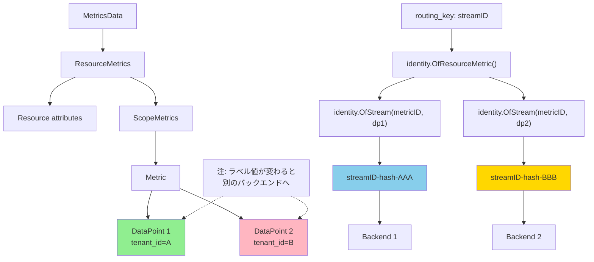

## 要約（Summary）

- loadbalancingexporterの`routing_key: streamID`は、data point attributes（ラベル）を含めた時系列単位でルーティングキーを生成する
- ラベル値が変われば別のstreamIDになり、異なるバックエンドにルーティングされる
- Prometheusのラベルベースのシャーディングと同等の細かい分散が可能

## 本文（Body）

### 背景・問題意識

メトリクスをラベル値に基づいて異なるバックエンドに振り分けたい場合、`routing_key: resource`では不十分である。特に、cumulative化やステートフルな集約処理では、同じ時系列（ラベルセット）が同じバックエンドに到達することが重要になる。

### アイデア・主張

`routing_key: streamID`は、**data point attributes（ラベル）**を含めたストリーム識別子を使ってルーティングする。実装上は`splitMetricsByStreamID`関数が呼ばれ、各DataPointごとにキーを生成する。

```go
// routing_key: streamID の場合
case streamIDRouting:
  batches = splitMetricsByStreamID(md)

// splitMetricsByStreamID の実装（概念）
metricID := identity.OfResourceMetric(res, scope, m)
key := identity.OfStream(metricID, dp).String()
```

この実装では、Gauge、Sum、Histogramなど全てのメトリクスタイプで`DataPoints().At(l)`を取得し、`identity.OfStream(metricID, dp)`でキーを作成する。**dpにはdata point attributes（ラベル）が含まれるため、ラベルが変われば別のstreamIDになる**。

### 内容を視覚化するMermaid図



### 具体例・ケース

**例1: テナントIDでルーティング**
- Metric: `http_requests_total`
- DataPoint 1: `{tenant_id=A, method=GET}` → streamID-X → Backend 1
- DataPoint 2: `{tenant_id=B, method=GET}` → streamID-Y → Backend 2

→ `routing_key: streamID`では、`tenant_id`の違いにより異なるバックエンドに送信される

**例2: Cumulative変換との組み合わせ**
Delta形式のメトリクスをCumulativeに変換する場合、同じ時系列（ラベルセット）が常に同じバックエンドに到達する必要がある。`routing_key: streamID`を使うことで、時系列ごとに固定化される。

**例3: カーディナリティの高いメトリクス**
- ラベルの組み合わせが多い（例: `user_id`, `session_id`など）場合、`streamID`によって細かくシャーディングされる
- Resource数が少ない環境でも、時系列数が多ければ負荷分散が効く

### 反論・限界・条件

**メリット（streamID routingが適している場面）**:
- ラベル値に基づいた細かいルーティングが必要な場合
- Cumulative化やステートフルな集約処理を行う場合
- カーディナリティの高いメトリクス（多数の時系列）を分散したい場合

**デメリット・制約**:
- 時系列数が非常に多い場合、ルーティングキーの計算コストが高くなる可能性
- 同じリソースから来るメトリクスでも、ラベルが違えば別バックエンドに分散される（リソース単位での集約が難しい）
- カーディナリティ爆発が起きると、シャーディングも爆発する

**streamIDに含まれる情報**:
- Resource attributes
- Scope（Instrumentation Scope）
- Metric name/unit/type
- **Data point attributes（ラベル）**

つまり、上記の全てが同一でない限り、別のstreamIDになる。

## 関連ノート（Links）

- [[202511291440-load-balancing-exporter|OpenTelemetry Collector Load Balancing Exporterの概要]] - Load Balancing Exporterの全体像
- [[20251221154459-loadbalancing-exporter-routing-key-resource|loadbalancingexporter の routing_key:resource はリソース属性でルーティングする]] - resourceによるルーティング
- [[20251221154501-otel-resource-attributes-vs-datapoint-attributes|OpenTelemetry メトリクスの Resource attributes と Data point attributes の違い]] - 2階層の属性の違い
- [[202511291430-delta-to-cumulative-processor|OpenTelemetry DeltaToCumulative Processorの概要]] - ステートフル処理とstreamIDルーティングの相性
- [[20251129173333-delta-to-cumulative-detailed-analysis|Delta to Cumulative Temporality変換の詳細な分析]] - 時系列単位のルーティングの重要性

## To-Do / 次に考えること

- [ ] identity.OfStream() の実装を確認し、streamIDに含まれる属性の詳細を調べる
- [ ] streamID routingとresource routingの負荷分散パターンの違いを可視化
- [ ] カーディナリティが高い環境でのstreamID routingのパフォーマンス影響を測定
