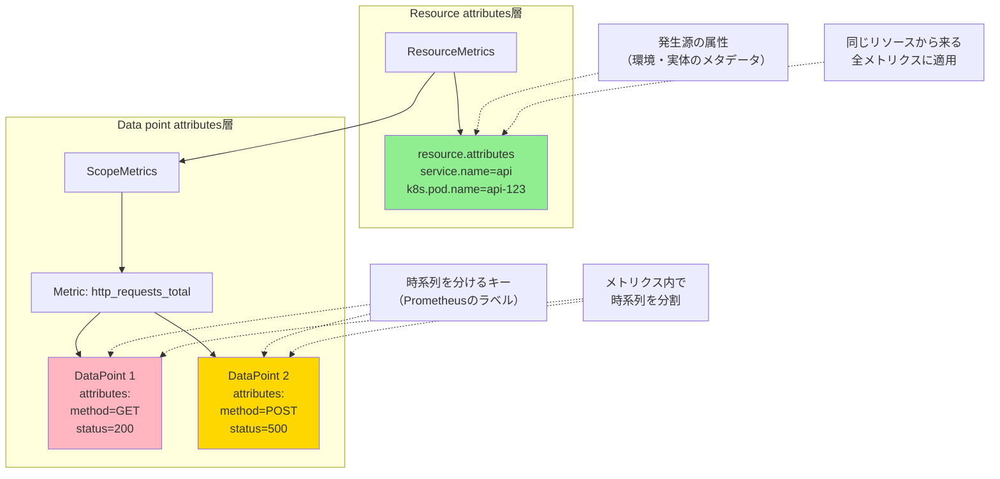

## 要約（Summary）

- OpenTelemetryのメトリクスには「属性」が2階層ある：Resource attributesとData point attributes
- Resource attributes: 計測主体（サービス、Pod、ホスト）の属性。複数のメトリクスに共通して適用される
- Data point attributes: 時系列を区別するキー（Prometheusのラベルに相当）。メトリクス内で時系列を分割する

## 本文（Body）

### 背景・問題意識

OpenTelemetryのメトリクスを扱う際、`session.id`や`tenant_id`といった属性がどこに配置されているかによって、ルーティングや集約の挙動が大きく変わる。同じキー名でも、Resource attributesとData point attributesでは全く異なる意味を持つ。

### アイデア・主張

OpenTelemetryのメトリクスデータモデルは、以下の入れ子構造になっている：

```
ResourceMetrics
├── resource.attributes ← Resource attributes
└── ScopeMetrics
    └── Metric
        └── DataPoint
            ├── attributes ← Data point attributes
            ├── value
            └── timestamp
```

**Resource attributes（リソース属性）**:
- **定義**: その計測主体（発生源）そのものの属性
- **スコープ**: 1つのResourceにぶら下がる複数のメトリクス（さらにその中の複数のDataPoint）に共通して適用
- **典型例**: 
  - `service.name`, `service.namespace`
  - `deployment.environment`
  - `k8s.namespace.name`, `k8s.pod.name`
  - `host.name`, `cloud.region`
- **性質**: しばらく安定している前提（同一プロセスの間は基本一定）

**Data point attributes（データポイント属性）**:
- **定義**: そのデータポイント（1時点の観測値、特定の時系列）を区別するための属性
- **スコープ**: 同じメトリクス名でも、属性セットが違えば別の時系列（ストリーム）になる
- **典型例**:
  - `http.method=GET`
  - `http.status_code=200`
  - `route=/api/users`
  - `db.system=postgresql`
  - `tenant_id=...`
  - `session.id=...`
- **性質**: 変動しやすい（リクエストごとに変わるものが多い）。カーディナリティを爆発させる主因

### 内容を視覚化するMermaid図



### 具体例・ケース

**例1: 同じ `session.id` でも配置場所で意味が変わる**

```yaml
# ケース1: Resource attributesにある場合
ResourceMetrics:
  resource.attributes:
    service.name: web-app
    session.id: abc-123  # ← この発生源（プロセス）のセッションID
  ScopeMetrics:
    - Metric: http_requests_total
      DataPoints:
        - attributes: {method: GET}
        - attributes: {method: POST}

# ケース2: Data point attributesにある場合
ResourceMetrics:
  resource.attributes:
    service.name: web-app
  ScopeMetrics:
    - Metric: http_requests_total
      DataPoints:
        - attributes: {method: GET, session.id: abc-123}  # ← この時系列のセッションID
        - attributes: {method: POST, session.id: xyz-789}  # ← 別の時系列
```

**例2: loadbalancingexporterでの影響**
- `routing_key: resource`は上の構造のResource attributes側だけを見る
- `routing_key: streamID`は両方（Resource + Data point attributes）を含めたストリーム識別子を見る

**例3: カーディナリティへの影響**
- Resource attributes: カーディナリティは「サービスインスタンス数」程度（通常は低い）
- Data point attributes: カーディナリティは「ラベルの組み合わせ数」（爆発的に増える可能性）

### 反論・限界・条件

**Resource attributesとして配置すべき属性の条件**:
- 計測主体（プロセス、Pod、ホスト）のライフサイクルと連動
- 比較的安定している
- 複数のメトリクスに共通して意味がある

**Data point attributesとして配置すべき属性の条件**:
- リクエストごとに変わる
- メトリクスの「次元」として切り分けたい
- フィルタリングや集約の軸として使いたい

**グレーゾーン（どちらにも配置可能）**:
- `tenant_id`: マルチテナント環境で、テナントごとに専用Podがある場合はResource attributesが適切。共有Podの場合はData point attributesが適切
- `environment`: デプロイ環境（prod/staging）は通常Resource attributesだが、同一プロセスから複数環境にアクセスする場合はData point attributesになりうる

**属性昇格（Promotion）パターン**:
特定のData point attributeをResource attributes側に「昇格」させることで、resourceベースのルーティングで効くようにできる（例: `groupbyattrs` processorを使用）。

## 関連ノート（Links）

- [[20251221154459-loadbalancing-exporter-routing-key-resource|loadbalancingexporter の routing_key:resource はリソース属性でルーティングする]] - Resource attributesでのルーティング
- [[20251221154500-loadbalancing-exporter-routing-key-streamid|loadbalancingexporter の routing_key:streamID は時系列単位でルーティングする]] - Data point attributesを含むルーティング
- [[20251221154502-otel-attribute-promotion-pattern|OpenTelemetry における属性昇格パターン]] - 属性をResource側に昇格させる方法
- [[202511291440-load-balancing-exporter|OpenTelemetry Collector Load Balancing Exporterの概要]] - ルーティングキーとの関係
- [[20251129181833-temporality-protocol-details|OpenTelemetry Temporalityのプロトコルレベル詳細]] - OTLPデータモデル

## To-Do / 次に考えること

- [ ] OTLP メトリクスの実際の出力例（JSON/Protocol Buffers）で2階層を確認
- [ ] Resource attributesとData point attributesのカーディナリティの違いを実測
- [ ] OpenTelemetry Semantic Conventionsで推奨される属性配置を調査
