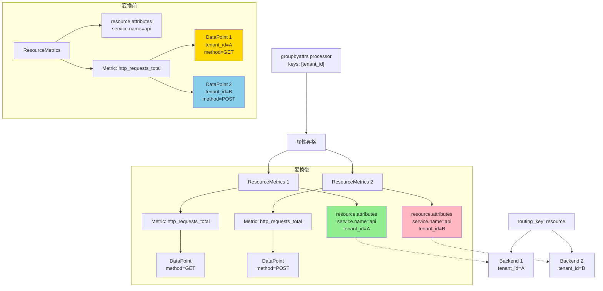

## 要約（Summary）

- 特定のData point attributeをResource attributes側に「昇格」させることで、`routing_key: resource`ベースのルーティングで効かせられる
- `groupbyattrs` processorなどを使って、ラベルをリソース属性にコピーまたは移動する
- 特定のラベル1つだけでルーティングしたい場合の実務的な回避策

## 本文（Body）

### 背景・問題意識

loadbalancingexporterには「特定のラベルだけでルーティングする」機能が標準では存在しない。`routing_key: resource`はResource attributes全体を見るし、`routing_key: streamID`は全てのData point attributes + Resourceを含めたハッシュを使う。

しかし実務では、「`tenant_id`だけでルーティングしたい」「`session.id`が同じなら同じバックエンドに送りたい」といった要件がある。

### アイデア・主張

**属性昇格（Attribute Promotion）パターン**は、Data point attributesに含まれる特定の属性を、Resource attributes側にコピーまたは移動することで、`routing_key: resource`でその属性を効かせる手法である。

実装方法:
1. **groupbyattrs processor**を使う
2. **attributesprocessor + resourceprocessor**の組み合わせを使う

```yaml
# groupbyattrs processorの例
processors:
  groupbyattrs:
    keys:
      - tenant_id  # この属性でグルーピング
      - session.id

exporters:
  loadbalancing:
    routing_key: resource  # ← Resource attributesを見る
    resolver:
      static:
        hostnames:
          - backend-1:4317
          - backend-2:4317
    protocol:
      otlp:
        # ...

service:
  pipelines:
    metrics:
      processors: [groupbyattrs]
      exporters: [loadbalancing]
```

この設定により、`tenant_id`と`session.id`がResource attributes側に昇格され、`routing_key: resource`でこれらの値に基づいたルーティングが可能になる。

### 内容を視覚化するMermaid図



### 具体例・ケース

**例1: マルチテナント環境でのテナントIDルーティング**
- 要件: `tenant_id=A`のメトリクスは必ずBackend 1へ、`tenant_id=B`はBackend 2へ
- 元のデータ: `tenant_id`はData point attributesに付いている
- 対策: `groupbyattrs`で`tenant_id`をResource側に昇格 → `routing_key: resource`で分散

**例2: セッションベースのルーティング**
- 要件: 同じ`session.id`のメトリクスは同じバックエンドに集約したい（ステートフル集約のため）
- 元のデータ: `session.id`はData point attributesに付いている
- 対策: `groupbyattrs`で`session.id`をResource側に昇格 → `routing_key: resource`で固定化

**例3: 属性昇格しない場合の挙動**
- `routing_key: streamID`を使うと、`tenant_id`だけでなく他の全てのラベル（`method`, `status_code`など）も含めたハッシュになる
- 結果: 同じ`tenant_id`でも、他のラベルが違えば別バックエンドに送られる可能性がある

### 反論・限界・条件

**メリット**:
- 特定の属性だけでルーティングできる（シンプルで予測可能）
- カーディナリティの制御がしやすい（昇格させる属性を限定できる）
- `routing_key: resource`の一貫性（同じリソース＝同じバックエンド）を維持

**デメリット・制約**:
- `groupbyattrs`は元のResourceMetricsを分割するため、処理オーバーヘッドがある
- 昇格させる属性の値が多様（カーディナリティが高い）だと、Resource数が爆発する
- 元々のResource attributes（例: `k8s.pod.name`）と昇格した属性が混在するため、トラブルシューティングが複雑になる可能性

**groupbyattrs processorの注意点**:
- 指定したkeysで新しいResourceMetricsを作成する（元のResourceは上書きされる可能性）
- keep_keys オプションで、元のResource attributesを保持するか制御できる

**代替手段の比較**:
1. **属性昇格 + routing_key: resource**: 特定のラベル1つでルーティング（推奨）
2. **routing_key: streamID**: 全てのラベルを含めた細かいルーティング（カーディナリティ高い）
3. **カスタムルーティングロジック**: Collectorを拡張して独自のrouting_key実装（高コスト）

## 関連ノート（Links）

- [[20251221154501-otel-resource-attributes-vs-datapoint-attributes|OpenTelemetry メトリクスの Resource attributes と Data point attributes の違い]] - 2階層の属性の違い
- [[20251221154459-loadbalancing-exporter-routing-key-resource|loadbalancingexporter の routing_key:resource はリソース属性でルーティングする]] - Resource attributesベースのルーティング
- [[20251221154500-loadbalancing-exporter-routing-key-streamid|loadbalancingexporter の routing_key:streamID は時系列単位でルーティングする]] - streamIDとの比較
- [[202511291440-load-balancing-exporter|OpenTelemetry Collector Load Balancing Exporterの概要]] - Load Balancing Exporterの全体像
- [[202511291450-deltatocumulative-spof-design|OpenTelemetry DeltaToCumulative ProcessorのSPOF回避設計]] - ルーティングとステートフル処理

## To-Do / 次に考えること

- [ ] groupbyattrs processorの詳細設定（keep_keys等）を検証
- [ ] 属性昇格による処理オーバーヘッドを測定
- [ ] カーディナリティが高い属性を昇格させた場合のResource数の増加を確認
- [ ] 属性昇格とstreamIDルーティングのトレードオフを整理
