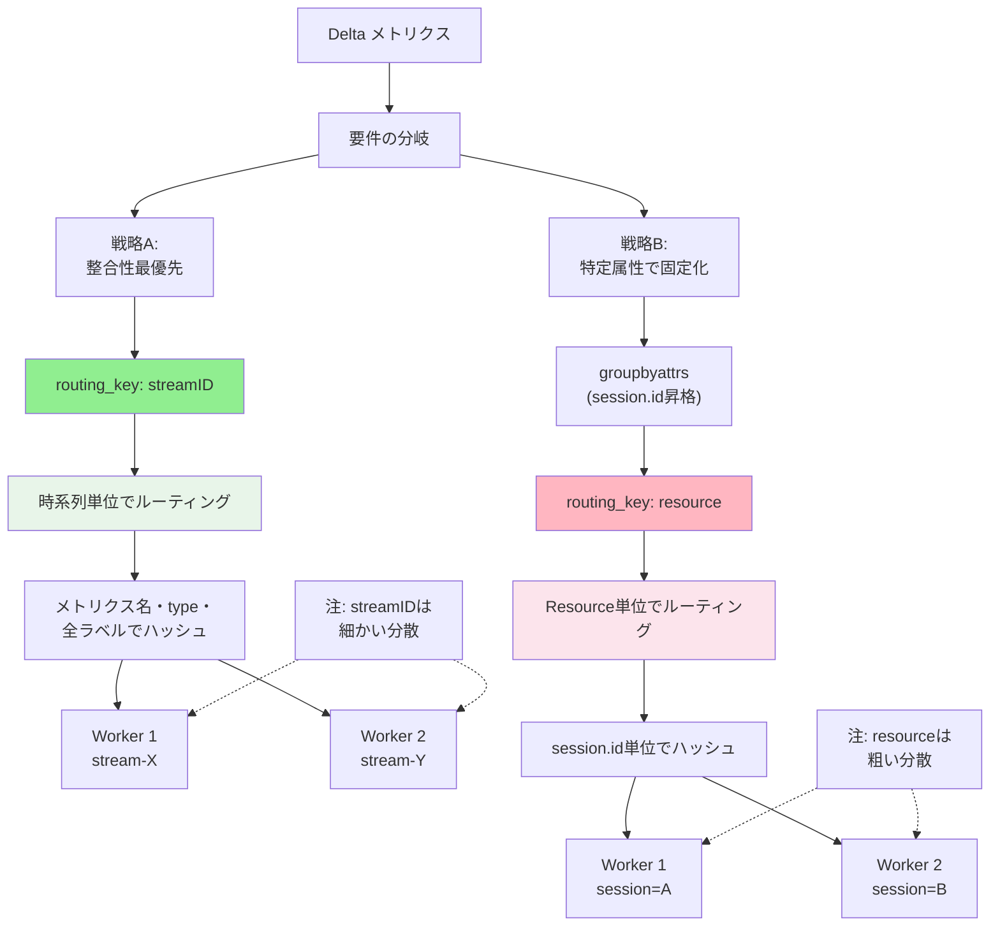

## 要約（Summary）

- Delta→Cumulative変換では、同一時系列を同じCollectorに送る必要がある
- `routing_key: streamID`は時系列単位でスティッキーなため、整合性を最優先するなら最適
- `routing_key: resource` + 属性昇格は、特定属性（例: session.id）で同じCollectorに固定化したい場合に有効
- 要件に応じて2つの戦略を使い分ける

## 本文（Body）

### 背景・問題意識

Delta→Cumulative変換はステートフル処理であり、同じ時系列（stream）が異なるCollectorに分散すると、累積状態が壊れてカウンタが正しく計算できない。loadbalancingexporterのrouting_keyをどう選ぶかが、整合性と運用性に直結する。

### アイデア・主張

**戦略A: 整合性を最優先する場合 → `routing_key: streamID`**

`streamID`は「同一ストリーム（= 同一時系列）」を同じバックエンドに送るために設計されたキーであり、ステートフル変換（delta→cumulative）の要件と完全に一致する。

**メリット**:
- 追加の属性操作が不要（シンプル）
- 時系列単位で正しくスティッキーになる
- delta→cumulativeの整合性が保証される

**デメリット**:
- 同じ`session.id`でもメトリクス名やtypeが違えば別ストリームになるため、Workerが分かれる可能性がある
- ただし、delta→cumulativeの正しさには通常影響しない（各ストリームごとに独立して変換されるため）

**戦略B: 特定属性（例: session.id）で同じWorkerに固定化したい場合 → `routing_key: resource` + 属性昇格**

Data point attributesにある`session.id`をResource attributes側に昇格させることで、`routing_key: resource`で同じ`session.id`を持つ全てのメトリクスを同じCollectorに送れる。

**メリット**:
- 同じ`session.id`のメトリクス全体が同じWorkerに集約される
- セッション単位でのログ相関や分析が容易
- Resource attributesベースのルーティングで予測可能

**デメリット**:
- groupbyattrs + transform processorの追加が必要（構成が複雑）
- groupbyattrsがメトリクスのmetadataを落とす既知の問題がある可能性
- 属性のカーディナリティが高いと、Resource数が爆発する

### 内容を視覚化するMermaid図

### 具体例・ケース

**例1: 単純なdelta→cumulative変換（戦略A）**
- メトリクス: `http_requests_delta{method=GET, status=200}`
- 要件: 整合性だけを保証したい
- 選択: `routing_key: streamID`
- 結果: `{method=GET, status=200}`というラベルセットが常に同じWorkerに送られる

**例2: セッションIDで集約したい（戦略B）**
- メトリクス: 
  - `http_requests_delta{session.id=abc, method=GET}`
  - `db_queries_delta{session.id=abc, db=postgres}`
- 要件: 同じ`session.id`の全メトリクスを同じWorkerに送り、セッション単位で分析したい
- 選択: `groupbyattrs` + `routing_key: resource`
- 結果: `session.id=abc`の全てのメトリクス（異なるメトリクス名でも）が同じWorkerに送られる

**例3: カーディナリティが高い場合（戦略Aが有利）**
- 状況: `user_id`が数万〜数十万ある環境
- 戦略Bで`user_id`を昇格: Resource数が爆発し、groupbyattrsのオーバーヘッドが大きい
- 戦略Aで`streamID`: 時系列数は多いが、ルーティングは効率的に分散される

### 反論・限界・条件

**戦略Aの適用条件**:
- delta→cumulativeの整合性が最優先
- 属性昇格の複雑さを避けたい
- カーディナリティが高い環境

**戦略Bの適用条件**:
- 特定属性（session.id、tenant.idなど）で固定化が必要
- その属性のカーディナリティが比較的低い（数十〜数百程度）
- セッション単位でのログ相関や分析が重要

**両方に共通する制約**:
- Workerのスケーリングや再配置時に、consistent hashingでもキーの再割当が起き、カウンタが飛ぶ可能性がある
- 運用面での対策が必要（後述の関連ノート参照）

**どちらを選ぶべきか**:
- デフォルトは戦略A（`streamID`）を推奨
- 明確な理由（セッション固定化など）がある場合のみ戦略Bを採用
- 戦略Bを選ぶ場合は、groupbyattrsの既知問題（metadata喪失など）を確認する

## 関連ノート（Links）

- [[20251221154500-loadbalancing-exporter-routing-key-streamid|loadbalancingexporter の routing_key:streamID は時系列単位でルーティングする]] - streamIDルーティングの詳細
- [[20251221154459-loadbalancing-exporter-routing-key-resource|loadbalancingexporter の routing_key:resource はリソース属性でルーティングする]] - resourceルーティングの詳細
- [[20251221154502-otel-attribute-promotion-pattern|OpenTelemetry における属性昇格パターン]] - 戦略Bの実装方法
- [[20251221170720-groupbyattrs-transform-attribute-restoration|groupbyattrs と transform による属性昇格・復元パターン]] - 具体的な設定例
- [[202511291450-deltatocumulative-spof-design|OpenTelemetry DeltaToCumulative ProcessorのSPOF回避設計]] - アーキテクチャ全体の設計
- [[20251221170721-stateful-collector-scaling-consistency-problem|ステートフルCollectorのスケーリングと整合性問題]] - スケーリング時の課題
- [[202511291430-delta-to-cumulative-processor|OpenTelemetry DeltaToCumulative Processorの概要]] - DeltaToCumulative Processorの基本
- [[20251129173333-delta-to-cumulative-detailed-analysis|Delta to Cumulative Temporality変換の詳細な分析]] - 変換の詳細分析

## To-Do / 次に考えること

- [ ] 両戦略のパフォーマンスとリソース使用量を実測比較
- [ ] カーディナリティが異なる環境での挙動の違いを検証
- [ ] groupbyattrsのmetadata喪失問題が現行バージョンで解決されているか確認
- [ ] セッション固定化の実務的なメリット・デメリットを整理
