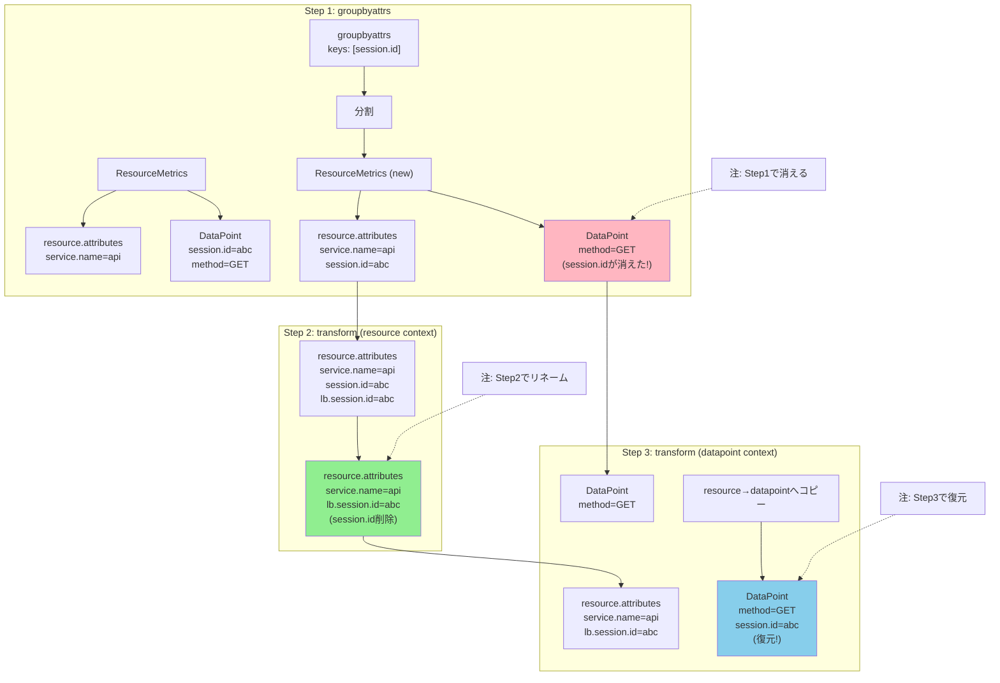

## 要約（Summary）

- groupbyattrs processorは指定した属性でResourceを分割するが、その属性をdata point側から削除してしまう
- data pointにラベルとして残したい場合は、transform processorで復元する必要がある
- 3ステップ: ①groupbyattrsで昇格 → ②Resource側でリネーム → ③data point側に復元

## 本文（Body）

### 背景・問題意識

`groupbyattrs`を使って`session.id`をResource attributesに昇格させると、`routing_key: resource`でセッション単位のルーティングが可能になる。しかし、groupbyattrsは**グルーピングに使った属性をdata pointから削除する仕様**であるため、そのままではPrometheusなどのバックエンドで`session.id`ラベルが失われる。

ラベルとして残したいが、ルーティングにも使いたい、という二重の要件を満たすには、**属性の昇格と復元を組み合わせる**必要がある。

### アイデア・主張

**groupbyattrs + transform processorの3ステップパターン**:

1. **groupbyattrs**: data point attributesの`session.id`でResourceを分割（この時点で`session.id`はResource側に移動し、data pointから消える）
2. **transform (Resource context)**: Resource側の`session.id`を`lb.session.id`にリネームして、元の`session.id`を削除（重複キーの衝突を避ける）
3. **transform (DataPoint context)**: Resource側の`lb.session.id`を参照して、data point側に`session.id`として復元

この3ステップにより：
- `routing_key: resource`でResource attributesの`lb.session.id`を使ってルーティング
- バックエンドにはdata point attributesの`session.id`ラベルとして送信

が両立する。

### 内容を視覚化するMermaid図



### 具体例・ケース

**実装例（Collector設定）**:

```yaml
processors:
  # 既存: memory_limiter, resourcedetection など...

  # Step 1: session.id で Resource を分割
  groupbyattrs/session:
    keys: [session.id]
    # この時点でdata pointからsession.idは削除される

  # Step 2: Resource側の session.id を lb.session.id に移動
  transform/sessionid_to_lb_resource:
    error_mode: ignore
    metric_statements:
      - context: resource
        statements:
          # lb.session.id にコピー
          - set(attributes["lb.session.id"], attributes["session.id"]) 
            where attributes["session.id"] != nil
          # 元のsession.idを削除
          - delete_key(attributes, "session.id") 
            where attributes["session.id"] != nil

  # Step 3: data point 側へ session.id を復元
  transform/restore_sessionid_label:
    error_mode: ignore
    metric_statements:
      - context: datapoint
        statements:
          # Resource側のlb.session.idを、data point側のsession.idにコピー
          - set(attributes["session.id"], resource.attributes["lb.session.id"])
            where attributes["session.id"] == nil 
              and resource.attributes["lb.session.id"] != nil

exporters:
  loadbalancing:
    routing_key: "resource"  # lb.session.idでルーティング
    resolver:
      static:
        hostnames:
          - worker-1:4317
          - worker-2:4317
    protocol:
      otlp:
        timeout: 1s

service:
  pipelines:
    metrics:
      receivers: [otlp]
      processors:
        - memory_limiter
        - resourcedetection
        - groupbyattrs/session         # Step 1
        - transform/sessionid_to_lb_resource  # Step 2
        - transform/restore_sessionid_label   # Step 3
        - batch
      exporters: [loadbalancing, debug]
```

**なぜStep 2（リネーム）が必要か**:
- groupbyattrsで昇格した`session.id`がResource attributesに残ったまま、data pointにも`session.id`が復元されると、バックエンド側で衝突する可能性がある
- Resource側を`lb.session.id`にリネームすることで、ルーティング用と表示用で名前空間を分離

**transform processorのOTTL（OpenTelemetry Transformation Language）**:
- `context: resource`: Resource attributesにアクセス
- `context: datapoint`: Data point attributesにアクセスし、`resource.attributes[...]`でResourceを参照可能
- この「datapointコンテキストからresourceへアクセス」がキーポイント

### 反論・限界・条件

**このパターンのメリット**:
- `routing_key: resource`で特定属性（session.id）でのルーティングが可能
- バックエンドには元のラベル（session.id）が残る
- transform processorのOTTLは柔軟で、複雑な変換ロジックも記述可能

**このパターンのデメリット・制約**:
- 設定が複雑になる（3つのprocessorを正しい順序で配置する必要）
- groupbyattrsのオーバーヘッド（Resourceの分割・再構成）
- groupbyattrsの既知問題: メトリクスのmetadata（description、unit等）が落ちる可能性がある（過去のissue）
  - 現行バージョン（v0.142.0等）で解決されているかは要確認
  - Worker側で期待するmetadataが残っているか検証が必要

**代替手段の比較**:
1. **このパターン（groupbyattrs + transform）**: 属性昇格とラベル保持を両立
2. **routing_key: streamID**: 属性操作不要だが、セッション固定化はできない
3. **attributesprocessor**: data point → resourceへのコピーは標準機能では不可能（議論がある）

**適用条件**:
- 特定属性（カーディナリティが低〜中程度）でルーティングしたい
- かつ、その属性をバックエンドのラベルとしても残したい
- groupbyattrsのオーバーヘッドとmetadata喪失リスクを許容できる

## 関連ノート（Links）

- [[20251221154502-otel-attribute-promotion-pattern|OpenTelemetry における属性昇格パターン]] - 属性昇格の概念
- [[20251221170719-delta-cumulative-routing-key-strategy|Delta-to-Cumulative変換における routing_key 選択戦略]] - このパターンの使いどころ
- [[20251221154501-otel-resource-attributes-vs-datapoint-attributes|OpenTelemetry メトリクスの Resource attributes と Data point attributes の違い]] - 2階層の属性の違い
- [[20251221154459-loadbalancing-exporter-routing-key-resource|loadbalancingexporter の routing_key:resource はリソース属性でルーティングする]] - resourceルーティングの詳細
- [[202511291440-load-balancing-exporter|OpenTelemetry Collector Load Balancing Exporterの概要]] - Load Balancing Exporterの全体像

## To-Do / 次に考えること

- [ ] groupbyattrsのmetadata喪失問題の現状を確認（GitHub issue検索）
- [ ] transform processorのOTTL構文の詳細ドキュメントを参照
- [ ] 実環境でこのパターンを適用し、metadata（description/unit）が残るか検証
- [ ] groupbyattrsのパフォーマンスオーバーヘッドを測定
- [ ] 属性のカーディナリティとResource数の増加の関係を検証
