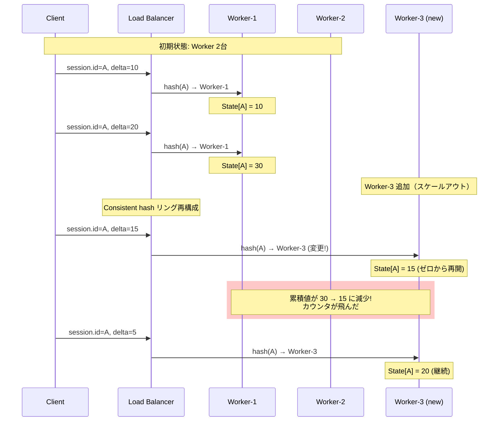

## 要約（Summary）

- Delta→Cumulative変換などステートフル処理では、Collectorが状態（state）を持つため、インスタンス数の変更やDNS解決結果の変更でカウンタが飛ぶリスクがある
- Consistent hashingを使っても、キーの再割当は完全には防げない
- 運用面での対策: スケーリング抑制、rolling更新の制御、streamIDルーティングによる影響範囲の最小化

## 本文（Body）

### 背景・問題意識

OpenTelemetry Collectorでdelta→cumulative変換を行う場合、各時系列の累積状態をCollectorがメモリ上に保持する。この「ステートフル」な特性により、以下のような変更が発生すると問題が起きる：

- Collectorインスタンス数の増減（スケールアウト/イン）
- DNS解決結果の変更（ECS Serviceの自動復旧など）
- タスクの入れ替わり（rolling updateなど）

これらの変更により、consistent hashingのリング上でキーの再割当が発生し、別のCollectorに時系列が移動すると、**累積状態が失われてカウンタ値がリセット（ゼロから再開）される**。

### アイデア・主張

**問題の本質**:
Consistent hashingは「キーを均等に分散する」ための仕組みであり、「状態を永続化する」わけではない。ノード（Collectorインスタンス）が変わると、そのノードが持っていた状態は失われる。

```
変更前:
session.id=A → Worker-1 (累積値: 1000)
session.id=B → Worker-2 (累積値: 500)

Worker台数を2→3に増やす（スケールアウト）:
session.id=A → Worker-3 (累積値: 0から再開！)
session.id=B → Worker-2 (累積値: 継続)
```

**OpenTelemetry公式の見解**:
「Stateful collectorをスケールするなら、load balancing exporterなどでルーティングを工夫しろ」という整理。つまり、スケーリングによる状態喪失は**構造的な問題**として認識されており、完全な解決策はない。

### 内容を視覚化するMermaid図



### 具体例・ケース

**例1: ECS Service の rolling update**
- ECS Serviceで2台のWorkerが稼働中
- Rolling updateで1台ずつ新しいタスクに入れ替わる
- DNS解決結果が変わり、consistent hashのリングも変わる
- 一部の時系列が新しいWorkerに移動し、累積値がリセットされる

**例2: AutoScaling によるスケールアウト**
- 負荷が上がり、Worker台数が2→4に増加
- Consistent hashingで約半分のキーが再割当される
- 再割当された時系列のカウンタがゼロから再開される
- バックエンド（Prometheus、AMP等）では、グラフに不自然なドロップが現れる

**例3: Worker の異常終了と復旧**
- Worker-1が異常終了
- そのWorkerに割り当てられていた時系列が、他のWorkerに再割当
- 状態は完全に失われる（累積値がリセット）

### 反論・限界・条件

**運用面での緩和策**:

1. **Workerのスケーリングを抑制する**
   - AutoScalingを無効化、または閾値を厳しく設定
   - 少なくとも急激な増減を避ける
   - 予測可能なスケジュールでのみスケーリング（メンテナンスウィンドウなど）

2. **ECS rolling updateの同時更新数を制限**
   - `minimumHealthyPercent`と`maximumPercent`を調整
   - 例: `minimumHealthyPercent: 100`, `maximumPercent: 150`で、1台ずつゆっくり更新
   - DNS TTLを短くして、更新後の新IPへの切り替えを早める

3. **routing_key: streamID を使う（影響範囲の最小化）**
   - `streamID`は時系列単位でルーティングするため、再割当されても**その時系列だけ**が影響を受ける
   - `resource`でルーティングすると、1つのResourceに多数の時系列がぶら下がるため、再割当時の影響が大きい
   - つまり、streamIDの方が「必要最小単位のstate」になる

4. **状態の永続化を検討（高度な対策）**
   - Collectorの状態を外部ストア（Redis、S3等）に永続化
   - ただし、標準機能ではないため、カスタム実装が必要
   - パフォーマンスへの影響も大きい

5. **Delta対応バックエンドを使う（根本的解決）**
   - バックエンド側でDelta→Cumulative変換を行う（例: Prometheus、Cortex、Mimir等）
   - Collector側ではDelta形式のまま送信
   - ステートフル処理が不要になり、スケーリングの制約がなくなる

**統計上の許容**:
- 一時的なカウンタのリセットは、長期的な統計（日次、週次の集計）ではノイズとして吸収されることが多い
- アラートの閾値を適切に設定すれば、誤検知を減らせる
- ただし、課金やSLA監視など、正確な累積値が必要な場合は許容できない

**許容できないケース**:
- 課金メトリクス（正確な累積値が必須）
- SLA監視（ダウンタイムの正確な計測が必要）
- セキュリティ監査（すべてのイベントを正確にカウント）

→ これらのケースでは、Delta形式を避けるか、バックエンド側でCumulative化する

## 関連ノート（Links）

- [[20251221170719-delta-cumulative-routing-key-strategy|Delta-to-Cumulative変換における routing_key 選択戦略]] - streamIDルーティングによる影響範囲の最小化
- [[202511291450-deltatocumulative-spof-design|OpenTelemetry DeltaToCumulative ProcessorのSPOF回避設計]] - アーキテクチャ全体の設計
- [[20251221152242-hash-ring-structure|Hash Ring（ハッシュリング）の構造と円環ハッシュ空間]] - Consistent hashingの基礎
- [[20251221152244-consistent-hashing-locality-principle|Consistent Hashingの局所的影響の原理]] - キー再割当の仕組み
- [[202511291430-delta-to-cumulative-processor|OpenTelemetry DeltaToCumulative Processorの概要]] - DeltaToCumulative Processorの基本
- [[20251129173333-delta-to-cumulative-detailed-analysis|Delta to Cumulative Temporality変換の詳細な分析]] - 変換の詳細分析
- [[20251221154500-loadbalancing-exporter-routing-key-streamid|loadbalancingexporter の routing_key:streamID は時系列単位でルーティングする]] - streamIDルーティング

## To-Do / 次に考えること

- [ ] 実環境でのWorker入れ替え時のカウンタリセット頻度を測定
- [ ] streamIDとresourceルーティングでの影響範囲の違いを定量化
- [ ] ECS rolling updateの設定最適化（minimumHealthyPercent等）
- [ ] Delta対応バックエンド（Prometheus、Mimir等）への移行を検討
- [ ] 状態永続化の実装可能性とコストを調査
