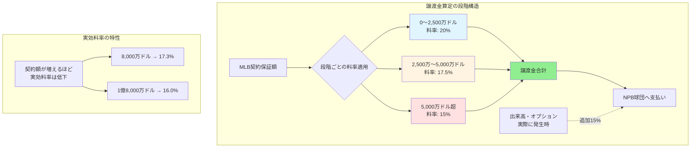

## 要約（Summary）

- MLBポスティングの譲渡金は、選手のMLB契約保証額に対して段階的に異なる料率（20%→17.5%→15%）を適用する累進的な算定方式を採用している。
- この設計により、高額契約ほどNPB球団への譲渡金率は下がり、MLB球団の負担を抑えつつ、NPB球団にも一定の金銭的補償を提供する構造になっている。

## 本文（Body）

MLB譲渡金の算定方式は、**契約額の段階ごとに異なる料率を適用する累進制**という特徴的な設計を持っている。

### 背景・問題意識

NPB球団は育成した選手を失う代償として金銭補償を求める一方、MLB球団は高額な譲渡金が選手獲得の障壁になることを避けたい。この両者の利害を調整するため、段階式の料率設計が採用された。

### アイデア・主張

**譲渡金算定における段階式料率は、「低額契約での補償確保」と「高額契約での負担軽減」を同時に実現する経済設計である。**

現行の算定式（MLB公表）：

1. **〜2,500万ドル**：契約保証額の **20%**
2. **2,500万〜5,000万ドル**：超過分の **17.5%**（最初の2,500万ドル分の20%に追加）
3. **5,000万ドル超**：超過分の **15%**（上記に追加）

さらに、出来高条項・昇給条項・オプション年が実際に発生した場合、**後日追加で15%**が支払われる。

#### 計算例

**5年総額8,000万ドルの契約の場合：**

1. 最初の2,500万ドル：2,500万 × 20% = **500万ドル**
2. 2,500万〜5,000万ドル：2,500万 × 17.5% = **437.5万ドル**
3. 5,000万〜8,000万ドル：3,000万 × 15% = **450万ドル**

合計譲渡金：**1,387.5万ドル**（契約額の約17.3%）

**8年総額1億8,000万ドルの契約の場合：**

1. 最初の2,500万ドル：**500万ドル**
2. 2,500万〜5,000万ドル：**437.5万ドル**
3. 5,000万〜1億8,000万ドル：1億3,000万 × 15% = **1,950万ドル**

合計譲渡金：**2,887.5万ドル**（契約額の約16.0%）

### 内容を視覚化するMermaid図

### 具体例・ケース

村上宗隆選手の報道ベースの予想では：

- **5年総額8,000万ドル**の場合 → ヤクルトは約1,387.5万ドル（約22億円※）を受け取る
- **8年総額1億8,000万ドル**の場合 → ヤクルトは約2,887.5万ドル（約46億円※）を受け取る

※為替レート1ドル=160円で概算

この差額（約24億円）は、ヤクルト球団にとって無視できない規模であり、ポスティング成立のインセンティブとなる。

### 反論・限界・条件

この段階式料率には以下の特性と限界がある：

**特性：**
- 超高額契約（1億ドル超）では実効料率が15%台前半まで低下し、MLB球団の負担が相対的に軽くなる
- これにより、トップ選手の契約額がさらに上昇しやすくなる可能性がある

**限界：**
- 出来高や昇給条項の「実際の発生」まで待つ必要があり、NPB球団にとってはキャッシュフローが不確実
- 契約が短期・低額の場合、譲渡金も少なくなり、NPB球団のメリットが限定的
- 後日追加支払いの管理コストが発生する

**前提条件：**
- この算定式が機能するのは、MLB球団が「契約を成立させたい」インセンティブを持っている場合のみ
- 期限内に契約がまとまらなければ、譲渡金はゼロになる

## 関連ノート（Links）

- [[20251221171240-posting-system-basic-mechanism|ポスティングシステムの基本仕組みと交渉期限]] - ポスティングシステムの基本仕組みと交渉期限
- ポスティング vs 海外FAの比較（次に作成予定）
- 累進課税との類似性と経済設計思想

## To-Do / 次に考えること

- [ ] 過去のポスティング事例で実際の譲渡金額を調査し、料率の妥当性を検証
- [ ] 他のスポーツ（サッカーの移籍金など）との比較
- [ ] 出来高条項の実際の発生率と追加支払いの実績を調査
- [ ] この料率設計が導入された経緯と制度変更の歴史を整理
