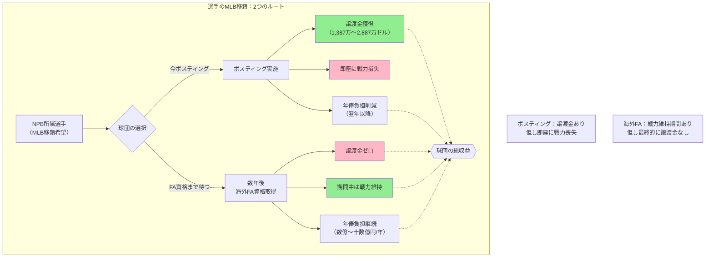

## 要約（Summary）

- NPB球団にとって、選手を「ポスティングで出す」と「海外FA資格取得まで待つ」では金銭的インパクトが大きく異なる。
- ポスティングは譲渡金を得られるが、海外FAでは譲渡金がゼロになる。この違いが球団の意思決定における重要な分岐点となる。

## 本文（Body）

選手のMLB移籍における**ポスティング**と**海外FA**の違いは、NPB球団にとって「譲渡金を得る機会の有無」という決定的な経済的差異をもたらす。

### 背景・問題意識

トップ選手がMLBを目指す際、NPB球団は以下の選択肢に直面する：

1. **今すぐポスティングで出す** → 譲渡金を得るが、すぐに戦力を失う
2. **海外FA資格取得まで引き留める** → 数年間は戦力を維持できるが、最終的に譲渡金なしで失う可能性

この2つの選択肢の経済的含意を理解することが、球団経営の戦略的意思決定に不可欠である。

### アイデア・主張

**海外FA資格取得まで待つことは、NPB球団にとって「戦力維持期間」と引き換えに「譲渡金収入の機会」を放棄する選択である。**

#### ポスティングの特徴

- **譲渡金あり**：MLB契約額に応じた段階式料率で算定された譲渡金を受け取る
- **球団主導**：NPB球団がポスティング申請の可否を決定できる
- **タイミング選択**：選手のキャリアのどの時点でも実施可能

#### 海外FAの特徴

- **譲渡金なし**：選手が直接MLB球団と契約するため、NPB球団への金銭補償は発生しない
- **選手主導**：FA資格取得後は選手が移籍を決定でき、球団は拒否できない
- **資格要件**：1軍登録145日換算で**9シーズン**の実績が必要

#### 金銭的比較（村上選手の仮想例）

**ケースA：今すぐポスティング（2025年）**
- 譲渡金収入：1,387万〜2,887万ドル（約22〜46億円※）
- 戦力損失：即座に発生
- 年俸負担削減：2026年以降の年俸支払い不要

**ケースB：海外FA資格取得まで待つ（数年後）**
- 譲渡金収入：**ゼロ**
- 戦力維持：FA資格取得までの数年間は在籍
- 年俸負担：その間の年俸を支払い続ける（推定数億〜十数億円/年）

※為替レート1ドル=160円で概算

### 内容を視覚化するMermaid図

### 具体例・ケース

**大谷翔平選手の事例（2017年）**：
- 日本ハムはポスティングで大谷選手を出した
- ただし当時のルールでは譲渡金が上限2,000万ドルに制限されており、実際の受取額は比較的少額だった
- これは「新しいルール」導入前の事例

**村上宗隆選手（2025年）**：
- ヤクルトがポスティングを承認
- 現行ルールでは契約額に応じた譲渡金を得られる
- 海外FA資格取得まで待つと、ヤクルトは**数十億円規模の譲渡金を失う**ことになる

### 反論・限界・条件

この「ポスティング優位」の判断には、以下の前提条件と例外がある：

**前提条件：**
- ポスティングが成立する（期限内にMLB球団と契約がまとまる）ことが必要
- 成立しなければ譲渡金ゼロで選手は戻る

**例外的ケース：**
1. **チーム競争力が重要な時期**：優勝争い中なら、数年間の戦力維持を優先する判断もあり得る
2. **選手の人気による収益**：選手が在籍することで観客動員・グッズ・スポンサー収入が大幅に増える場合、その収益が譲渡金を上回る可能性
3. **譲渡金の規模が小さい場合**：低額契約が予想される選手では、ポスティングの金銭メリットが限定的

**長期的戦略：**
- 早期にポスティングで出すことで、得た譲渡金を他の選手獲得や育成に再投資できる
- FA資格取得まで待つと、その間の年俸負担と最終的な無償流出で「二重の損失」となる可能性

## 関連ノート（Links）

- [[20251221171240-posting-system-basic-mechanism|ポスティングシステムの基本仕組みと交渉期限]] - ポスティングシステムの基本仕組みと交渉期限
- [[20251221171328-mlb-posting-fee-tiered-calculation|MLB譲渡金の段階式算定方式]] - MLB譲渡金の段階式算定方式
- 主力選手流出の複合的経済影響（次に作成予定）

## To-Do / 次に考えること

- [ ] 過去のポスティング vs FA事例を分析し、球団の意思決定パターンを抽出
- [ ] 選手の市場価値と譲渡金の関係を定量的に分析
- [ ] 優勝争いのタイミングと選手放出の判断基準を整理
- [ ] 譲渡金の再投資効果（他の選手獲得や育成への影響）を調査
- [ ] NPB球団の財務状況と意思決定の相関を分析
