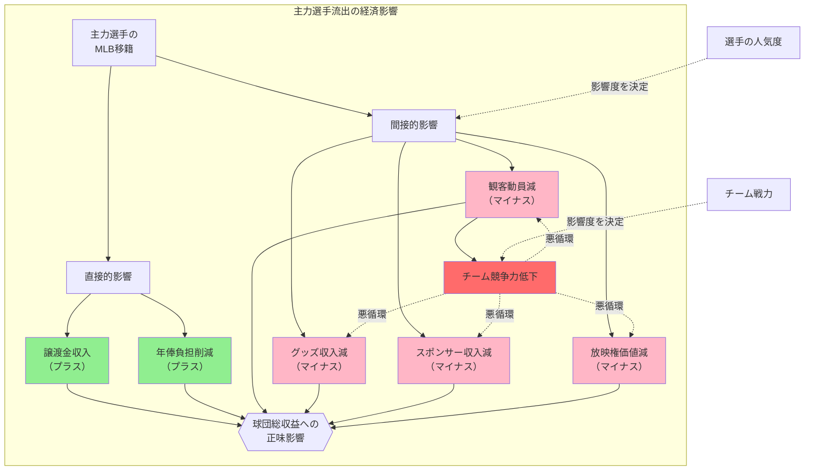

## 要約（Summary）

- 主力選手のMLB移籍は、球団に「譲渡金収入」と「年俸負担削減」をもたらすが、同時に「観客動員減」「グッズ収入減」「スポンサー収入減」などの間接的な収益低下を引き起こす可能性がある。
- 年俸負担の削減は単純なコスト減として見えるが、球団経営の総収益への影響は「選手の人気度」と「チーム競争力」に強く依存するため、一概にプラスとは言えない。

## 本文（Body）

主力選手の移籍による経済的影響は、**直接的な金銭フロー**（譲渡金・年俸）だけでなく、**間接的な収益変動**（興行収入・商業収入）を含めた複合的な評価が必要である。

### 背景・問題意識

スポーツビジネスでは、選手は「コスト」であると同時に「収益源」でもある。主力選手の移籍を単純な「年俸負担の削減＝利益」として捉えると、球団経営の実態を見誤る可能性がある。

### アイデア・主張

**主力選手流出の経済影響は、「直接的な金銭収支の改善」と「間接的な収益基盤の毀損」の両面を持つ。**

#### 直接的なプラス要素

1. **譲渡金収入**（ポスティングの場合）
   - 数千万〜数億ドル規模の一時収入
   - 即座に財務に反映される確実な収入

2. **年俸負担の削減**
   - 翌年以降のコスト削減
   - トップ選手の場合、年間数億〜十数億円規模

#### 間接的なマイナス要素

1. **観客動員の減少**
   - スター選手の不在により、ホーム・アウェイ両方で集客力が低下
   - チケット収入・球場内販売の減少

2. **グッズ収入の減少**
   - 主力選手のユニフォーム・グッズ販売が消失
   - 球団全体のブランド価値低下

3. **スポンサー収入の変動**
   - チーム人気・注目度の低下によるスポンサー評価の下振れ
   - 契約更新時の条件悪化の可能性

4. **放映権料への影響**
   - 視聴率低下による放映権価値の減少（中長期的）

5. **チーム競争力の低下**
   - 成績悪化により上記すべての要素がさらに悪化する悪循環のリスク

### 内容を視覚化するMermaid図

### 具体例・ケース

**村上宗隆選手の場合（2025年）**：

**直接的プラス**：
- 譲渡金：約22〜46億円（契約規模による）
- 年俸削減：推定年間数億円（複数年）

**間接的マイナス（推定）**：
- 村上選手はセ・リーグを代表するスター選手であり、集客力・メディア注目度が極めて高い
- ヤクルトの観客動員、グッズ販売、メディア露出に大きく貢献していた
- 流出により、これらの収益が一定割合減少する可能性が高い

**正味の影響**：
- 球団の財務状況、チーム戦力、ファン基盤の大きさによって、正味の影響はプラス・マイナスいずれにもなり得る
- 短期的には譲渡金収入で黒字化する可能性が高い
- 中長期的には、チーム成績とファン離れの程度に依存する

**他球団の事例**：
- 大谷翔平選手（日本ハム）：流出後も球団ブランドは維持されたが、集客には一定の影響があった可能性
- ダルビッシュ有選手（日本ハム）：同様に短期的な影響は避けられなかった

### 反論・限界・条件

この複合的影響の評価には、以下の条件と不確実性がある：

**評価の難しさ**：
- 間接的な収益減少を定量化することは困難
- 選手流出以外の要因（景気・他チームの動向・新規獲得選手）も収益に影響する
- 因果関係の特定が難しい

**球団による違い**：
1. **大都市球団 vs 地方球団**：ファン基盤の大きさで影響度が異なる
2. **チーム戦力**：他に主力選手が多ければ影響は限定的
3. **球団ブランド**：球団自体のブランド力が強ければ、選手依存度が低い

**時間軸の違い**：
- **短期**（1〜2年）：譲渡金のプラス効果が大きい
- **中期**（3〜5年）：収益減少が累積し、正味でマイナスになる可能性
- **長期**（5年超）：新規選手の育成・獲得によって回復する可能性

**前提条件**：
- この分析は、ポスティングが成立して譲渡金を得られることが前提
- 不成立なら、直接的プラスがゼロになり、判断が大きく変わる

## 関連ノート（Links）

- [[20251221171240-posting-system-basic-mechanism|ポスティングシステムの基本仕組みと交渉期限]] - ポスティングシステムの基本仕組みと交渉期限
- [[20251221171328-mlb-posting-fee-tiered-calculation|MLB譲渡金の段階式算定方式]] - MLB譲渡金の段階式算定方式
- [[20251221171411-posting-vs-overseas-fa-financial-strategy|ポスティング vs 海外FA：球団の金銭戦略比較]] - ポスティング vs 海外FA：球団の金銭戦略比較

## To-Do / 次に考えること

- [ ] 過去の主力選手流出事例で、球団の興行収入・総収益の実績データを収集
- [ ] 選手の人気度を定量化する指標（SNSフォロワー、ユニフォーム販売、メディア露出）を整理
- [ ] スポーツビジネスにおける「選手の経済価値」の評価モデルを調査
- [ ] 譲渡金の再投資戦略（新規選手獲得、育成強化）とその成果を分析
- [ ] 他のスポーツ（サッカー、バスケなど）における同様の事例と比較
