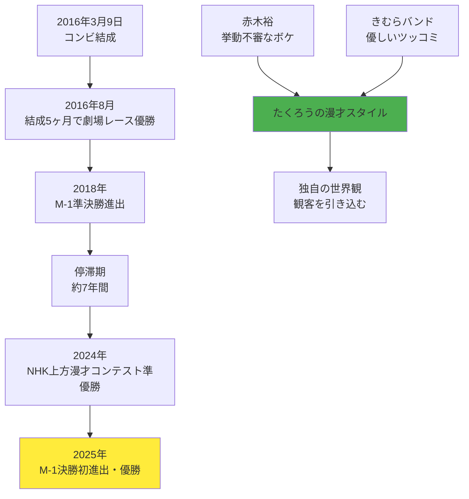

## 要約（Summary）

- たくろうは、赤木裕ときむらバンドによる吉本興業所属のお笑いコンビで、2025年12月21日にM-1グランプリで優勝（第21代王者）を果たした
- 赤木の「挙動不審なボケ」ときむらの「優しいツッコミ」という独自のスタイルで、観客を彼らの世界観に引き込む
- 2016年結成後、賞レースでの停滞期を経て2025年に大きく飛躍した事例として注目に値する

## 本文（Body）

### 背景・問題意識

お笑いの賞レース、特にM-1グランプリは多くの若手芸人にとって登竜門だが、結成から優勝まで長期間を要するケースは珍しくない。たくろうは2016年結成後、2018年に準決勝進出したものの、その後約7年間停滞し、2025年に突如として決勝初進出・初優勝という「跳ね方」を見せた。このような軌跡は、継続的な改善と独自性の確立がいかに重要かを示す事例である。

### アイデア・主張

**漫才における「ボケ」と「ツッコミ」の関係性は、単なる役割分担ではなく、コンビ独自の世界観を構築する要素である。** たくろうの場合、赤木の「挙動不審」という不安定な要素に対し、きむらが「優しく」対応することで、観客に安心感と笑いを同時に提供している。

また、彼らは年単位で「グラデーション的に」スタイルを変化させる戦略を取っており、観客に新鮮さを保ちながらも、コアな世界観は維持している。これは長期的なキャリア構築において重要な示唆を与える。

### 内容を視覚化するMermaid図

### 具体例・ケース

**メンバー構成:**
- 赤木裕（あかぎ・ゆう）: 1991年10月24日生まれ、滋賀県出身、ボケ担当
- きむらバンド: 1990年1月28日生まれ、愛媛県出身、ツッコミ担当

**主な実績:**
- M-1グランプリ2025 優勝（決勝で審査員9人中8票を獲得）
- NHK上方漫才コンテスト2024 準優勝
- ytv漫才新人賞決定戦2019 準優勝
- M-1グランプリ2018 準決勝進出

**ネタ作りの方法論:**
赤木がベース（骨子）を作成し、2人で合わせて仕上げる。赤木のボケは日常で生まれた発想や思考をそのまま持ち込むのが特徴で、これが「挙動不審」な印象の源泉となっている。

### 反論・限界・条件

- このノートは2025年12月時点の情報に基づいており、今後のキャリアの変化は追跡していない
- お笑いにおける「面白さ」は主観的であり、ここで述べたスタイルの評価も観客によって異なる
- M-1優勝後の活動やメディア露出の増加により、スタイルが変化する可能性がある
- 賞レースの結果は運やタイミングにも左右されるため、「停滞期」の評価は一面的である可能性がある

## 関連ノート（Links）

現時点では、このリポジトリ内にエンターテインメントやパフォーマンス関連のノートが少ないため、今後以下のようなノートを作成すると良い連携が期待できる:

- パフォーマンスにおける「世界観」の重要性
- 長期的キャリア構築における停滞期の乗り越え方
- ボケとツッコミの関係性におけるバリエーション
- お笑い賞レースの仕組みと芸人のキャリアパス
- 継続的改善とグラデーション的変化の戦略

## To-Do / 次に考えること

- [ ] M-1グランプリの歴史や他の優勝者の軌跡を調べ、たくろうのケースと比較する
- [ ] 「優しいツッコミ」という手法が他のコンビでどう使われているかを分析する
- [ ] エンターテインメントにおける「独自性」と「世界観」について一般化したノートを作成する
- [ ] パフォーマンス芸術全般における長期的キャリア構築の事例を収集する
