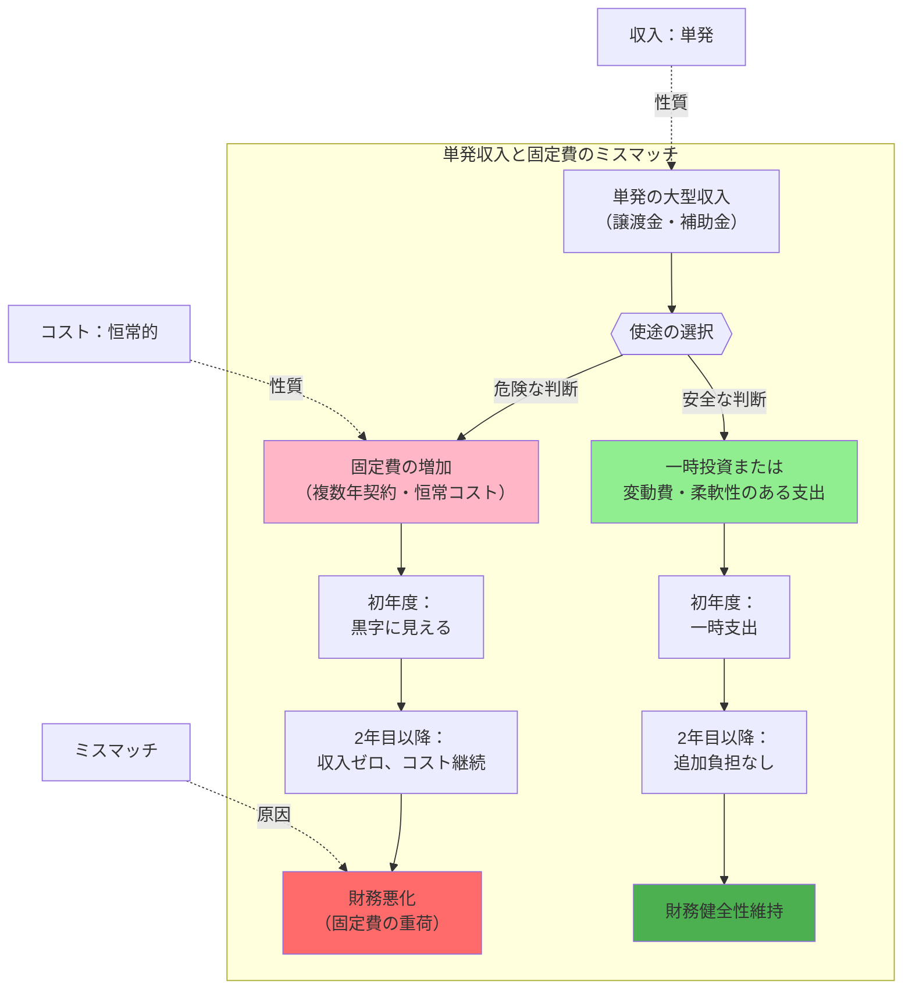

## 要約（Summary）

- 単発の一時金（譲渡金、補助金、臨時収入）を使って固定費（複数年契約、高額年俸、恒常的なコスト）を積み上げると、翌年以降に収入源がなくなり財務が悪化する。
- 一時金は「単発」であるため、それを原資に「毎年発生するコスト」を増やすことは、収支のミスマッチを生み出す危険な財務判断である。

## 本文（Body）

組織が一時的な大型収入を得たとき、その使い道を誤ると中長期的な財務を悪化させる。最も危険なパターンは、**単発収入を固定費の増加に充てる**ことである。

### 背景・問題意識

スポーツ球団における主力選手のポスティング譲渡金、企業における補助金・助成金、プロジェクトの成功報酬など、組織は時として「単発の大型収入」を得る機会がある。このとき、経営者は「この資金をどう使うべきか」という意思決定を迫られる。

表面的には「譲渡金で10億円入ったから、年俸3億円の選手を複数年契約で獲得しよう」という判断は合理的に見える。しかし、これは**収入の性質とコストの性質のミスマッチ**を生む。

### アイデア・主張

**単発収入を原資に固定費を積むと、翌年以降に「収入はゼロ、コストだけ残る」状態になり、組織の財務持続性を損なう。**

#### 単発収入と固定費のミスマッチ構造

| 収入の性質 | コストの性質 | 結果 |
|-----------|------------|------|
| **単発（1回限り）** | **固定費（毎年発生）** | ❌ ミスマッチ：翌年以降の負担増 |
| **単発（1回限り）** | **変動費・一時投資** | ✅ 整合：支出も1回限り |
| **恒常的（毎年発生）** | **固定費（毎年発生）** | ✅ 整合：持続可能 |

#### 危険な意思決定の例

1. **高額複数年契約の選手獲得**
   - 譲渡金10億円で年俸3億円×4年契約の選手を獲得
   - 初年度：譲渡金10億 - 年俸3億 = プラス7億
   - 2年目以降：収入ゼロ - 年俸3億 = マイナス3億/年

2. **恒常的な人件費の増加**
   - 補助金を使って正社員を大量採用
   - 補助金終了後も人件費は固定費として残る

3. **固定的な設備運営コストの増加**
   - 一時金で新施設を建設するが、維持費・運営費が毎年発生
   - 初期投資は賄えても、ランニングコストが重荷になる

### 内容を視覚化するMermaid図

### 具体例・ケース

#### スポーツ球団のポスティング譲渡金（NPB）

**問題のある戦略**：
- 譲渡金10億円を得て、年俸3億円×複数年の高額FA選手を複数獲得
- 初年度は「譲渡金でプラス」に見えるが、2年目以降は年俸負担のみが残る
- 球団の恒常的な収益構造が改善していない場合、財務が苦しくなる

**健全な戦略**：
- 譲渡金を**一時投資**（施設改修、トレーニング設備、スカウト強化）に充てる
- または**柔軟性のある補強**（単年契約中心、球団オプション付き複数年契約）
- 固定費を増やさずに戦力・収益基盤を強化する

**実例**：
- 西武：松坂大輔の譲渡金を球場改修と育成投資に充当（一時投資型） permanent/20251221171458-star-player-transfer-economic-impact.md:161
- オリックス：山本由伸の譲渡金を舞洲施設の投資回収に充当（一時投資型）
- 広島：前田健太の譲渡金を由宇練習場改修と地域還元に充当（一時投資型）

#### 企業の補助金活用

**問題のある戦略**：
- 新規事業補助金で正社員を大量採用
- 補助金終了後も人件費は固定費として残る
- 事業が成長せず収益が上がらない場合、人件費負担が重荷になる

**健全な戦略**：
- 補助金を設備投資、R&D、マーケティングなど一時的な支出に充てる
- 人材は業務委託や契約社員など柔軟性のある形で確保
- 事業が軌道に乗ってから正社員化を検討

### 反論・限界・条件

#### この原則が成立しない場合

1. **一時収入が将来の恒常収入増を生む場合**
   - 例：譲渡金で獲得した選手が大当たりし、観客動員・スポンサー収入が大幅増加
   - この場合、固定費増加を上回る恒常収益が生まれ、ミスマッチが解消される

2. **組織の収益基盤が極めて強固な場合**
   - 例：親会社が潤沢な資金を持ち、赤字を補填できる
   - この場合、単発収入の有無に関わらず固定費を支えられる

3. **固定費増加が戦略的に必要な場合**
   - 例：競争上、今すぐ戦力を整えないと市場シェアを失う
   - 短期的なリスクを取ってでも投資が必要なケースもある

#### 前提条件

- この原則は「組織の恒常的な収益構造が変わらない」ことを前提とする
- 単発収入が「将来の恒常収益を生む投資」に化ければ、ミスマッチは解消される
- したがって重要なのは、**「単発収入を、恒常収益を生む仕組みに変換できるか」**という視点

## 関連ノート（Links）

- [[20251221171458-star-player-transfer-economic-impact|主力選手流出の複合的な経済影響]] - スター選手流出時の収益への影響を分析
- [[20251215090824-migration-operation-safety-pattern|マイグレーション操作の安全化パターン]] - リスク管理の一般原則（類似の慎重性）
- [[20251215104625-si-project-elasticity-by-type|案件タイプ別の価格弾力性マトリクス]] - 収益構造の分析手法
- [[20251129160322-junior-engineer-growth-with-ai|ジュニアエンジニアの成長戦略としてのAI活用]] - 人材投資の持続可能性の観点

## To-Do / 次に考えること

- [ ] 実際の企業・球団で「補助金終了後の財務悪化」事例を収集
- [ ] 「単発収入を恒常収益に転換する成功パターン」を整理（設備投資→生産性向上など）
- [ ] 個人の家計でも同じ原則が成立するか検討（ボーナスで固定費を増やす危険性）
- [ ] 「固定費 vs 変動費」の戦略的コントロールについて別ノートを作成
- [ ] スタートアップの資金調達と固定費管理の関係を調査
