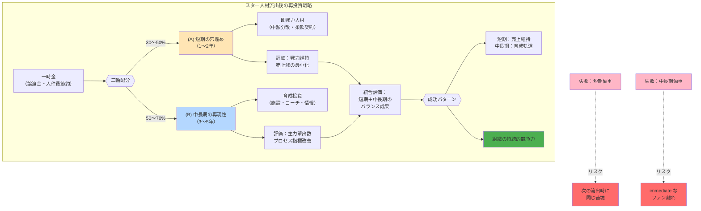

## 要約（Summary）

- スター人材流出後の一時金は、(A) 短期の穴埋め（1〜2年で戦力維持）と (B) 中長期の再現性強化（3〜5年で内製化）の二軸で配分すべきである。
- 短期のみに偏ると持続性がなく、中長期のみでは immediate な売上減・ファン離れを招くため、両軸のバランスが重要である。

## 本文（Body）

組織のスター人材が流出し、一時金（譲渡金、退職金の節約、補助金など）を得たとき、その再投資戦略は**時間軸による二軸思考**が必要である。単に「良い選手を獲得する」「育成を強化する」では不十分で、**短期と中長期のバランス配分**が成否を分ける。

### 背景・問題意識

スポーツ球団における主力選手のポスティング、企業における中核人材の引き抜き、研究機関のスター研究者の転出など、組織は「稼ぎ頭の流出」に直面することがある。このとき、得られる一時金（譲渡金、人件費節約など）をどう使うかが、組織の将来を左右する。

多くの組織が陥る失敗パターン：
1. **短期偏重**：高額FAや即戦力外国人で穴を埋めるが、育成が進まず次の流出時に同じ苦境に
2. **中長期偏重**：育成施設や若手強化に全振りするが、immediate な戦力低下でファン・顧客離れが加速
3. **無計画な分散**：「とりあえず色々やる」で効果が不明瞭、説明責任を果たせない

### アイデア・主張

**スター人材流出後の一時金は、(A) 短期の穴埋めと (B) 中長期の再現性の二軸で戦略的に配分し、両軸の目的と評価指標を明確にすべきである。**

#### (A) 短期の穴埋め（1〜2年）

**目的**：
- 戦力の"穴"を埋めて、immediate な売上減（動員・露出・スポンサー）を最小化
- ファン・顧客の離反を防ぎ、組織のブランド価値を守る

**投資先**：
- 即戦力人材の獲得（ただし複数年高額契約は避ける）
- 「高額1人」より **中額の複数枚**に分散してリスクヘッジ
- 複数年契約でも**球団オプション**や**出来高中心**で下振れ耐性を作る

**評価指標**：
- 勝利貢献（WAR等のパフォーマンス指標）
- 1軍稼働率（怪我・不調で使えなければ意味がない）
- 観客動員・スポンサー露出の落ち込み幅（どれだけ防げたか）

**典型的な配分比率**：一時金の **30〜50%**

#### (B) 中長期の再現性強化（3〜5年）

**目的**：
- 次の主力を**組織内で再生産**し、同じ事態が起きても崩れない体質にする
- 外部依存を減らし、持続的な競争力を確保する

**投資先（効果が高い順）**：
1. **怪我予防・出力向上**：トレーニング設備、リハビリ、動作解析（バイオメカニクス）、栄養管理
2. **コーチングの厚み**：育成担当コーチ、投手コーディネータ、守備走塁専門コーチ
3. **スカウティングと編成の情報力**：アマチュア評価、外国人発掘、データ基盤

**評価指標**：
- 育成からの主力輩出数（3〜5年で何人が1軍主力になったか）
- 故障離脱日数の減少（トレーニング・リハビリ投資の効果）
- 投手球速・打球指標など**プロセス指標**の改善（結果より先行指標）

**典型的な配分比率**：一時金の **50〜70%**

### 内容を視覚化するMermaid図

### 具体例・ケース

#### NPB球団のポスティング譲渡金活用

**成功例（二軸配分型）**：

1. **西武（松坂大輔）**：
   - 短期：即戦力投手を複数獲得（穴埋め）
   - 中長期：球場改修＋育成部門強化
   - 結果：immediate な戦力低下を抑えつつ、後の主力選手を輩出

2. **オリックス（山本由伸）**：
   - 短期：外国人投手・野手を複数獲得
   - 中長期：舞洲施設（総工費約60億円）の投資回収＋育成強化
   - 結果：2024年も優勝争いを継続しつつ、育成基盤を強化

3. **広島（前田健太）**：
   - 短期：即戦力外国人投手獲得
   - 中長期：由宇練習場改修＋地域還元（ファン基盤強化）
   - 結果：戦力維持とブランド価値向上の両立

**失敗パターン（短期偏重）**：
- 譲渡金を全額「高額FA選手の複数年契約」に投入
- 初年度は戦力補強に成功するが、育成が進まず次の流出時に同じ問題が再発
- 固定費が増えて財務が悪化（[[20251221223329-one-time-revenue-fixed-cost-mismatch-risk|単発収入で固定費を積む財務リスク]]）

**失敗パターン（中長期偏重）**：
- 譲渡金を全額「施設改修・育成強化」に投入
- immediate な戦力低下で観客動員・スポンサー収入が急減
- ファン離れが進み、育成が実を結ぶ前に組織が弱体化

#### 企業の中核人材流出

**二軸配分の応用**：

**短期の穴埋め（A）**：
- 即戦力の外部人材を業務委託・契約社員で確保（柔軟性を保つ）
- 既存メンバーのスキルアップ研修で急場をしのぐ

**中長期の再現性（B）**：
- 社内育成プログラム、メンター制度、ナレッジ共有基盤の構築
- 採用力強化（リファラル、ブランディング）
- 技術的負債の解消（属人化の排除、ドキュメント整備）

### 反論・限界・条件

#### この二軸モデルが成立する前提

1. **一時金の規模が十分である**
   - 小規模な一時金では、どちらか一方にしか投資できない
   - 目安：年間予算の10%以上あれば二軸配分が現実的

2. **短期と中長期の目標が明確である**
   - 「とりあえず両方やる」では効果測定ができない
   - 各軸の目的・KPI・責任者を明確にする必要がある

3. **組織のリスク許容度による配分調整**
   - リスク回避型：短期60% / 中長期40%（安全志向）
   - リスク許容型：短期30% / 中長期70%（成長志向）
   - 組織の状況（ファン基盤、財務、競合）で最適比率は変わる

#### この戦略が失敗するケース

1. **短期補強が大外れ**
   - 獲得した即戦力が怪我・不調で機能しない
   - これを防ぐため、「高額1人」より「中額分散」が推奨される

2. **中長期投資が空振り**
   - 施設を作ってもコーチングが改善せず、育成が進まない
   - 投資と運用（ソフト面）をセットで設計する必要がある

3. **市場環境の急変**
   - 景気悪化、競合の台頭などで短期・中長期の前提が崩れる
   - 定期的な見直しと軌道修正が必要

## 関連ノート（Links）

- [[20251221223329-one-time-revenue-fixed-cost-mismatch-risk|単発収入で固定費を積む財務リスク]] - 短期補強で固定費を増やす危険性
- [[20251221171458-star-player-transfer-economic-impact|主力選手流出の複合的な経済影響]] - スター流出の収益への影響
- [[20251129160322-junior-engineer-growth-with-ai|ジュニアエンジニアの成長戦略としてのAI活用]] - 人材育成投資の考え方
- [[20251215102820-domain-knowledge-as-moat|ドメイン知識と業界知識が開発者の唯一の持続的競争優位（護城河）]] - 中長期の再現性の重要性
- [[20251215090824-migration-operation-safety-pattern|マイグレーション操作の安全化パターン]] - リスク分散の一般原則

## To-Do / 次に考えること

- [ ] NPB各球団の譲渡金活用事例を整理し、短期/中長期の配分比率を推定
- [ ] 企業のM&A後の人材統合戦略で、同様の二軸モデルが有効か検証
- [ ] 個人のキャリア投資（資格・スキルアップ）にも二軸思考が適用できるか検討
- [ ] 「最適配分比率」を決定する要因（組織の状況・リスク許容度）を体系化
- [ ] 短期・中長期の成果を統合評価する指標（ROI、NPV等）を設計
