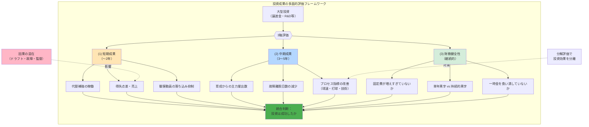

## 要約（Summary）

- 組織の投資成果を「勝った/負けた」や単年の財務結果だけで評価するのは不十分である。短期成果（1〜2年）、中期成果（3〜5年）、財務健全性の3軸で分解して追うことで、因果が混ざりやすい投資の真の効果を把握できる。
- 特に中期成果では、結果指標（勝敗・売上）より**プロセス指標**（能力向上・故障減少・情報基盤）を重視すべきである。

## 本文（Body）

組織が大型投資を行った後、「成功したか？」を評価するのは容易ではない。多くの要因が絡み合い、因果関係が不明瞭になるからである。しかし、**評価軸を時間と性質で分解**すれば、投資の真の効果を追跡できる。

### 背景・問題意識

スポーツ球団がポスティング譲渡金を育成投資に充てた場合、「効果があったか」をどう判断するか？ 単純に「翌年優勝したから成功」「最下位だから失敗」では、投資以外の要因（ドラフトの当たり外れ、故障、監督の手腕、他球団の動向）と混ざり、正しい評価ができない。

同様に、企業がR&D投資を行った場合も「新製品のヒット」だけで評価すると、市場環境や競合の影響を無視することになる。

**投資評価が雑になる典型的な失敗**：
1. **結果だけ見る**：「優勝したから成功」「売上が増えたから成功」→因果不明
2. **短期だけ見る**：「初年度は赤字だから失敗」→中長期効果を無視
3. **財務だけ見る**：「黒字化したから成功」→組織能力の改善を見ない

### アイデア・主張

**投資成果は、(1) 短期成果、(2) 中期成果、(3) 財務健全性の3軸で分解して追うべきである。特に中期では「プロセス指標」を重視し、結果指標の先行指標として監視する。**

#### 評価フレームワークの3軸

| 評価軸 | 時間軸 | 主な指標 | 目的 |
|-------|-------|---------|------|
| **短期成果** | 〜2年 | パフォーマンス、稼働率、売上維持 | immediate な効果を確認 |
| **中期成果** | 3〜5年 | プロセス指標、能力向上、主力輩出数 | 組織能力の改善を追跡 |
| **財務健全性** | 継続的 | 固定費比率、ROI、キャッシュフロー | 持続可能性を確認 |

### 内容を視覚化するMermaid図

### 具体例・ケース

#### (1) 短期成果（〜2年）の評価指標

**スポーツ球団の場合**：
- **代替補強の稼働**：獲得した選手が怪我なく1軍で活躍したか
- **得失点差**：チーム全体のパフォーマンスが維持されたか
- **観客動員・スポンサー露出**：スター流出による下落をどれだけ抑えたか

**企業の場合**：
- **即戦力人材の稼働率**：外部採用・業務委託が機能したか
- **売上・利益の維持**：中核人材流出による下落をどれだけ防いだか
- **顧客満足度**：サービス品質が低下しなかったか

**評価のポイント**：
- 「勝ったか負けたか」ではなく、「投資がなかった場合と比べてどうか」を考える
- 例：「最下位だったが、投資なしなら観客動員が半減していた」→短期成果は一定評価できる

#### (2) 中期成果（3〜5年）の評価指標

**スポーツ球団の場合**：
- **育成からの主力輩出数**：3〜5年で何人が1軍主力になったか
- **故障離脱日数の減少**：トレーニング・リハビリ投資の効果
- **プロセス指標の改善**：
  - 投手：平均球速、空振り率、制球力
  - 打者：打球速度、打球角度、選球眼
  - これらは**勝敗より先に改善が見える**ため、投資効果の早期検出に有効

**企業の場合**：
- **社内育成プログラムからの主力輩出**：何人がリーダー・専門家に成長したか
- **技術的負債の減少**：ドキュメント整備、属人化解消の進捗
- **プロセス指標**：
  - 開発速度（デプロイ頻度、リードタイム）
  - 品質（バグ密度、テストカバレッジ）
  - これらは**売上より先に改善が見える**

**評価のポイント**：
- **結果指標（勝敗・売上）は遅行指標**であり、因果が混ざりやすい
- **プロセス指標は先行指標**であり、投資の直接効果を捉えやすい
- 「勝てなかったが、投手陣の平均球速が3km/h上がった」→中期投資は効いている可能性

#### (3) 財務健全性の評価指標

**共通指標**：
- **固定費が増えすぎていないか**：一時金で恒常コストを積んでいないか（[[20251221223329-one-time-revenue-fixed-cost-mismatch-risk|単発収入で固定費を積む財務リスク]]）
- **単年黒字 vs 持続的黒字**：短期的に黒字でも、翌年以降が赤字なら失敗
- **ROI（投資利益率）**：投資額に対して、どれだけの経済効果を生んだか

**評価のポイント**：
- 「初年度黒字」だけでは判断できない（一時金の恩恵かもしれない）
- 「固定費比率の推移」を見て、持続可能性を確認する
- 理想：**短期黒字＋中期プロセス改善＋財務健全性維持**の3つ揃った状態

### 具体例：NPB球団の譲渡金活用評価

#### 成功例（仮想）

**短期成果（〜2年）**：
- 獲得した外国人投手が規定投球回到達、防御率2点台
- 観客動員は前年比5%減に抑制（スター流出で20%減の予測だった）

**中期成果（3〜5年）**：
- 育成投資の結果、5年で3人が1軍レギュラーに定着
- 投手陣の平均球速が147km/h → 150km/hに向上（設備・トレーニング改善の効果）
- 故障離脱日数が年間300日 → 150日に半減

**財務健全性**：
- 固定費は微増に抑制（複数年高額契約を避けた）
- 3年目以降も黒字を維持（育成選手が戦力化し、外部補強コストが減少）

**総合評価**：✅ 投資は成功（3軸すべてでポジティブな結果）

#### 失敗例（仮想）

**短期成果（〜2年）**：
- 獲得した高額FA選手が故障で1年目ほぼ欠場
- 観客動員は前年比30%減（補強失敗で失望が拡大）

**中期成果（3〜5年）**：
- 育成投資が不十分で、5年で主力輩出ゼロ
- プロセス指標も改善せず（投資が施設だけで、コーチング改善がなかった）

**財務健全性**：
- FA選手の複数年高額契約で固定費が急増
- 2年目以降、毎年赤字（一時金を食い潰した）

**総合評価**：❌ 投資は失敗（3軸すべてでネガティブな結果）

### 反論・限界・条件

#### このフレームワークの限界

1. **因果関係の完全分離は不可能**
   - 他の要因（ドラフト、故障、市場環境）の影響を完全に排除できない
   - 「投資があった場合」と「なかった場合」を比較できない（反実仮想）

2. **プロセス指標の選定が難しい**
   - 「何を測るべきか」は業界・組織によって異なる
   - 間違った指標を追うと、改善が歪む（KPIの罠）

3. **評価に時間がかかる**
   - 中期成果は3〜5年待たないと見えない
   - 短期判断が求められる状況では使いにくい

#### 前提条件

- このフレームワークは「投資の効果を事後的に検証する」ためのもの
- **投資前の意思決定**には別のフレームワーク（ROI予測、リスク分析等）が必要
- 評価結果を次の投資判断にフィードバックすることで、組織学習が進む

#### 応用範囲

このフレームワークは以下の投資評価にも応用できる：
- **R&D投資**：短期（試作品）、中期（特許・論文）、財務（ROI）
- **人材育成投資**：短期（研修効果）、中期（スキル向上）、財務（離職率・生産性）
- **システム投資**：短期（稼働率）、中期（開発速度・品質）、財務（TCO削減）

## 関連ノート（Links）

- [[20251221223454-star-talent-departure-reinvestment-two-axis-model|スター人材流出後の再投資戦略の二軸モデル]] - この評価フレームワークで成果を測定する
- [[20251221223329-one-time-revenue-fixed-cost-mismatch-risk|単発収入で固定費を積む財務リスク]] - 財務健全性の評価軸で検出すべきリスク
- [[20251221171458-star-player-transfer-economic-impact|主力選手流出の複合的な経済影響]] - 短期成果の評価に含めるべき要素
- [[20251215090824-migration-operation-safety-pattern|マイグレーション操作の安全化パターン]] - リスク評価の一般原則
- [[20251215102730-software-cost-reduction-ai-agents|エージェント型AIによるソフトウェア開発コストの劇的削減]] - プロセス指標で効果を測定する事例

## To-Do / 次に考えること

- [ ] NPB各球団の譲渡金活用を3軸で評価し、成功・失敗パターンを整理
- [ ] 企業のR&D投資評価で、どのようなプロセス指標が使われているか調査
- [ ] 「反実仮想」（投資しなかった場合）をどう推定するか、統計的手法を学ぶ
- [ ] KPI設計で陥りやすい罠（歪んだインセンティブ）と対策を別ノートにまとめる
- [ ] 短期・中期・財務の3軸を統合した「総合スコア」の算出方法を検討
