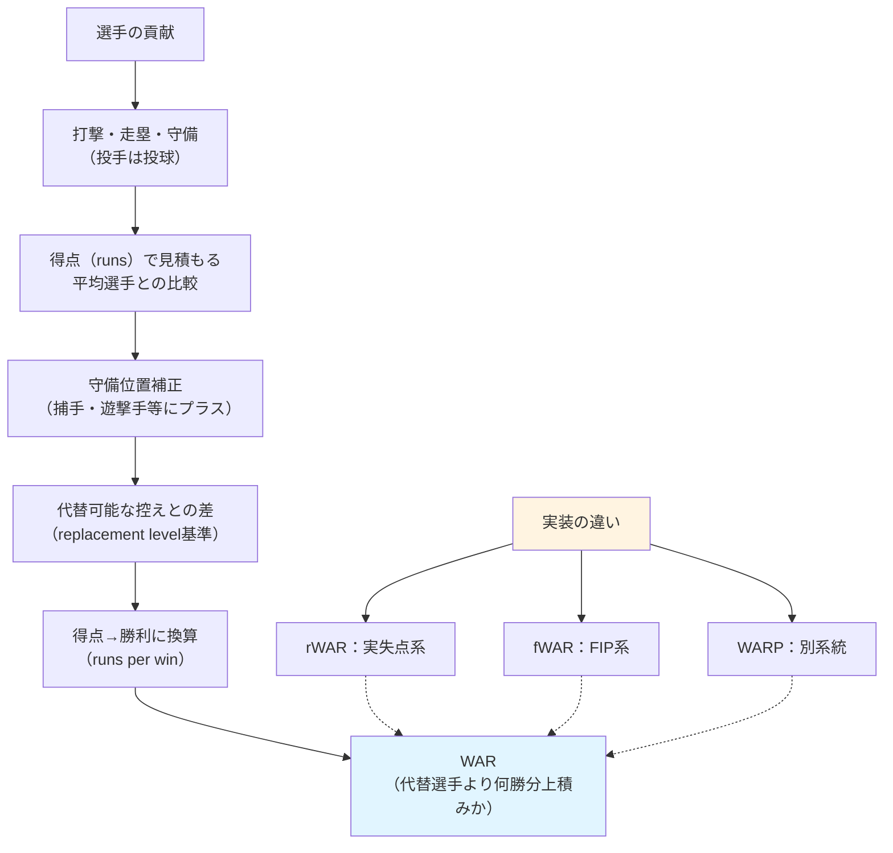

## 要約（Summary）

- WAR（Wins Above Replacement）は、選手が「代替可能な控え選手」より何勝分チームに上積みをもたらしたかを示す総合評価指標である
- 打撃・走塁・守備（投手なら投球）を統一単位（勝利数）で比較できるため、異なるタイプ・守備位置の選手を同じ土俵で評価できる
- WARは「概念」であり、rWAR、fWAR、WARPなど複数の実装があり、守備評価や投手評価の前提が異なるため同じ選手でも値が一致しない

## 本文（Body）

### 背景・問題意識

野球において、選手の貢献は多面的である。打てる一塁手と、守れて走れる遊撃手、あるいは奪三振の多い先発投手と、失点を抑える抑え投手など、役割が異なる選手を同じ基準で比較することは難しい。編成・契約・MVP議論において「どの選手がより価値があるか」を判断するには、異なる要素を統一的に評価する枠組みが必要だった。

### アイデア・主張

WARは、選手の総合貢献を「代替可能な控え選手（replacement level）を基準に、何勝分チームに上積みしたか」という形で定量化する。計算の骨格は以下の通り：

1. **得点での貢献を見積もる**：野手は打撃＋走塁＋守備、投手は失点抑止を「得点（runs）」で積み上げる（平均的選手との比較）
2. **守備位置の難しさを補正する**：捕手・遊撃手など守備負担の大きいポジションにはプラス補正
3. **代替可能な控えとの差に変換する**：平均ではなく「二軍・ベンチから補える水準」を基準に置く（Above Replacement）
4. **得点→勝利に換算する**：「だいたい何得点が1勝に相当するか」の係数で勝利数に変換

こうして、WAR =（代替水準よりどれだけ得点を増やしたか）÷（1勝あたり得点）が得られる。

重要なのは、**WARは1つの実装ではなく、複数の実装が存在する**ことである：

- **rWAR**（Baseball-Reference）：投手は実失点（RA9）寄りの考え方
- **fWAR**（FanGraphs）：投手はFIP（奪三振・四球・被本塁打中心）寄りの考え方
- **WARP**（Baseball Prospectus）：別系統の実装

同じ選手でも、守備評価のモデルや投手の見方（FIP系か実失点系か）が違うため、WARが一致しないことがある。したがって、「WARという考え」＋「どのWARか」をセットで扱うのが実務上のコツである。

また、WARはリーグ公式の指標ではなく、**民間のデータ会社・分析サイト・研究者（および球団の分析部門）**が独自に計算している。Baseball-Reference、FanGraphs、Baseball Prospectus（MLB）、DELTA（NPB）などが代表的な提供主体である。

### 内容を視覚化するMermaid図

### 具体例・ケース

**1. 選手比較（異なるタイプ・守備位置でも比較可能）**

打てる一塁手と、守れて走れる遊撃手のように役割が違う選手を、勝利貢献で同じ土俵に置ける。ただし単年の差はブレやすいので、複数年（例：直近3年）や出場機会込みで見ると判断が安定する。

**2. 補強・編成（どこを補強すると勝ちが増えるかを定量化）**

ポジション別に「現有戦力のWAR」と「市場の候補のWAR」を並べ、差分（増えるWAR）を勝利増＝順位影響として見積もる。特に"穴"を埋める補強は、WARの差分がそのまま期待勝利増になりやすい。

**3. 契約・年俸評価（勝利1つの市場価値に落とす）**

MLBでは「1WARあたりいくら」という相場観で契約妥当性を議論する（NPBは市場構造が違うのでそのまま移植は注意）。社内で評価軸を作るなら、WARだけでなく年齢・故障リスク・再現性（守備のブレ等）を併記すると事故りにくい。

**4. MVP/ベストナインの議論のたたき台**

WARは「総合価値」の起点として便利だが、重要場面（クラッチ）、役割（抑え投手の起用法）、守備指標の誤差など"WARが捉えにくい価値"もあるので、WARを結論にせず、議論の出発点にするのが健全である。

### 反論・限界・条件

**守備WARは特にブレやすい**

単年で断定しない。サンプル（守備機会）と複数年平均で見る必要がある。

**投手WARは前提が分かれる**

FIP系（投手の責任を絞る）か、実失点系（結果も含める）かで評価が変わる。どちらを採用するかは分析の目的による。

**"代替水準"は仮定**

リーグや時代で厳密に一致しない。比較対象を揃えるのが重要。

**WARは結論ではなく、議論の出発点**

WARが捉えにくい価値（クラッチ性能、チームケミストリー、リーダーシップ等）も存在する。数値だけで判断せず、他の情報と組み合わせて意思決定する必要がある。

## 関連ノート（Links）

- [[20251221223454-star-talent-departure-reinvestment-two-axis-model|スター人材流出後の再投資戦略の二軸モデル]]：選手の価値評価と補強編成の文脈で共通点
- [[20251215085315-critical-perspective-integration|批判的視点の統合による読書深化]]：定量指標の限界を理解し批判的に扱う必要性
- [[20251221114928-explicit-manual-intervention-design|完全自動化できない対話ポイントの明示設計]]：数値だけでは判断できない部分を明示する設計思想
- [[20251214140142-ai-as-linter-antipattern|AI-as-Linterアンチパターンと決定的ツールの優位性]]：定量的ツールの限界と適用範囲の明確化
- [[20251129160317-ai-role-division-what-why-how|AI連携開発における役割分担の原則]]：異なる評価軸を統合して意思決定する考え方

## To-Do / 次に考えること

- [ ] rWARとfWARの具体的な計算式の違いを調べ、別zettelとして整理する
- [ ] セイバーメトリクス全体の体系（OPS、FIP、wOBA等）とWARの位置づけを整理する
- [ ] NPBにおけるWAR実装（DELTA等）の詳細を調査する
- [ ] 「代替可能な控え選手（replacement level）」の定義がリーグ・時代でどう変化するかを調べる
