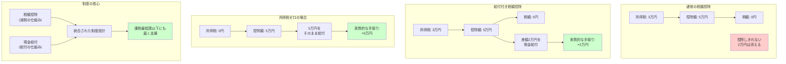

## 要約（Summary）

- 給付付き税額控除（refundable tax credit）は、税額控除を税金がゼロの人にまで効かせるため、控除しきれない分を現金給付する仕組み
- 本来の所得税が0円の人でも、条件を満たせば一定額を受け取れる（＝「税の仕組みで給付までやる」）
- 低所得層支援・子育て支援・就労支援・消費税の逆進性対策など、多様な政策目的に利用できる制度設計の柔軟性が特徴

## 本文（Body）

### 背景・問題意識

従来の所得控除や税額控除は、そもそも税金を払っている人にしか恩恵がない。課税最低限以下の低所得層は、減税メリットを受けられない「再分配の穴」が存在していた。給付付き税額控除は、この構造的な問題を解決する仕組みとして設計された。

**通常の税額控除との違い：**
- **通常の税額控除**：税額が5万円、控除額が8万円 → 税額はゼロになるが、差額3万円は消える
- **給付付き税額控除**：税額が5万円、控除額が8万円 → 税額ゼロ + 差額3万円を現金給付

### アイデア・主張

**給付付き税額控除は、「税制」と「給付制度」を一体化することで、課税最低限以下の層にも同じ設計思想で支援を届ける制度である。**

#### 基本メカニズム

1. **税額控除の計算**：所得に基づいて控除額を決定（例：5万円）
2. **税額との比較**：
   - 所得税が3万円の場合 → 税額ゼロ + 2万円を給付
   - 所得税がゼロの場合 → 5万円をそのまま給付
3. **年1回の精算**：多くの制度では確定申告時に還付

#### 設計上の特徴

**柔軟性が高い：**
- 対象を絞る（低所得者のみ、子育て世帯のみ、等）
- 給付額を所得・世帯構成・就労状況に応じて変動させる
- 段階的に増減する設計が可能（後述の就労インセンティブ設計）

**税と給付の境界を消す：**
- 税を払う層には「減税」として
- 税を払わない層には「給付」として
- 同じ制度設計で一貫性のある支援が可能

#### 典型的な政策目的

1. **低所得者支援（再分配）**：課税最低限以下の層への所得移転
2. **就労促進**：働くほど給付が増える設計で「働かないほうが得」を回避
3. **子育て支援**：子供の数に応じた給付で養育費負担を軽減
4. **消費税の逆進性対策**：低所得層への直接給付で負担を相殺

### 内容を視覚化するMermaid図

### 具体例・ケース

**ケース1：米国のEITC（Earned Income Tax Credit）**
- 対象：低〜中所得の勤労世帯
- 仕組み：
  - 所得に応じて控除額が増減（就労インセンティブ）
  - 子供の数で給付額が変動
  - 確定申告時に還付
- 規模：年間約6,400万世帯が受給（2019年）
- 効果：就労促進と貧困削減の両立を目指す

**ケース2：カナダのCanada Workers Benefit**
- 対象：低所得の勤労者
- 特徴：
  - 所得の段階的増加に応じて給付が増える（フェーズイン）
  - 一定所得を超えると段階的に減る（フェーズアウト）
  - 障害者には追加給付
- 効果：労働市場への参加を促進

**ケース3：日本での検討例**
- 目的：低所得者対策、消費税の逆進性対応、就労支援
- 課題：
  - 所得把握の不完全性（課税最低限以下の層の情報が不足）
  - 不正受給・誤支給のリスク
  - システム構築コスト（税務・自治体の連携が必要）
- 現状：2025年末時点で制度設計の検討段階

### 反論・限界・条件

**「給付付き税額控除は万能ではない」**
- 所得把握が不完全な国では運用が困難
- 年1回の精算だと、日々の生活費への支援としてはタイミングが遅い
- 申告ベースだと、申告しない層（高齢者、低所得層）が取りこぼされる

**「税と給付の一体化」の複雑性**
- 税務当局が給付業務を担うのか、福祉部門が担うのか
- 組織間の情報連携が必須（システム改修・プライバシー保護）
- 運用コストが高い

**制度設計の難しさ**
- 給付額の設定：少なすぎると効果薄、多すぎると財政負担
- フェーズアウト設計：減り方が急だと「働くと損」になる
- 対象の絞り方：普遍的給付 vs 選別的給付のトレードオフ

**成立条件：**
- マイナンバー等の個人識別制度の整備
- 税務と社会保障の情報連携基盤
- 国民の制度理解と申告率の向上
- 不正対策の仕組み（所得・資産の捕捉）

## 関連ノート（Links）

- [[20251221231128-refundable-tax-credit-work-incentive-design|給付付き税額控除の就労インセンティブ設計]] 就労インセンティブを組み込んだ設計パターン
- [[20251221231129-benefit-system-implementation-challenges|給付制度の実装課題]] 日本で導入に時間がかかる理由
- [[20251215104528-switching-cost-vendor-lockin|スイッチングコストとベンダーロックイン]] 制度への依存と離脱コストの類似性
- [[20251215104430-si-project-price-inelasticity|SI個別開発案件の価格非弾力性]] 限界負担率の概念との関連

## To-Do / 次に考えること

- [ ] EITCの具体的な給付額と所得階層別の効果を調査
- [ ] 日本の所得捕捉率（クロヨン・トーゴーサン）の現状と改善策を整理
- [ ] マイナンバーと税務情報連携の進捗状況を追跡
- [ ] 「年1回精算」の課題を解決する月次給付の仕組みを検討
- [ ] 消費税の逆進性対策として、軽減税率との比較を行う
