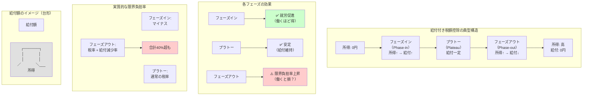

## 要約（Summary）

- 給付付き税額控除の多くは「増える→上限で横ばい→減る」（フェーズイン・プラトー・フェーズアウト）の構造を持つ
- フェーズイン局面では就労促進効果があるが、フェーズアウト局面では実質的な限界負担率が上昇し、「働くほど損」の問題が生じる
- 就労促進と再分配のバランスをどう取るかが、制度設計の最大の難所

## 本文（Body）

### 背景・問題意識

給付制度の設計では「貧困層を支援したい」と「働くインセンティブを削がない」の両立が常に課題となる。無条件の一律給付は就労意欲を削ぎ、所得制限が厳しすぎると「働いて所得が増えると給付が減って手取りが変わらない」という「貧困の罠（poverty trap）」が発生する。

給付付き税額控除は、この問題を「所得に応じて給付額を変動させる」ことで解決しようとする。

### アイデア・主張

**給付付き税額控除の典型的な設計は、3つのフェーズから成る「台形」構造である：**

#### 1. フェーズイン（Phase-in）：所得増加に応じて給付が増える

**仕組み：**
- 所得が低い層から働き始めると、所得に応じて給付額が増加
- 例：所得10万円で給付2万円、所得20万円で給付4万円

**効果：**
- **就労促進**：働くほど手取りが増える構造
- 「働かないほうが得」を回避
- 労働市場への参加を促す

**実質的な限界負担率：**
- マイナス（働くほど手取りが増える）
- 例：所得10万円増 → 給付2万円増 → 実質12万円の手取り増

#### 2. プラトー（Plateau）：給付額が上限で横ばい

**仕組み：**
- 一定の所得範囲で給付額が一定
- 例：所得20万円〜40万円の間、給付5万円で固定

**効果：**
- 所得が増えても給付は減らない（安心して働ける）
- フェーズアウトへの移行を緩やかにする

**実質的な限界負担率：**
- 通常の所得税・社会保険料のみ（給付の増減なし）

#### 3. フェーズアウト（Phase-out）：所得増加に応じて給付が減る

**仕組み：**
- 一定所得を超えると、所得増加に応じて給付が段階的に減少
- 例：所得40万円で給付5万円、所得50万円で給付3万円、所得60万円で給付0円

**効果：**
- **財政コストの抑制**：高所得層への給付を避ける
- **所得再分配の精緻化**：低所得層に集中

**問題点：**
- **実質的な限界負担率の上昇**：
  - 所得税・社会保険料に加えて、給付減少が追加の「実質課税」として働く
  - 例：所得10万円増 → 所得税2万円 + 給付減2万円 = 実質4万円の負担
  - 実質的な限界負担率が40%を超えることも
- **「働くと損」の感覚**：
  - 手取りの増加が鈍くなる
  - 労働供給の抑制（就労時間の調整）

### 内容を視覚化するMermaid図

### 具体例・ケース

**ケース1：米国EITC（Earned Income Tax Credit）の設計**

**フェーズイン（Phase-in）：**
- 所得1ドル増えるごとに給付が約34〜45セント増加（子供の数による）
- 働き始めの段階で強い就労インセンティブ

**プラトー（Plateau）：**
- 所得約1.5万ドル〜2.5万ドルで給付額が最大値で固定
- 安定した支援

**フェーズアウト（Phase-out）：**
- 所得1ドル増えるごとに給付が約21セント減少
- 実質的な限界税率：連邦所得税（10-15%）+ FICA（7.65%）+ EITC減少（21%）= **約40%**
- 「働くほど手取りが増えにくい」ゾーン

**研究結果：**
- フェーズイン効果：労働市場参加率の向上（特にシングルマザー）
- フェーズアウト効果：就労時間の若干の抑制（統計的に有意だが効果は小さい）

**ケース2：カナダのCanada Workers Benefit（旧Working Income Tax Benefit）**

**設計の特徴：**
- フェーズアウトの傾斜を緩やかに設定（EITCより減少率が低い）
- 障害者には別途追加給付（フェーズアウトの影響を緩和）

**効果：**
- 限界負担率の上昇を抑制
- ただし財政コストは増加（給付対象が広がる）

**ケース3：日本での検討における論点**

**仮想的な設計例：**
- フェーズイン：年収100万円まで、所得の20%を給付
- プラトー：年収100万円〜200万円、給付20万円
- フェーズアウト：年収200万円〜400万円、所得増加に応じて給付を段階的に減少

**懸念点：**
- 社会保険料（厚生年金、健康保険）の負担がすでに重い
- フェーズアウト局面で「給付減 + 社会保険料増」のダブルパンチ
- 実質的な限界負担率が50%を超える可能性

**対策案：**
- フェーズアウトの傾斜を緩やかに（減少率を低く）
- プラトーの範囲を広く（給付維持の所得帯を拡大）
- 社会保険料の軽減措置との組み合わせ

### 反論・限界・条件

**「フェーズアウトは必ず必要か？」**
- 財政的制約がなければ、フェーズアウトなしの設計も可能
- ただし給付対象が広がり、財政コストが急増
- 普遍的ベーシックインカム（UBI）との接近

**「限界負担率の上昇は本当に問題か？」**
- 実証研究では、フェーズアウトによる就労抑制効果は比較的小さい
- 「働かなくなる」より「働く時間を調整する」程度
- ただし制度への不信感（「働くと損」の感覚）は社会的コスト

**「フェーズインの副作用」**
- 所得を意図的に低く抑える（働く時間を減らす）インセンティブ
- ただし実証研究では効果は限定的

**成立条件：**
- 所得の正確な把握（過少申告を防ぐ）
- 国民の理解（複雑な制度を理解してもらう）
- 他の制度との整合性（社会保険料、児童手当等）

**設計のトレードオフ：**
- フェーズアウトを急にする → 財政コスト低、限界負担率高
- フェーズアウトを緩やかにする → 財政コスト高、限界負担率低
- どこでバランスを取るかが政治的判断

## 関連ノート（Links）

- [[20251221231127-refundable-tax-credit-basic-mechanism|給付付き税額控除の基本メカニズム]] 給付付き税額控除の基本的な仕組み
- [[20251221231129-benefit-system-implementation-challenges|給付制度の実装課題]] 日本で導入に時間がかかる理由
- [[20251215101734-jevons-paradox-concept|Jevonsパラドックス]] インセンティブ設計の逆説的効果
- [[20251215104430-si-project-price-inelasticity|SI個別開発案件の価格非弾力性]] 限界負担率の概念
- [[20251214140318-agent-config-high-leverage-point|エージェント設定ファイルの高レバレッジ特性]] 制度設計の高レバレッジ性（類似の構造）

## To-Do / 次に考えること

- [ ] EITCの実証研究（Eissa & Liebman, Meyer & Rosenbaum等）を精読
- [ ] 日本の社会保険料負担と組み合わせた限界負担率のシミュレーション
- [ ] フェーズアウト設計の国際比較（米国・カナダ・英国・ニュージーランド）
- [ ] 「貧困の罠」と限界負担率の関係を詳細に整理
- [ ] ベーシックインカムとの比較（普遍的給付 vs 選別的給付）
