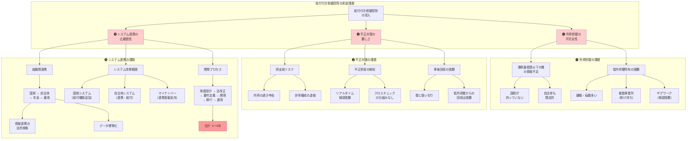

## 要約（Summary）

- 給付付き税額控除の導入が「数年かかる」のは、制度のアイデアではなく「正しく・速く・不正なく配るための土台」の構築が重いから
- 課税最低限以下の層の所得・世帯情報を行政が十分に持たず、誤支給・不正受給のリスクが高い
- 税務・自治体・社会保障の情報連携とシステム改修が広範囲に及び、数年単位の時間を要する

## 本文（Body）

### 背景・問題意識

給付付き税額控除は、概念としては理解しやすく、海外での実績もある。しかし日本で「導入に数年かかる」と言われるのは、制度設計そのものよりも、**運用基盤の整備**が重いからである。

**運用の3大課題：**
1. **所得把握の不完全性**：誰にいくら配るべきかを正確に判断できない
2. **不正対策の難しさ**：誤支給・不正受給をどう防ぐか
3. **システム連携の複雑さ**：税務・自治体・社会保障の横断的な改修が必要

### アイデア・主張

**給付付き税額控除の実装課題は、「情報」「審査」「システム」の三層で発生する。特に課税最低限以下の層への給付では、既存の税務インフラだけでは対応できない構造的な問題がある。**

#### 1. 所得把握の不完全性：行政が「給付対象の情報」を持っていない

**問題の核心：**
- 給付付き税額控除は、課税最低限以下（そもそも納税していない層）にも給付する
- しかし国税側は、そうした層の所得・世帯情報を基本的に持たない
- 自治体（住民税）も、非課税層の詳細情報は限定的

**具体的な課題：**
- **低所得層ほど所得把握が困難**：
  - 離職・転職が多い
  - 複数事業所で働く（掛け持ち）
  - 短期・単発の仕事（ギグワーク等）
  - 現金払いの仕事（捕捉困難）
- **世帯構成の把握が不完全**：
  - 住民票と実態の乖離（単身赴任、別居等）
  - 事実婚・同棲の扱い
  - 扶養関係の変動（子供の独立、介護等）
- **申請ベースの限界**：
  - 申請しない層（高齢者、制度を知らない層）が取りこぼされる
  - 過少申告・虚偽申告のリスク

**海外の事例：**
- 米国EITCでも、所得把握の不完全性が誤支給の主因
- OECDも、所得・資産捕捉が不十分なまま実施すると誤支給が懸念されると指摘

#### 2. 誤支給・不正受給の抑制：制度設計と審査運用の難しさ

**問題の核心：**
- 制度が複雑になるほど、誤りが増えやすい
- 給付を伴う税制では、データ照合や分析による不正対策が重要（OECD）

**具体的な課題：**
- **誤支給（過大給付）**：
  - 所得の過少申告（意図的・非意図的）
  - 世帯構成の虚偽申告（扶養家族の水増し等）
  - 申請漏れ・二重受給
- **不正受給の検知**：
  - リアルタイムの所得変動を捕捉できない（年1回の申告ベース）
  - 複数の給付制度にまたがる不正の発見が困難
  - クロスチェックの仕組みがない（税務・福祉・雇用の情報が分断）
- **事後的な回収の困難性**：
  - 過大給付の返還請求が難しい（既に使い切っている）
  - 低所得層からの回収は社会的・政治的に困難

**対策の方向性：**
- データ照合の自動化（税務・雇用保険・年金の突合）
- AIによる異常検知（申請パターンの分析）
- 段階的導入（給与所得者のみで先行、複雑なケースは後回し）

#### 3. 税と給付をつなぐ情報連携・システム改修の広範囲性

**問題の核心：**
- 国（税務）だけで完結せず、住民情報・給付・社会保障の実務とつながる
- 自治体側のシステム改修を含む対応が必要

**具体的な課題：**
- **組織間の情報連携**：
  - 国税（所得税）⇔ 自治体（住民税、福祉）⇔ 年金機構 ⇔ ハローワーク
  - 情報連携の法的根拠（個人情報保護法、マイナンバー法）
  - データフォーマットの標準化
- **システム改修の範囲**：
  - 国税：所得税システムに給付計算・還付機能を追加
  - 自治体：住民税システムと連携、給付システムの改修
  - マイナンバーシステム：情報連携基盤の拡充
  - 銀行：還付金の振込処理
- **開発のプロセス**：
  - 制度設計 → 法改正 → 要件定義 → 開発 → 移行 → 運用立ち上げ
  - 税・給付の横断システムでは特に影響範囲が大きい
  - 「数年」になりやすい構造

**スケジュール感（一般的な見積もり）：**
1. 制度設計・法改正：1年
2. 要件定義・設計：6ヶ月〜1年
3. システム開発：1〜2年
4. テスト・移行：6ヶ月
5. 運用立ち上げ・習熟：6ヶ月
- **合計：3〜5年**

### 内容を視覚化するMermaid図

### 具体例・ケース

**ケース1：米国EITCの誤支給問題**
- 誤支給率：約20〜25%（2010年代）
- 主な原因：
  - 所得の過少申告
  - 扶養家族の虚偽申告（友人・親戚の子供を申告）
  - 申告資格のない人が申告
- 対策：
  - IRS（米国国税庁）が事後監査を強化
  - 所得情報の自動照合（雇用主からの源泉徴収票との突合）
  - ペナルティの強化

**ケース2：カナダのCWBシステム構築**
- 導入プロセス：
  - 2007年に制度設計開始
  - 2008年に試験導入（Working Income Tax Benefit）
  - 2019年にCanada Workers Benefitへ改組
  - システム改修・運用改善に10年以上
- 課題：
  - 初期は申請率が低い（制度を知らない層）
  - 自動計算・自動還付への移行に時間がかかる

**ケース3：日本のマイナンバー制度とのタイミング**
- 前提条件：
  - マイナンバー制度（2016年運用開始）
  - マイナンバーカードの普及率（2025年時点で約70%）
  - 情報連携基盤の整備（中途段階）
- 課題：
  - 課税最低限以下の層のマイナンバー登録・利用が不十分
  - 自治体システムの標準化が進行中（2025年完了予定が遅延）
  - 情報連携の法的整備が必要

**現実的な導入パス（段階的導入案）：**
1. **第1段階（先行導入）**：
   - 対象：給与所得者のみ（源泉徴収で所得捕捉が容易）
   - 仕組み：年末調整で自動計算・還付
   - 期間：2〜3年
2. **第2段階（拡大）**：
   - 対象：自営業者、年金受給者を追加
   - 仕組み：確定申告ベース
   - 期間：さらに2〜3年
3. **第3段階（完全導入）**：
   - 対象：全国民（課税最低限以下を含む）
   - 仕組み：マイナンバー連携で自動計算・給付
   - 期間：さらに2〜3年

### 反論・限界・条件

**「所得把握の不完全性は解決不可能か？」**
- マイナンバー制度の拡充、銀行口座との紐付けで改善可能
- ただしプライバシー保護との兼ね合い
- ギグワーク・現金収入の捕捉は依然として困難

**「システム改修に3〜5年は長すぎでは？」**
- クラウド・アジャイル開発なら短縮可能
- ただし税・給付システムは「ミスが許されない」性質上、慎重な開発が必須
- 影響範囲が広い（数千万人規模）ため、テスト・移行に時間がかかる

**「不正受給は防げないのか？」**
- 完全には防げないが、データ分析・AI活用で大幅に削減可能
- 事後監査の強化、ペナルティの設計が重要
- ただし「疑わしい人を排除」すると本来の受給者も排除されるトレードオフ

**成立条件：**
- マイナンバー制度の普及と信頼性向上
- 税務・社会保障の情報連携基盤の整備
- 自治体システムの標準化完了
- 国民の制度理解と協力（申告・更新）
- 十分な開発期間と予算の確保

## 関連ノート（Links）

- [[20251221231127-refundable-tax-credit-basic-mechanism|給付付き税額控除の基本メカニズム]] 給付付き税額控除の基本的な仕組み
- [[20251221231128-refundable-tax-credit-work-incentive-design|給付付き税額控除の就労インセンティブ設計]] 就労インセンティブを組み込んだ設計
- [[20251214140318-agent-config-high-leverage-point|エージェント設定ファイルの高レバレッジ特性]] 制度設計の高レバレッジ性（設計ミスの影響が全体に波及）
- [[20251215104528-switching-cost-vendor-lockin|スイッチングコストとベンダーロックイン]] システム改修コストとロックイン
- [[20251220012101-terraform-lock-cross-platform-hash|Terraform Lock Fileのクロスプラットフォームハッシュ問題]] システム連携の技術的課題の類似例

## To-Do / 次に考えること

- [ ] マイナンバー制度の情報連携範囲と限界を整理
- [ ] 諸外国の誤支給率と対策の比較調査
- [ ] 日本の自治体システム標準化の進捗状況を追跡
- [ ] 段階的導入案の詳細設計（対象範囲、スケジュール、コスト試算）
- [ ] AIによる不正検知の技術動向と適用可能性を調査
