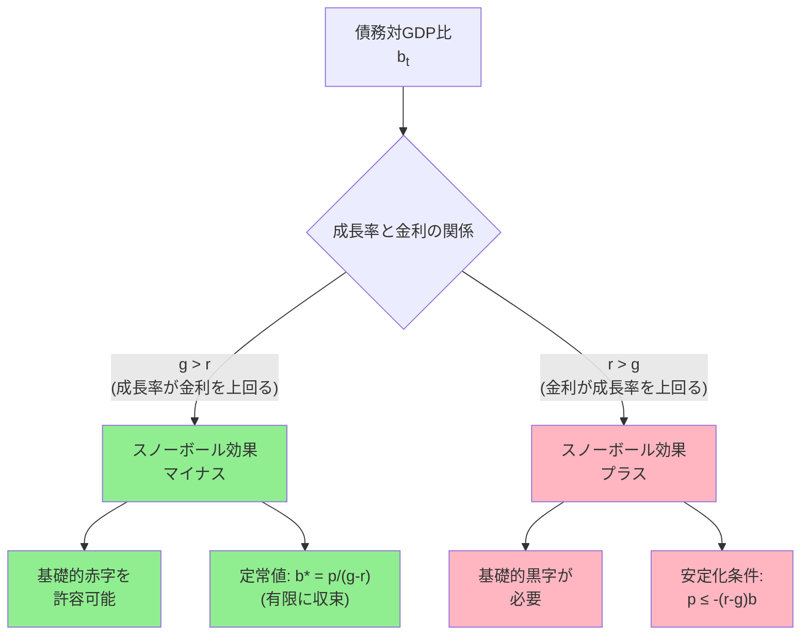
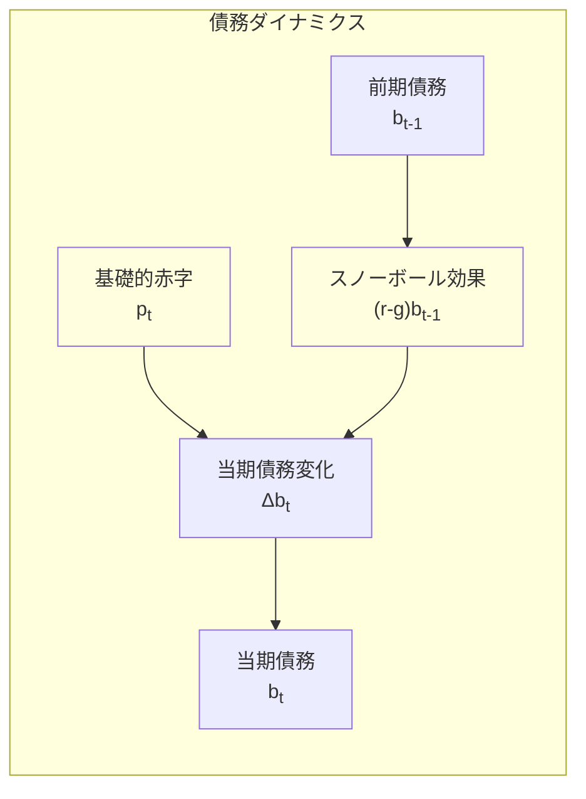

## 要約（Summary）

- ドーマー条件は、名目GDP成長率gが名目金利rを上回る（g>r）とき、一定の基礎的赤字を続けても債務対GDP比が発散せず有限の水準に収束しうるという会計的な安定条件
- 定常状態では債務対GDP比は b* = p/(g-r) に収束する（pは基礎的赤字の対GDP比）
- ただし、これは会計上の安定を示すだけであり、実際の持続可能性には市場の信認、金利の内生的上昇、景気循環などの要因も考慮が必要

## 本文（Body）

### 背景・問題意識

政府債務の持続可能性（debt sustainability）を評価する際、「どこまで赤字を続けられるか」「債務残高はどこまで増やせるか」という問いは実務的に重要である。債務対GDP比が無限に発散すると市場の信認を失い、借換（ロールオーバー）が困難になる。

ドーマー条件は、債務ダイナミクスの会計的側面から、債務比率が安定しうる基本条件を明確にする枠組みである。

### アイデア・主張

債務対GDP比を b_t、基礎的収支の赤字（利払いを除く赤字）対GDP比を p_t とすると、近似的に以下の債務ダイナミクスが成り立つ：

```
b_t - b_{t-1} ≈ (r-g)b_{t-1} + p_t
```

ここで **(r-g)b_{t-1}** は「スノーボール効果」と呼ばれ、既存債務が金利と成長率の差によって自然に膨らむ（あるいは縮む）効果を表す。

**ドーマー条件（g>r）**が成り立つ場合：
- スノーボール効果がマイナス（成長が債務を「薄める」）
- 基礎的赤字 p が一定なら、債務比率は定常値 **b* = p/(g-r)** に収束
- つまり、ある程度の基礎的赤字を続けても債務比率は安定しうる

**逆にr>gの場合**：
- スノーボール効果がプラス（債務が自己増殖的に膨張）
- 債務比率を安定化させるには **基礎的黒字** が必要
- 必要な基礎的黒字の規模は (r-g)b に比例する

### 内容を視覚化するMermaid図





### 具体例・ケース

**ケース1：g>r の状況（日本、2010年代前半）**
- 名目成長率 g = 2%、名目金利 r = 1%
- 債務対GDP比 b = 200%、基礎的赤字 p = 4%
- 定常値：b* = 4%/(2%-1%) = 400%
- つまり、年4%の赤字を続けても債務比率は400%で安定（ただし高水準）

**ケース2：r>g の状況（財政危機時）**
- 名目成長率 g = 1%、名目金利 r = 4%（リスクプレミアム上昇）
- 債務対GDP比 b = 150%
- 必要な基礎的黒字：p ≤ -(4%-1%)×150% = -4.5%
- つまり、GDP比4.5%の黒字を出さないと債務比率は上昇し続ける

**ケース3：成長の加速（政策転換）**
- 構造改革で名目成長率が1%から3%に上昇
- 金利が2%で固定なら、g-r が -1% から +1% に転換
- 同じ財政赤字でも債務ダイナミクスが安定化する

### 反論・限界・条件

**g>rでも債務が持続可能とは限らない理由：**

1. **金利の内生的上昇**
   - 債務が増えるとリスクプレミアムが上昇し、r が上がる
   - 市場の信認が低下すると、簡単に r>g に反転しうる
   - ドーマー条件は「r と g が固定」という静的な仮定に依存

2. **景気循環の影響**
   - 不況・災害・金融危機で g が低下すると力学が逆回転
   - 名目成長率は変動するが、債務の名目額は下方硬直的

3. **インフレによる見かけの g 上昇**
   - 名目 g が高くても、実質成長が弱い場合は生産性や税収の伸びが限定的
   - インフレ税は政治的コスト・家計負担を伴う

4. **定常値の水準問題**
   - g>r でも p が大きいと b* は巨大になる
   - 「発散しない」≠「市場が受け入れる」
   - 実務では債務比率の絶対水準も重要

5. **会計的安定と経済的持続可能性の乖離**
   - ドーマー条件は債務の会計式から導かれる力学条件
   - 実際の持続可能性には以下も必要：
     - 政府の異時点間予算制約の充足
     - 市場参加者の信認維持
     - 財政反応関数（債務増加時に増税・歳出抑制できるか）

**実務での評価には：**
- 金利・成長率のストレステスト（感度分析）
- 財政反応関数の推定（政治・制度的実現可能性）
- 償還・借換リスクの評価（平均償還年限、国内保有比率など）
- が必要となる

## 関連ノート（Links）

- [[20251221231127-refundable-tax-credit-basic-mechanism|給付付き税額控除：税額控除と現金給付を統合する制度設計]] - 財政政策の制度設計の別の側面
- [[20251221231128-refundable-tax-credit-work-incentive-design|給付付き税額控除の就労インセンティブ設計：フェーズイン・プラトー・フェーズアウト構造]] - インセンティブ設計と財政負担のトレードオフ
- [[20251215101906-khazzoom-brookes-postulate|Khazzoom-Brookes仮説：エネルギー効率化とマクロ経済成長]] - マクロ経済成長のパラドックス
- [[20251221223329-one-time-revenue-fixed-cost-mismatch-risk|単発収入で固定費を積む財務リスク]] - 収入と固定費のミスマッチによる財務リスク（ミクロ版の類似構造）

## To-Do / 次に考えること

- [ ] 日本の債務対GDP比の推移と g-r の関係を実データで検証
- [ ] 財政反応関数の推定方法を調査（政治経済学的視点）
- [ ] 中央銀行の金融政策が r に与える影響を整理（量的緩和、イールドカーブコントロール）
- [ ] 債務の通貨建て・保有主体別構成が持続可能性に与える影響を分析
- [ ] 他国（イタリア、ギリシャ、アルゼンチンなど）の財政危機事例をドーマー条件の枠組みで再解釈
