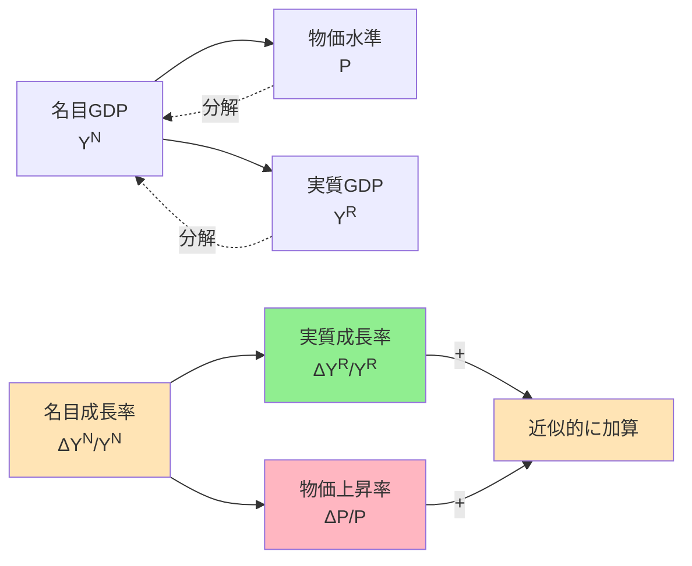
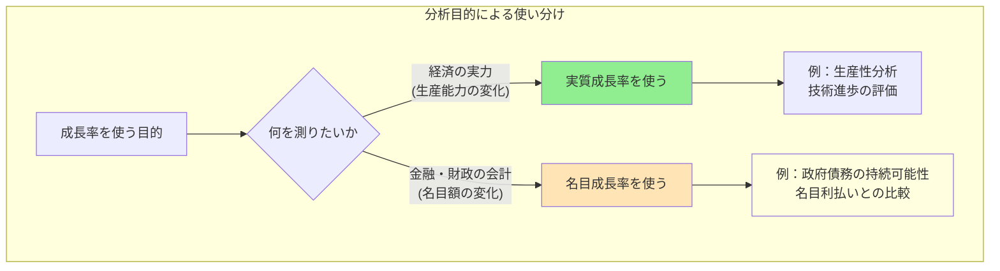

## 要約（Summary）

- 名目成長率は「お金で測ったGDP」の成長率、実質成長率は「物の量としてのGDP」の成長率で、両者の差は物価上昇率
- 近似的に：名目成長率 ≈ 実質成長率 + 物価上昇率（GDPデフレーターの変化率）
- 政府債務の持続可能性分析では、債務が名目額で動くため名目成長率を使うのが整合的

## 本文（Body）

### 背景・問題意識

経済成長を議論する際、「成長率」には名目と実質の2種類があり、混同すると誤った結論を導く。特に政府債務の持続可能性（ドーマー条件など）を評価する際、名目金利 r と対比する成長率 g は名目でなければならない。しかし、経済ニュースでは「実質GDP成長率」がよく報じられ、名目との違いが曖昧になりやすい。

また、物価指標としてGDPデフレーターとCPI（消費者物価指数）があり、どちらを使うかで成長率の解釈が変わる。

### アイデア・主張

**名目成長率（Nominal GDP Growth Rate）**
- お金で測ったGDP（名目GDP Y^N）が前年（前期）から何％増えたか
- 式：名目成長率 ≈ (Y^N_t - Y^N_{t-1}) / Y^N_{t-1}

**実質成長率（Real GDP Growth Rate）**
- 物の量（生産量）としてのGDP（実質GDP Y^R）が何％増えたか
- 物価変動の影響を取り除いて「実力としてどれだけ増えたか」を測定
- 式：実質成長率 ≈ (Y^R_t - Y^R_{t-1}) / Y^R_{t-1}

**両者の関係**
名目GDPはざっくり Y^N = P × Y^R（P は物価水準）と分解できるので、成長率で見ると：

```
名目成長率 ≈ 実質成長率 + 物価上昇率
```

ここでの「物価上昇率」は、厳密にはGDPデフレーターの変化率を指す。

**直感的な例：**
- 実質成長率 = +1%（作ったモノ・サービスが1%増えた）
- 物価上昇率 = +2%（同じ量でも値段が2%上がった）
- → 名目成長率 ≈ +3%

逆にデフレ（物価マイナス）なら、実質が伸びても名目は伸びにくい、あるいは下がることもある。

### 内容を視覚化するMermaid図





### 具体例・ケース

**ケース1：アベノミクス期（2013-2015年頃）**
- 実質成長率：平均 +1%程度
- GDPデフレーター変化率：+1〜2%（デフレ脱却）
- 名目成長率：+2〜3%
- 政府債務の持続可能性評価では、この名目+2〜3%を金利と比較する

**ケース2：デフレ期（1990年代後半〜2000年代）**
- 実質成長率：+1%前後
- GDPデフレーター変化率：-1〜-2%（デフレ）
- 名目成長率：0%前後、あるいはマイナス
- 実質では成長しているのに、名目では停滞（デフレの罠）

**ケース3：統計での観測方法**

日本の場合、内閣府（ESRI）の国民経済計算（SNA）から取得：
1. **内閣府「国民経済計算（GDP統計）」**
   - 四半期GDP成長率として実質（前期比）と名目（前期比）が並んでいる
   - CSV形式でダウンロード可能

2. **e-Stat（政府統計ポータル）**
   - 「国民経済計算 → 四半期別GDP速報」
   - 名目・実質の成長率、四半期デフレーターなどがデータセットとして提供

3. **自分で計算する場合**
   - 名目GDP水準 Y_t が取れるなら：
     - 単純成長率：g_t = Y_t/Y_{t-1} - 1
     - 対数差分（近似）：g_t ≈ ln(Y_t) - ln(Y_{t-1})

### 反論・限界・条件

**GDPデフレーターとCPIの違い（混同しやすいポイント）**

名目成長率を「実質＋物価」で近似するなら、物価はCPIではなく**GDPデフレーター**を使うのが筋。

**GDPデフレーター（GDP Deflator）**
- GDPに含まれる財・サービス全体の平均的な価格変化を表す
- 対象が広く、設備投資や政府支出なども含む
- 輸入品はGDPに入らない（国内生産ベース）ため、輸入価格の影響はCPIとズレる
- CPIと指数算式が違うため、短期の振れ方や水準に差が出る

**CPI（Consumer Price Index：消費者物価指数）**
- 家計が買う消費バスケットの価格変化を測る
- 輸入品を含む（店頭価格として家計が払う価格）
- 家計消費に寄るので、投資財や政府支出の価格変化は反映しない

**乖離の要因：**
1. **ウエイト（重み）の違い**：CPIは家計消費、GDPデフレーターは経済全体
2. **指数算式の違い**：ラスパイレス指数 vs パーシェ指数など
3. **対象範囲・概念の違い**：輸入品の扱い、投資財・政府支出の含み方

**政府債務の持続可能性での使い分け**

債務対GDP比の力学で r（名目金利）と g（成長率）を比較する場合：
- r：名目金利（国債利回り・平均利払い）
- g：**名目GDP成長率**（SNAの名目系列）

を揃えるのが基本。もし「実質成長率＋インフレ率」で近似したいなら、インフレ率は**CPIではなくGDPデフレーターの変化率**を使うのが整合的（名目GDPの定義そのものに対応するため）。

**その他の注意点：**
- 四半期データは速報・改定があり、後から数値が変わる
- 季節調整済み vs 原系列の違い
- 前期比 vs 前年同期比の違い
- 年率換算（前期比を4倍）の有無

## 関連ノート（Links）

- [[20251222231020-domar-debt-sustainability]] - ドーマー条件で名目成長率gを使う理由
- [[20251215101906-khazzoom-brookes-postulate]] - マクロ経済成長のパラドックス
- [[20251221231127-refundable-tax-credit-basic-mechanism]] - 財政政策の制度設計
- [[20251215010142-subjective-feeling-vs-statistics]] - 統計データの解釈と実感の乖離
- [[20251215010141-magazine-book-statistical-confusion]] - 統計データの定義と分類の重要性

## To-Do / 次に考えること

- [ ] 日本の名目・実質GDP成長率の長期時系列を可視化（1990年代〜現在）
- [ ] GDPデフレーターとCPIの乖離が大きかった時期を特定し、要因を分析
- [ ] 他国（米国、ユーロ圏）での名目・実質の乖離パターンと比較
- [ ] 財政政策評価で「実質」を使うべきケース、「名目」を使うべきケースを整理
- [ ] 四半期データの季節調整方法（X-12-ARIMAなど）の理解を深める
