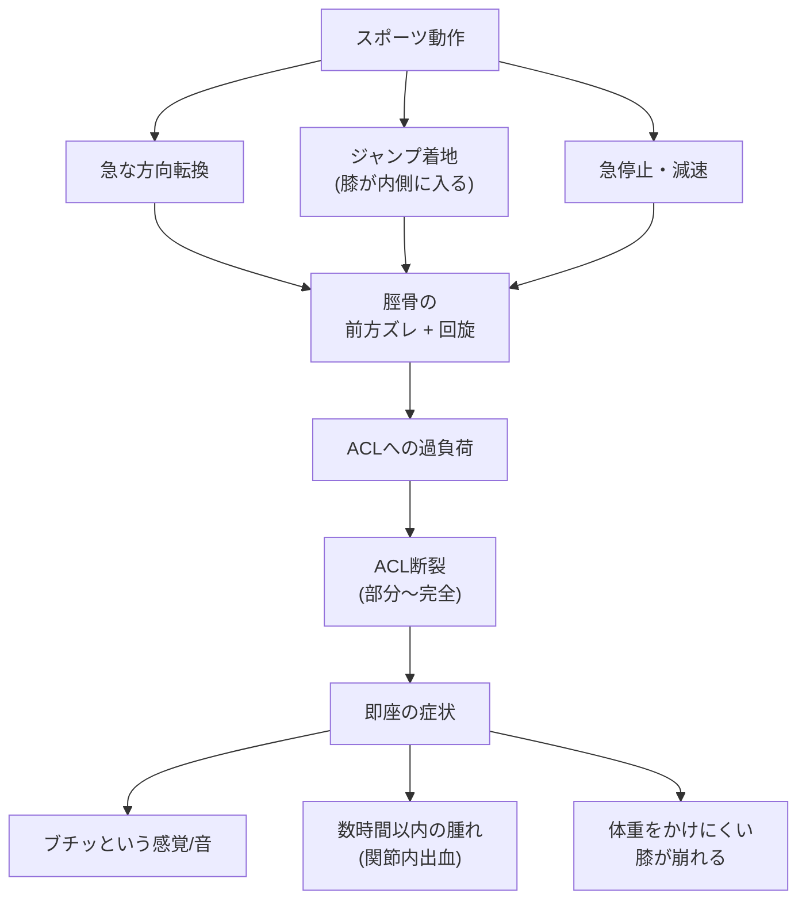

## 要約（Summary）

前十字靱帯（ACL）の損傷は、他の選手との接触がなくても発生する。急な方向転換、ジャンプ着地時の膝の内側への動き、急停止などの動作で、脛骨の前方ズレと膝の回旋を制御するACLに過度な負荷がかかり断裂する。非接触型の受傷が多いのは、動作パターンとACLの機能的役割の関係による。

## 本文（Body）

### 背景・問題意識

前十字靱帯（ACL）は大腿骨と脛骨をつなぎ、①脛骨が前方にズレるのを止める、②膝の回旋（ねじれ）を抑える役割を持つ。この靱帯が断裂すると、膝が「抜ける」「ガクッとする」不安定さが生じ、スポーツ活動に大きな支障をきたす。興味深いのは、他者との衝突よりも、選手自身の動作で損傷するケースが多い点である。

### アイデア・主張

非接触型ACL損傷は、**動作時の膝の位置と負荷のタイミング**によって起こる。具体的には以下の動作で脛骨の前方ズレと回旋が同時に発生し、ACLが耐えられる限界を超えることで断裂する：

- **急な方向転換（カット動作）**: 足を地面に着けた状態で体幹を回転させると、脛骨が前方かつ回旋方向に引っ張られる
- **ジャンプ着地で膝が内側に入る（knee-in）**: 着地の衝撃で膝が内側に崩れると、回旋力とともに前方へのズレが生じる
- **急停止**: 減速時に大腿四頭筋が収縮すると、脛骨を前方に引く力が働く

多くの場合、受傷時に「ブチッ」「ポンッ」という感覚や音があり、数時間以内に関節内出血で膝が腫れる。

### 内容を視覚化するMermaid図

### 具体例・ケース

- **サッカー**: ドリブル中の急な切り返し、ディフェンス時の相手の動きへの反応
- **バスケットボール**: ドライブからのストップ、リバウンド後の着地
- **バレーボール**: スパイク後の片脚着地
- **スキー**: ターン時の膝の内側への崩れ

これらの競技では、接触プレーよりも、選手自身の動作パターンが受傷の主要因となる。

### 反論・限界・条件

- 同じ動作をしても全員が受傷するわけではない。筋力、柔軟性、疲労度、既往歴などの個人差が大きい
- 接触によるACL損傷も存在する（タックル、衝突など）
- 「膝が内側に入る」動きだけが原因ではなく、股関節や足関節の動きも複合的に影響する
- 予防トレーニングで動作パターンを改善できれば、受傷リスクを下げられる可能性がある

## 関連ノート（Links）

- [[20251222235356-soccer-acl-injury-performance-impact]] - サッカー選手への具体的影響
- [[20251222235357-neuromuscular-training-acl-prevention]] - 予防のためのトレーニング手法

## To-Do / 次に考えること

- [ ] ACL損傷の性別差（女性選手に多い理由）を調査
- [ ] 着地動作の生体力学的分析の文献を探す
- [ ] 個人のリスク因子（解剖学的、神経筋的）について深掘り
