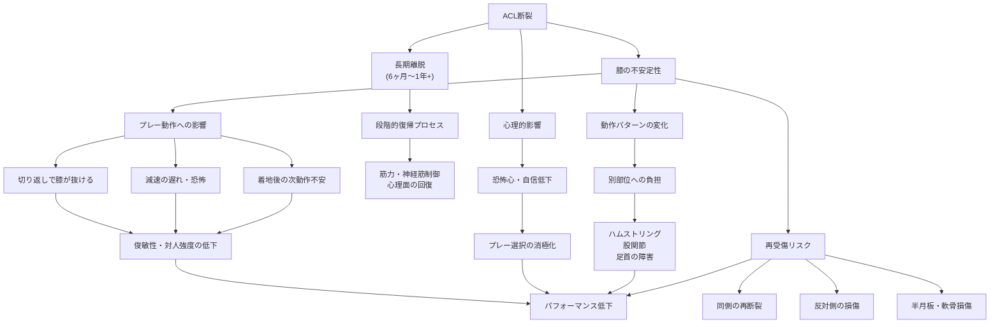

## 要約（Summary）

サッカー選手にとってACL断裂は、競技の核となる動作（切り返し・減速・着地）を直撃する重大な怪我である。復帰までの期間は長期にわたり、復帰後も俊敏性・対人強度の低下、再受傷リスク、心理的な恐怖心がパフォーマンスに影響する。サッカーの競技特性がACLの機能要求と一致するため、影響は他のスポーツ以上に深刻になりやすい。

## 本文（Body）

### 背景・問題意識

サッカーは「まっすぐ走る」だけではなく、減速→方向転換→再加速、片脚での着地、接触下での体勢崩れが頻繁に起こる。これらの動作はすべて、ACLが担う「回旋制御」と「前方ズレの防止」機能に依存している。つまり、ACL断裂はサッカー選手にとって、競技の根幹を揺るがす損傷となる。

### アイデア・主張

サッカー選手のACL断裂は、**競技特性と靱帯機能の高度な一致**により、以下の多層的な影響をもたらす：

**1) プレーへの直接的影響**
- 切り返し・ターンで膝が「抜ける」（giving way）感覚
- 減速動作の恐怖・遅れ → ディフェンスの寄せ、1対1の駆け引きに支障
- 片脚着地やジャンプ後の次動作（ヘディング後の着地→次の一歩）での不安
- 結果として、**俊敏性（アジリティ）と対人の強さが低下**する

**2) 長期離脱とキャリアへの影響**
- 試合レベル復帰は「数か月」ではなく、より長期（通常6ヶ月〜1年以上）
- 復帰プロセス: 走る → スプリント → 方向転換 → 対人 → 試合
- 「痛みが引いた＝復帰」ではなく、筋力・神経筋コントロール・反応・持久力・心理面を揃える必要がある
- 復帰後も、最高速度より**初速・減速・方向転換の質**が戻りにくい
- 無意識のかばいでフォームが変わり、別部位（ハムストリング、股関節、足首）のトラブルが起きやすい

**3) 再受傷と合併損傷のリスク**
- 同じ膝の再断裂
- 反対側のACL損傷
- 半月板や軟骨の追加損傷（膝が「抜ける」を繰り返すほど発生）
- 早期復帰を急ぐほどリスクが上昇する

**4) 心理的影響**
- 恐怖心・自信低下がプレー選択に影響（踏み込まない、無理をしない）
- これが長期的なパフォーマンス低下につながる可能性

### 内容を視覚化するMermaid図

### 具体例・ケース

**ポジション別の影響**:
- **サイドバック（SB）**: カバーリング時の切り返し、オーバーラップからの急停止
- **フォワード（FW）**: 1stステップの鋭さ、ディフェンスとの駆け引き
- **ゴールキーパー（GK）**: セービング後の着地、クロスボールへの飛び出しからの着地

**復帰後の現実**:
- トップスピードは回復しても、「止まる→切り返す→加速する」という一連の動作の滑らかさが戻らない
- 試合で「いける」と頭ではわかっていても、身体が無意識にブレーキをかけてしまう

### 反論・限界・条件

- すべての選手が同じ影響を受けるわけではない。個人差（年齢、受傷前のレベル、リハビリの質、心理的レジリエンス）が大きい
- 適切なリハビリと復帰判断があれば、ほぼ完全な復帰も可能（ただし時間がかかる）
- ポジションによって要求される動作が異なるため、影響の出方も変わる
- チーム全体の予防プログラム導入により、受傷・再受傷リスクは低減可能

## 関連ノート（Links）

- [[20251222235355-non-contact-acl-injury-mechanism|非接触型ACL損傷のメカニズム]] - 受傷メカニズムの基本
- [[20251222235357-neuromuscular-training-acl-prevention|神経筋トレーニングによるACL損傷予防]] - 予防と再発防止のアプローチ

## To-Do / 次に考えること

- [ ] ACL再建術後の段階的復帰プロトコルの詳細を調査
- [ ] ポジション別の復帰成功率のデータを探す
- [ ] 心理的サポート（スポーツ心理学）の効果について学ぶ
- [ ] プロサッカー選手のACL損傷後のキャリア追跡研究を読む
