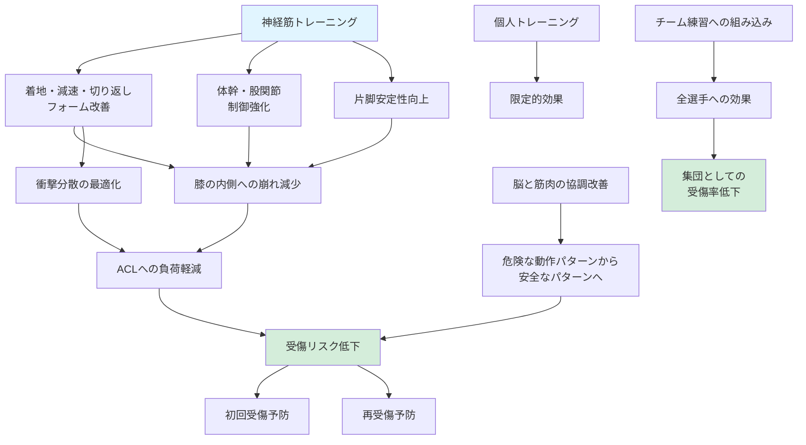

## 要約（Summary）

ACL損傷は「コンタクト」より「動作パターン（着地・減速・膝の内側への崩れ）」が主要因であるため、神経筋トレーニングで動作を改善すれば受傷リスクを下げられる。着地・減速・切り返しのフォーム、体幹・股関節周りの制御、片脚での安定性を鍛えることが、初回受傷と再受傷の両方の予防に効果的である。これは個人の努力だけでなく、チーム練習設計の問題でもある。

## 本文（Body）

### 背景・問題意識

ACL損傷は、他者との接触よりも選手自身の動作で起こることが多い。つまり、受傷は「運」や「偶然」だけの問題ではなく、**動作パターンの質**に大きく依存している。このことは、適切なトレーニングによって受傷リスクを低減できる可能性を示唆している。

実際、復帰後の再受傷リスクが高いことも、動作パターンが改善されないまま競技に戻ることの危険性を示している。予防は一度きりのものではなく、継続的な取り組みが必要である。

### アイデア・主張

神経筋トレーニング（Neuromuscular Training）は、**筋力だけでなく、脳と筋肉の協調（神経筋コントロール）を改善**することで、ACL損傷のリスクを下げる。

**トレーニングの3つの柱**:

1. **着地・減速・切り返しのフォーム改善**
   - 膝が内側に入る（knee-in）動きを減らす
   - 着地時に膝を軽く曲げ、衝撃を分散させる
   - 減速時に体幹を安定させ、膝への過負荷を避ける

2. **体幹・股関節周りの制御強化**
   - 体幹が不安定だと、下肢が代償的に過剰に動く
   - 股関節の外転筋（中殿筋など）を強化することで、膝の内側への崩れを防ぐ

3. **片脚での安定性向上**
   - 多くのスポーツ動作は片脚支持で行われる
   - 片脚でのバランス、着地、ジャンプの練習が重要

**重要な点**: これは「筋力を上げる」だけのトレーニングではなく、「正しい動きを脳に学習させる」トレーニングである。反復により、危険な動作パターンを安全なパターンに置き換える。

**チームレベルでの実装の重要性**:
- 個人の取り組みだけでは限界がある
- ウォーミングアップやチーム練習に組み込むことで、全選手の受傷リスクを下げられる
- 「ACL予防プログラム」として体系化されたプログラムが複数存在する（FIFA 11+など）

### 内容を視覚化するMermaid図

### 具体例・ケース

**具体的なトレーニング例**:
- **着地練習**: ボックスジャンプからの着地で、膝が内側に入らないよう鏡でチェック
- **片脚バランス**: 不安定な面（バランスボード等）での片脚立ち
- **体幹トレーニング**: プランク、サイドプランクで体幹を安定させる
- **股関節強化**: バンドを使った横歩き、クラムシェル等で中殿筋を鍛える
- **アジリティドリル**: コーンを使った切り返し練習で、正しいフォームを反復

**実装の成功例**:
- サッカーチームのウォーミングアップに15分のACL予防プログラムを導入
- シーズンを通じて継続することで、チーム全体の受傷率が低下
- 復帰選手に対しては、より集中的なプログラムを実施

### 反論・限界・条件

- トレーニングをしても、受傷リスクをゼロにはできない（個人差、疲労、不可抗力など）
- 効果を得るには、**継続的な実施**が必要（数週間で効果が出るものではない）
- 正しいフォームで行わなければ効果が薄い（指導者の質が重要）
- 選手が「面倒」と感じれば継続しない → チーム文化として根付かせる工夫が必要
- すでに受傷した選手の復帰プログラムと、未受傷選手の予防プログラムは強度・内容が異なる

**成立条件**:
- 選手とコーチの理解と協力
- チーム練習スケジュールへの組み込み
- 長期的な視点（短期的な成果を求めない）

## 関連ノート（Links）

- [[20251222235355-non-contact-acl-injury-mechanism|非接触型ACL損傷のメカニズム]] - どのような動作が危険か
- [[20251222235356-soccer-acl-injury-performance-impact|サッカー選手のACL断裂が競技パフォーマンスに与える影響]] - 予防がなぜ重要か

## To-Do / 次に考えること

- [ ] FIFA 11+などの具体的なACL予防プログラムの内容を調査
- [ ] 神経筋トレーニングの効果を示すエビデンス（論文）を読む
- [ ] 性別による予防プログラムの効果の違いを調べる
- [ ] チーム文化として予防を根付かせるための戦略を考える
