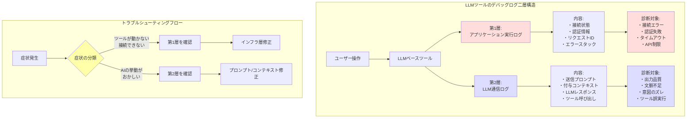

## 要約（Summary）

- LLMベースツールのデバッグでは、アプリケーション実行ログとLLM通信ログという二層のログ構造が必要
- 前者は接続・認証などインフラ層の問題診断に、後者はAI出力品質やコンテキスト問題の診断に使う
- 症状によってどちらのログを見るべきかを判断することで、効率的なトラブルシューティングが可能

## 本文（Body）

### 背景・問題意識

従来のソフトウェアツールでは、単一のアプリケーションログ（実行ログ、エラーログ）でデバッグが完結していた。しかし、LLMベースツール（GitHub Copilot、Claude Code等）では、ツール自体の動作とLLMとの通信という2つの異なる層が存在する。

ツールが「正しく動かない」場合、原因が以下のどちらにあるかで診断方法が異なる：
- **インフラ層の問題**: 接続エラー、認証失敗、API制限など
- **LLM層の問題**: プロンプトの問題、コンテキスト不足、出力品質の問題

この2層を区別せずにデバッグすると、無駄な調査に時間を費やすことになる。

### アイデア・主張

**LLMベースツールには、アプリケーション実行ログとLLM通信ログという二層のデバッグログ構造が必要である。症状に応じて適切な層のログを見ることで、効率的にトラブルシューティングできる。**

#### 二層構造の詳細

**第1層: アプリケーション実行ログ（Output / Diagnostics）**
- **内容**: 拡張機能の実行ログ、接続状態、認証情報、リクエストID、エラースタックトレース
- **用途**: インフラ層の問題診断
- **対象症状**:
  - ツールが起動しない
  - 接続できない
  - 認証エラー
  - タイムアウト
  - APIレート制限

**第2層: LLM通信ログ（Chat Debug log / Communication log）**
- **内容**: LLMに送信したプロンプト、付与されたコンテキスト、リクエスト/レスポンスの詳細、使用されたツール呼び出し
- **用途**: AI出力品質とコンテキスト問題の診断
- **対象症状**:
  - 返答がおかしい
  - 文脈が伝わっていない
  - エージェントが止まる
  - 編集が意図と異なる
  - ツール実行が変

#### 診断フローの判断基準

```
症状の分類
├─ ツールが動かない / 接続できない
│  → アプリケーション実行ログを確認
│
└─ ツールは動くがAIの挙動がおかしい
   → LLM通信ログを確認
```

### 内容を視覚化するMermaid図



### 具体例・ケース

**ケース1: GitHub Copilot Chat Debug log（VS Code）**

VS Codeの GitHub Copilot では、以下の2つのログが提供される：

1. **Output ログ**（アプリケーション実行ログ）
   - `GitHub Copilot` と `GitHub Copilot Chat` チャンネル
   - 接続状態、認証、リクエストIDなどを記録
   - 「Copilotが応答しない」といった接続問題の診断に使用

2. **Chat Debug log**（LLM通信ログ）
   - `Developer: Show Chat Debug View` コマンドで表示
   - `panel/askAgent`、`panel/editAgent` などのノードに、実際のLLMリクエスト/レスポンス詳細が記録
   - 「エージェントの編集が期待と違う」といったAI挙動問題の診断に使用

**ケース2: 症状別の診断例**

| 症状 | 使用するログ | 確認ポイント |
|------|------------|------------|
| Copilotが起動しない | Output | 認証トークンの有効性、拡張機能のロード状態 |
| チャットが応答しない | Output | 接続エラー、タイムアウト、API制限 |
| 回答が文脈を無視している | Chat Debug log | 送信されたコンテキストの内容、プロンプトの構造 |
| エージェントが無関係なファイルを編集 | Chat Debug log | ツール呼び出しの引数、意図の伝達状況 |

**ケース3: 効率的なデバッグプロセス**

従来のアプローチ（非効率）:
```
問題発生 → とりあえず全ログを見る → 関係ない情報に埋もれる
```

二層構造を活用したアプローチ（効率的）:
```
問題発生 → 症状を分類 → 該当層のログのみ確認 → 的確に原因特定
```

### 反論・限界・条件

**二層構造の維持コスト**

二層のログを別々に管理することで、ツール開発者側の実装コストが増加する。ログの保存先、フォーマット、アクセス方法をそれぞれ設計する必要がある。

**ユーザーの学習コスト**

ユーザーが「どちらのログを見るべきか」を判断するには、ツールの内部構造への理解が必要となる。初心者には敷居が高い可能性がある。

**対応策**:
- ツール側で症状に応じた診断ガイドを提供
- エラーメッセージに「このログを確認してください」と明示

**境界が曖昧なケース**

一部の問題は、両層にまたがる場合がある（例: コンテキスト取得時のファイル読み込みエラー）。このような場合、両方のログを確認する必要がある。

**成立条件**

この二層構造が有効に機能するためには：
- ツールが両方のログを適切に記録している
- ログが読みやすい形式で提供されている
- ユーザーがログへのアクセス方法を知っている

## 関連ノート（Links）

- [[20251129165841-ai-agent-end-to-end-testing|AIエージェントにおけるエンドツーエンドテスト]] テスト・検証プロセスとの関連
- [[20251214140142-ai-as-linter-antipattern|AI-as-Linterアンチパターンと決定的ツールの優位性]] 決定的ツールとLLMツールの使い分け原則
- [[20251206000000-ai-coding-invisible-problems|AIコーディング時代の「見えない問題」]] AI開発の透明性・可視性の課題
- [[20251214140418-effective-agent-config-design-principles|効果的なAIエージェント設定ファイル設計の原則]] エージェント設定とデバッグの関係
- [[20251223131149-llm-communication-log-privacy-risk|LLM通信ログに含まれる機密情報のリスク管理]] 第2層ログの機密性リスク

## To-Do / 次に考えること

- [ ] 使用しているLLMツールで両方のログにアクセスできるか確認
- [ ] 過去のトラブル事例を二層構造で分類し、診断効率を測定
- [ ] チーム内でログの使い分けガイドラインを作成・共有
- [ ] ログ記録の自動化やログ分析ツールの導入を検討
