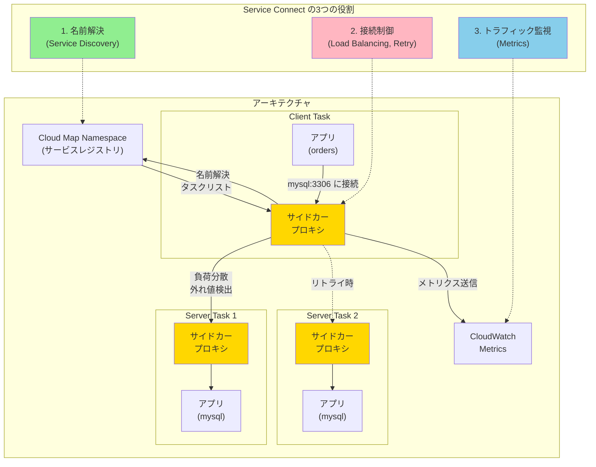

## 要約（Summary）

- ECS Service Connectは、名前解決・接続・トラフィック監視を統合的に提供するマイクロサービス通信機能である
- サイドカープロキシを自動注入し、短いサービス名で接続可能にしながら、負荷分散・外れ値検出・リトライ・メトリクス収集を実現する
- AWS Cloud Mapをサービスレジストリとして使い、プロキシ層で接続制御を行う2層構造を持つ

## 本文（Body）

### 背景・問題意識

**ECSでのマイクロサービス間通信の課題**：

VPC内でECSサービス同士を接続する場合、従来は以下の選択肢があった：
1. 内部ALB経由での接続（コスト高、オーバーヘッド大）
2. Cloud Mapによるサービスディスカバリ（名前解決のみ、接続制御は自前）
3. 直接IPアドレス指定（動的な変更に弱い）

これらには共通の課題がある：
- **接続の信頼性**：障害が発生したタスクを避ける仕組みが不十分
- **運用の可視性**：接続メトリクスを集めるのが困難
- **実装の複雑さ**：リトライ・タイムアウト・負荷分散をアプリ側で実装

AWSはこれらを統合的に解決する手段として、ECS Service Connectを推奨している。

### アイデア・主張

**Service Connectの核心**：

ECS Service Connectは「名前で呼べる」を超えて、**「接続の責任をECSが持つ」**という設計思想を持つ。

具体的には以下を提供：
1. **名前解決（サービス発見）**: AWS Cloud Mapの名前空間内で短いサービス名を解決
2. **接続（疎通）**: サイドカープロキシによる負荷分散・リトライ・外れ値検出
3. **トラフィック監視**: HTTP/gRPC/TCPメトリクスのCloudWatch自動出力

この3つを**統合管理**することで、アプリケーションコードを変更せずに信頼性の高い内部通信を実現する。

### 内容を視覚化するMermaid図



### Service Connectの仕組み

**1. 管理されたサイドカープロキシの自動注入**

Service Connectを有効化すると、各タスクに**ECSが管理するプロキシコンテナ**が自動的に追加される。アプリケーションコンテナからの通信は、すべてこのプロキシを経由する。

**2. Cloud Mapによるサービス台帳**

- Cloud Mapが「どのサービスがどこにいるか（どのタスクIPか）」を管理
- タスクの起動・停止に応じて自動更新
- 同一namespace内のサービスは、リージョン内でクラスタをまたいで配置可能

**3. プロキシによる接続制御**

クライアント側のプロキシが以下を実行：
- **ラウンドロビン負荷分散**: 複数タスクへの振り分け
- **外れ値検出（Outlier Detection）**: 実トラフィックで異常を検知し、問題のあるタスクを一時的に除外（パッシブヘルスチェック）
- **リトライ**: 接続失敗時に別のタスクへ自動再試行
- **メトリクス収集**: HTTP/1, HTTP/2, gRPC, TCPの接続性能を記録

### 設定の重要用語

**port name**:
タスク定義の`portMapping`に付ける名前。Service Connectがこの名前を参照してプロキシ設定を構成する。

```json
{
  "portMappings": [
    {
      "name": "mysql",
      "containerPort": 3306,
      "protocol": "tcp"
    }
  ]
}
```

**client alias**:
クライアントが使う「接続先名（DNS名）＋ポート」の別名設定。例えば`mysql:3306`のような短い名前で接続可能にする。

```json
{
  "clientAliases": [
    {
      "port": 3306,
      "dnsName": "mysql"
    }
  ]
}
```

**namespace**:
Cloud Mapの名前空間。Service Connectはこれを「会話できるサービスのグループ」として扱う。同一namespace内のサービス同士のみが名前で通信可能。

### 具体例・ケース

**ケース1: 注文サービス → MySQLデータベース**

- 注文サービス（ordersタスク）がMySQLサービス（mysqlタスク）に接続したい
- 従来：内部NLBを用意するか、Cloud MapでDNS解決してIPを取得
- Service Connect使用時：
  1. アプリコードは`mysql:3306`に接続するだけ
  2. プロキシが自動的に利用可能なmysqlタスクを選択
  3. 1つのタスクが異常なら、自動的に別のタスクへリトライ
  4. 接続メトリクスがCloudWatchに自動記録

**ケース2: 複数クラスタにまたがる配置**

- 同一リージョン内の複数ECSクラスタに分散配置したい場合
- 同じnamespace内であれば、クラスタをまたいでサービス間通信が可能
- プロキシがクラスタ境界を意識せずにルーティング

**ケース3: デプロイ時の切り替え**

- 新バージョンのタスクをデプロイ
- Service Connectは自動的にCloud Mapを更新
- DNS TTLの問題を回避し、タスク入れ替えと同時に接続先も切り替わる

### メリット

**アプリ改修が最小**:
- もともとDNS名で接続する設計なら、ほぼそのまま移行可能
- ECSが裏側の登録・更新・プロキシ実行を自動管理

**デプロイと整合する**:
- DNS TTLの浸透待ちを避けやすい
- Service Connectの変更は「デプロイでタスクを入れ替える」形で反映される

**観測性の向上**:
- プロキシがメトリクス収集を自動実行
- 接続の成功率・レイテンシ・タイムアウトなどを可視化

**信頼性の向上**:
- 外れ値検出で障害タスクを自動回避
- リトライによる一時的な障害の吸収

### 反論・限界・条件

**接続可能な範囲の制限**:

Service Connectのendpoint名を解決できるのは、**同じnamespaceでService Connect有効なタスクが基本**。

- ECS外（Lambda、EC2、オンプレミス）からは、その名前を解決できない
- Service Connect無効のECSタスクからも解決不可
- 外部からの接続には、別の手段（内部LB、通常のCloud Mapなど）を併用する設計が必要

**プロキシのオーバーヘッド**:
- すべての通信がプロキシを経由するため、わずかなレイテンシが追加される
- 超低レイテンシが要求される場合は注意が必要

**設定の複雑さ**:
- portMapping、serviceConnectConfiguration、client aliasなど、設定項目が増える
- 特に初回導入時は学習コストがかかる

**高度なメッシュ制御は不可**:
- Service Connectは基本的な負荷分散・リトライ・外れ値検出を提供
- より高度なトラフィック制御（カナリアデプロイの細かい制御、サーキットブレーカーなど）が必要な場合は、別のサービスメッシュ（App Mesh、Istioなど）の検討が必要

**ECS外との混在環境**:
- ECS以外の基盤（EKS、EC2、Lambda）も含めた統一的なサービスメッシュを構築したい場合、Service Connectでは不十分
- その場合はAWS App Meshなど、より汎用的なサービスメッシュソリューションが必要

## 関連ノート（Links）

- [[20251223133520-service-discovery-registry-vs-proxy-responsibility|サービスディスカバリにおけるレジストリ型とプロキシ型の接続責任範囲]] - Cloud MapとService Connectの本質的違い
- [[20251215171249-ecs-container-health-check-pattern|ECS Container Health Check設計パターン]] - タスクのヘルスチェック設計
- [[20251220130119-ecs-container-health-check-mechanism|ECS コンテナヘルスチェックの動作メカニズム]] - ヘルスチェックの動作詳細
- [[202511291440-load-balancing-exporter|OpenTelemetry Collector Load Balancing Exporterの概要]] - 負荷分散の概念
- [[20251221152245-virtual-nodes|仮想ノード（Virtual Nodes）による負荷分散の均一化]] - 負荷分散アルゴリズム

## To-Do / 次に考えること

- [ ] 実際のプロジェクトでService Connect導入の要件を整理（ECS内完結か、外部接続も必要か）
- [ ] namespaceの設計方針を決定（環境別、チーム別、機能別など）
- [ ] 外れ値検出のパラメータ調整方法を調査
- [ ] Service ConnectとApp Meshの使い分け基準を明確化
- [ ] プロキシのメトリクスを使った運用ダッシュボードを設計
